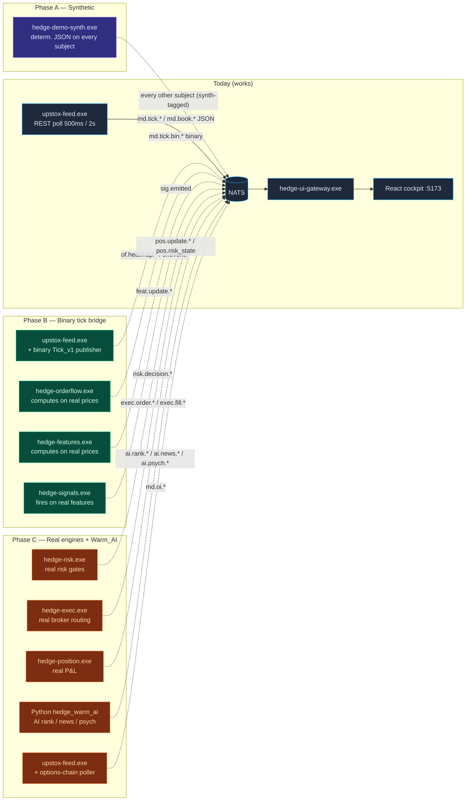
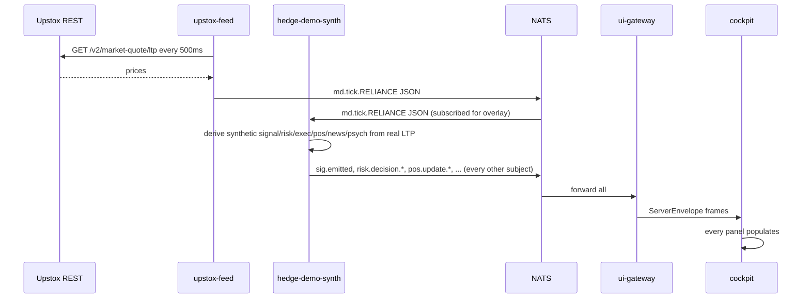
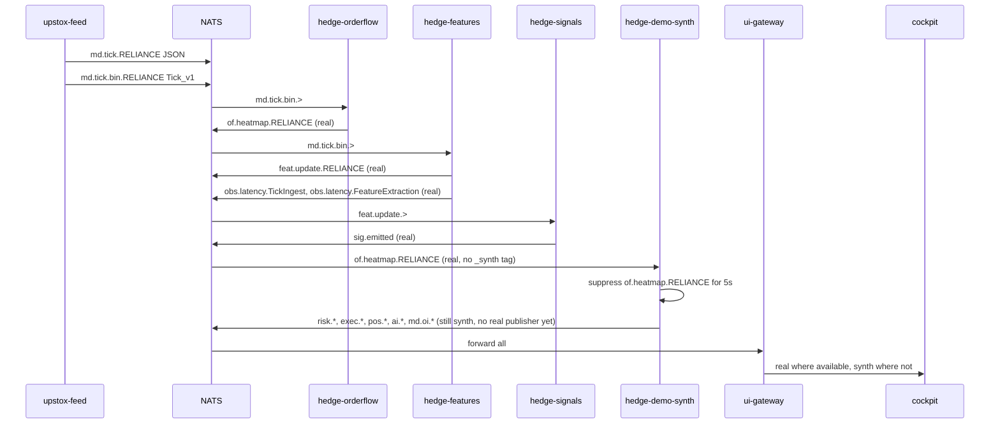
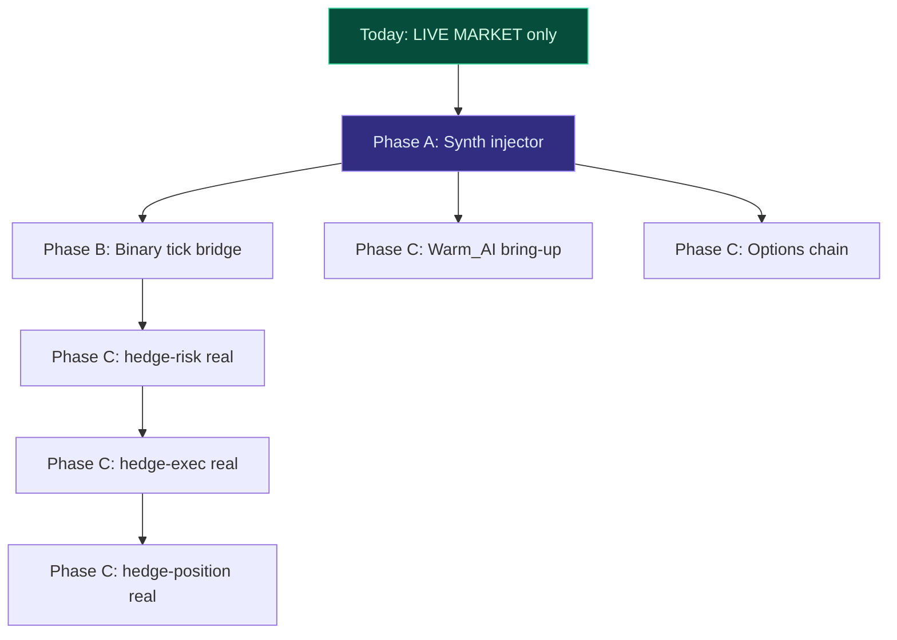

# Design Document — full-cockpit-data

## Overview

The cockpit currently shows live ticks in `LiveMarket` (the only panel with a working publisher) and "Awaiting…" everywhere else. This is **a phased build, not a rewrite**. Three sequential phases unblock progressively more panels with progressively more real data:

| Phase | Scope | Wall-clock | Panels unlocked |
|---|---|---|---|
| **A** — Synthetic data injector | new `hedge-demo-synth.exe` Rust binary that publishes deterministic, realistic JSON on every cockpit-subscribed NATS subject; defers to real publishers when present | ~2 h | Every panel populates immediately for demo / UI iteration |
| **B** — Binary tick bridge | `upstox-feed` also publishes `Tick_v1` 93-byte FlatBuffer alongside JSON; `hedge-orderflow` / `hedge-features` / `hedge-signals` consume real prices | ~2 h | `OrderflowHeatmap`, `Latency` (TickIngest, FeatureExtraction stages), `AiConfidenceScores`, `AiExplanations` go live with real data |
| **C** — Real engine implementations + Warm_AI_Pipeline | replace scaffolding stubs in `hedge-risk`, `hedge-exec`, `hedge-position`; bring up Python `hedge_warm_ai`; add Upstox options-chain endpoint | multi-week | `Positions`, `LivePnl`, `RiskPanel`, `ExecutionPanel`, `OptionsChain`, `News`, `TraderStabilityScore`, `Alerts`, full `Latency`, full `AI*` |

Phase A is the user's immediate ask. Phases B and C run only if A works as expected. Each phase **must keep prior phases working** — Phase B turning on does not break Phase A's synth; Phase C engines coming online cause Phase A's synth to defer (not crash, not duplicate).

This design stays in lockstep with the existing `live-cockpit-data` spec (`.kiro/specs/live-cockpit-data/`). That spec owns the cockpit-side contracts: `MarketEvent` discriminator, `FeedStatus` state machine, `EmptyState` reason set, IST timestamps, Connection_Banner. Nothing in this design alters those contracts — every publisher we add or extend conforms to them.

No new transports, no Kafka, no Kubernetes, no protocol redesign. Everything rides on the existing NATS bus, the existing JSON-on-the-cockpit / FlatBuffers-on-the-Hot_Path split, and the existing start.bat process supervisor.

---

## High-Level Design

### Architecture (all three phases)



### Component table

| Component | Phase | Subscribes to | Publishes on | Payload shape |
|---|---|---|---|---|
| `upstox-feed.exe` (existing) | today | (HTTP poll) | `md.tick.<SYM>` JSON, `md.book.<SYM>` JSON, `md.connection.upstox` dual | `{kind:"tick"\|"book"\|"connection", data:{...}}` |
| `hedge-ui-gateway.exe` (existing) | today | every cockpit-relevant subject | client WS `/ws` | `{type:"event", channel, payload, subject?, ts_ns?}` |
| **`hedge-demo-synth.exe`** | **A** | live `md.tick.*` JSON (overlay), heartbeats on suppression-tracked subjects | every "Awaiting…" subject (see ownership matrix below) | per-subject reducer-shaped JSON; carries `"_synth": true` for diagnostics |
| `upstox-feed.exe` (Phase B extension) | B | (HTTP poll) | `md.tick.bin.<SYM>` `Tick_v1` FlatBuffer, plus existing JSON unchanged | 93-byte binary |
| `hedge-orderflow.exe` (existing scaffold) | B | `md.tick.bin.>`, `md.book.>` | `of.event.*`, `of.heatmap.*` | (existing) |
| `hedge-features.exe` (existing scaffold) | B | `md.tick.bin.>` | `feat.update.*` + `obs.latency.FeatureExtraction` | (existing) |
| `hedge-signals.exe` (existing scaffold) | B | `feat.update.*` | `sig.emitted` | (existing) |
| `hedge-risk.exe` | **C** | `sig.emitted`, `feat.update.*`, `pos.update.*`, `pos.risk_state` | `risk.decision.approved\|rejected`, `risk.killswitch.activated`, `risk.target.reached`, `risk.cooldown.*` | (see Phase C low-level design) |
| `hedge-exec.exe` | **C** | `risk.decision.approved`, broker fill streams (Upstox/Angel One) | `exec.order.*`, `exec.fill.*`, `exec.broker.failover`, `exec.trade.closed` | (Phase C) |
| `hedge-position.exe` | **C** | `exec.fill.*`, `md.tick.bin.>` | `pos.update.<sym>`, `pos.risk_state` | (Phase C) |
| `hedge_warm_ai` (Python) | **C** | `sig.emitted`, news fetchers (HTTP/WS), psych state inputs | `ai.rank.*`, `ai.news.impact.*`, `ai.psych.stability\|intervention` | (Phase C) |
| `upstox-feed.exe` (Phase C options ext.) | **C** | (HTTP poll) | `md.oi.<SYM>` | matches `ui/src/types/market.ts` `OpenInterest` |

### Subject ownership matrix

Cockpit-relevant subjects × who publishes them per phase.

| Subject | Today | Phase A | Phase B | Phase C |
|---|---|---|---|---|
| `md.tick.<SYM>` (JSON) | upstox-feed | upstox-feed | upstox-feed | upstox-feed |
| `md.tick.bin.<SYM>` (binary) | — | — | upstox-feed | upstox-feed |
| `md.book.<SYM>` | upstox-feed | upstox-feed | upstox-feed | upstox-feed |
| `md.connection.upstox` | upstox-feed | upstox-feed | upstox-feed | upstox-feed |
| `md.oi.<SYM>` | — | synth | synth | upstox-feed (real) |
| `md.breadth.sector` | — | synth | synth | hedge-features (Phase C wires it) |
| `md.breadth.volatility` | — | synth | synth | hedge-features |
| `of.event.*` | — | synth | hedge-orderflow | hedge-orderflow |
| `of.heatmap.*` | — | synth | hedge-orderflow | hedge-orderflow |
| `feat.update.*` | — | synth | hedge-features | hedge-features |
| `sig.emitted` | — | synth | hedge-signals | hedge-signals |
| `ai.rank.*` | — | synth | synth | hedge_warm_ai |
| `ai.news.impact.*` | — | synth | synth | hedge_warm_ai |
| `ai.psych.stability` | — | synth | synth | hedge_warm_ai |
| `ai.psych.intervention` | — | synth | synth | hedge_warm_ai |
| `risk.decision.approved` | — | synth | synth | hedge-risk |
| `risk.decision.rejected` | — | synth | synth | hedge-risk |
| `risk.killswitch.activated` | — | synth (rare) | synth | hedge-risk |
| `risk.target.reached` | — | synth (rare) | synth | hedge-risk |
| `risk.cooldown.*` | — | synth | synth | hedge-risk |
| `pos.update.<sym>` | — | synth | synth | hedge-position |
| `pos.risk_state` | — | synth | synth | hedge-position |
| `exec.order.*` | — | synth | synth | hedge-exec |
| `exec.fill.*` | — | synth | synth | hedge-exec |
| `exec.broker.failover` | — | synth (rare) | synth | hedge-exec |
| `exec.trade.closed` | — | synth | synth | hedge-exec |
| `obs.latency.<stage>` | — | synth | hedge-features (TickIngest, FeatureExtraction) + synth (others) | every engine emits its own |
| `obs.budget.breach.<stage>` | — | synth (rare) | engines + synth | engines |
| `ops.action.replay` | — | synth (rare) | synth | hedge-replay (real) |

**Reading the matrix**: a cell tells you which process is responsible for that subject in that phase. Cells that read "synth" in Phase B/C are subjects whose real publisher hasn't shipped yet, so synth keeps them populated. As real publishers come online in C, synth defers to them and stops emitting on those subjects.

### Coexistence rule (how synth defers)

The synth runs as a single Rust process. For every subject it owns, it maintains a **suppression window**:

```
SuppressionState {
  subject: String,
  last_real_seen_at: Option<Instant>,
  suppressed_until: Option<Instant>,
}
```

- Synth subscribes to its own output subjects in addition to publishing on them.
- Every received message is parsed: if it lacks the `"_synth": true` tag (or the binary `Tick_v1` doesn't match synth's signature), `last_real_seen_at = now`.
- A real publisher seen within the last **2 seconds** sets `suppressed_until = now + 5s`. Synth skips its next publish on that subject.
- After 5 s of silence with no real publisher seen, synth resumes.

Properties:
- Two synth processes never fight: there's exactly one synth binary in start.bat.
- Real publishers always win: synth backs off within ≤2 s of a real event.
- No publish loop: synth never reacts to its own `_synth=true` events.

### Sequence diagrams

**Case A only (Phase A complete, Phase B+C off):**



**Case A + B (real ticks reach engines, synth fills the gaps):**



**Case C complete:**

```mermaid
sequenceDiagram
    participant Feed as upstox-feed (+options)
    participant NATS as NATS
    participant Engines as orderflow/features/signals/risk/exec/position
    participant Warm as hedge_warm_ai
    participant Synth as hedge-demo-synth
    participant UI as cockpit
    Note over Synth: every subject suppressed by real publishers; synth idle
    Feed->>NATS: ticks, books, options chain
    Engines->>NATS: full Hot_Path output
    Warm->>NATS: ai.rank.*, ai.news.*, ai.psych.*
    NATS->>UI: every panel real-data driven
    Synth->>NATS: nothing
```

### Phase exit criteria (by-eye, like live-cockpit-data Definition of Done)

**Phase A done when** — Outside trading hours with no Hot_Path engines running, the cockpit populates **every** panel within 10 seconds of `start.bat` finishing. The Connection_Banner shows `demo_mode` (per the live-cockpit-data spec). Every synth-driven panel renders a small `synth` badge next to its title (a 1-line addition to the per-panel React surface that reads the `_synth` flag from the most recent envelope).

**Phase B done when** — During NSE_Trading_Hours, with synth running, the `OrderflowHeatmap`, `AiConfidenceScores`, and `AiExplanations` panels render data without the `synth` badge (i.e. real `hedge-orderflow`, `hedge-features`, `hedge-signals` are publishing). The `Latency` panel's `TickIngest` and `FeatureExtraction` rows show real p50/p95/p99 numbers. The `LiveMarket` panel keeps working unchanged.

**Phase C done when** — During trading hours, with synth disabled (`HEDGE_DEMO_SYNTH=off`), every panel populates with real data. The `Positions` panel shows real Upstox positions, the `RiskPanel` shows real `risk.decision.*` events, the `ExecutionPanel` shows real `exec.order.*` flow, the `News` panel shows real news impact scores from `hedge_warm_ai`, the `OptionsChain` panel shows real OI for each strike, and `TraderStabilityScore` updates from real `ai.psych.*` events.

### Phase dependency graph



Phase B blocks `Latency`, `OrderflowHeatmap`, `AiConfidence`/`AiExplanations` from going real but does NOT block Phase C engines (they read from `feat.update.*` and `sig.emitted` which Phase B fills with real data, not `md.tick.bin.>` directly except for hedge-position).

---

## Low-Level Design

### Phase A — `hedge-demo-synth`

**Crate location**: `crates/hedge-demo-synth/`

**Module layout**:

```
crates/hedge-demo-synth/
├── Cargo.toml
└── src/
    ├── main.rs              # tokio entry, env parsing, NATS connect, coordinator spawn
    ├── coordinator.rs       # boots every generator with shared SuppressionRegistry
    ├── suppression.rs       # SuppressionRegistry; subscribes to own subjects, tracks last_real_seen_at
    ├── rng.rs               # mulberry32 with seed 0x5EEDED, per-generator stream split
    ├── derive.rs            # helpers that take a real LTP from md.tick.* and derive downstream payloads
    ├── symbols.rs           # static basket: RELIANCE, INFY, SBIN, HDFCBANK, ICICIBANK
    └── generators/
        ├── mod.rs
        ├── tick.rs          # falls through to real upstox-feed; emits ONLY when no real publisher
        ├── book.rs          # same fallback semantics
        ├── oi.rs            # md.oi.<SYM> — synthetic option chain
        ├── breadth.rs       # md.breadth.sector + md.breadth.volatility
        ├── connection.rs    # md.connection.<source> heartbeats for "ok"
        ├── orderflow.rs     # of.event.*, of.heatmap.*
        ├── features.rs      # feat.update.<SYM>
        ├── signal.rs        # sig.emitted (1 every 5–30s)
        ├── ai_rank.rs       # ai.rank.<corr_id> joined to recently emitted signals
        ├── risk.rs          # risk.decision.* + cooldowns
        ├── exec.rs          # exec.order.* lifecycle + exec.fill.*
        ├── position.rs      # pos.update.* + pos.risk_state aggregate
        ├── news.rs          # ai.news.impact.<topic>
        ├── psych.rs         # ai.psych.stability + interventions
        ├── latency.rs       # obs.latency.<stage> records, occasional obs.budget.breach.*
        └── replay.rs        # ops.action.replay heartbeat (very rare)
```

**Per-generator spec**:

| Generator | Input | Output subject(s) | Cadence | Seed stream | JSON envelope |
|---|---|---|---|---|---|
| `tick.rs` (fallback) | none | `md.tick.<SYM>` | 4 Hz when active | `0x5EEDED ^ 0x01` | `{kind:"tick", data:{symbol, ltp_paise, bid_paise, ask_paise, ts_recv_ns}, _synth:true}` matching `MarketEvent` |
| `book.rs` (fallback) | none | `md.book.<SYM>` | 1 Hz when active | `^0x02` | `{kind:"book", data:{symbol, bid_paise, bid_qty, ask_paise, ask_qty, ts_ns}, _synth:true}` |
| `oi.rs` | latest LTP per symbol (subscribed to `md.tick.*`) | `md.oi.<SYM>` | 5 s | `^0x03` | `{kind:"oi", data:{symbol, expiry, strikes:[{strike_paise, call_oi, put_oi, call_chg_oi, put_chg_oi}], ts_ns}, _synth:true}` matching `OpenInterest` |
| `breadth.rs` | latest LTPs across basket | `md.breadth.sector`, `md.breadth.volatility` | 1 s sector, 5 s volatility | `^0x04` | sector: `{kind:"breadth.sector", data:{sector, advancers, decliners, ts_ns}}`; volatility: `{kind:"breadth.volatility", data:{volatility:0.0–0.1, ts_ns}}` |
| `connection.rs` | none | `md.connection.synth` | every 30 s | `^0x05` | `{source:"synth", status:"reconnected", attempt:0, at, kind:"connection", data:{...}}` (dual-shape, supervisor + cockpit compatible) |
| `orderflow.rs` | LTPs | `of.event.<SYM>`, `of.heatmap.<SYM>` | 2 Hz events, 1 Hz heatmap | `^0x06`, `^0x07` | matches `OrderflowChannel` discriminator (see `ui/src/types/orderflow.ts`) |
| `features.rs` | LTPs | `feat.update.<SYM>` | 1 Hz | `^0x08` | matches `FeatureSnapshot` shape (see `ui/src/types`) — derive vwap/atr/ema from rolling LTP buffer |
| `signal.rs` | LTPs + features | `sig.emitted` | poisson-spaced 5–30 s | `^0x09` | matches `Signal` schema; `correlation_id` randomly generated, kept for join with `ai_rank` |
| `ai_rank.rs` | recent `sig.emitted` correlation_ids | `ai.rank.<corr_id>` | 200–800 ms after the corresponding signal | `^0x0A` | matches `RankedSignal`; `confidence` 0.4–0.95 |
| `risk.rs` | recent ranked signals | `risk.decision.approved\|rejected`, `risk.cooldown.<sym>`, occasional `risk.killswitch.activated` (1 every ~10 min), occasional `risk.target.reached` | per ranked signal | `^0x0B` | matches `RiskDecision` shape; rejection reasons cycle through documented codes |
| `exec.rs` | recent approvals | `exec.order.submitted`, `exec.order.filled`, `exec.fill.<sym>`, occasional `exec.broker.failover`, `exec.trade.closed` on close | 200–500 ms after approval; fills 1–3 s later | `^0x0C` | matches `ExecutionEvent` discriminator |
| `position.rs` | recent fills | `pos.update.<sym>`, `pos.risk_state` (aggregate) | per fill + 1 Hz aggregate | `^0x0D` | matches `PositionUpdate` shape; carries computed running P&L |
| `news.rs` | none | `ai.news.impact.<topic>` | 30–120 s | `^0x0E` | matches `NewsImpact`; cycles through fixture headlines + impact scores |
| `psych.rs` | none | `ai.psych.stability` (1 Hz), `ai.psych.intervention` (rare, 1 every ~5 min) | per cadence | `^0x0F` | matches `TraderStability` shape; stability score random walks 0.4–0.85 |
| `latency.rs` | none | `obs.latency.<stage>` for each of TickIngest/FeatureExtraction/AiScoringFetch/RiskCheck/ExecutionRouting/BrokerSubmit, plus occasional `obs.budget.breach.<stage>` (~1% rate) | 1 Hz per stage | `^0x10` | matches `LatencyRecord` |
| `replay.rs` | none | `ops.action.replay` heartbeat | every 60 s | `^0x11` | matches `ReplayEvent` |

**Suppression detection** (in `suppression.rs`):

```rust
struct SuppressionRegistry {
    map: DashMap<String, SubjectState>, // key = subject pattern
}
struct SubjectState {
    last_real_seen_at: Option<Instant>,
    suppressed_until: Option<Instant>,
}

impl SuppressionRegistry {
    fn record_message(&self, subject: &str, payload: &[u8]) {
        // if payload is JSON and contains "_synth":true -> ignore (our own echo)
        // otherwise -> set last_real_seen_at = now, suppressed_until = now + 5s
    }
    fn allow_publish(&self, subject: &str) -> bool {
        // true unless suppressed_until > now
    }
}
```

Each generator wraps its publish in `if reg.allow_publish(subject) { nats.publish(...) }`. The registry is a single instance shared via `Arc`.

**Rollout into `start.bat`**: a new line under "Hot_Path pipeline" section:

```bat
echo        [i] Demo Synth (deterministic dashboard filler)...
start "HEDGE-demo-synth" cmd /k target\release\hedge-demo-synth.exe
```

A `HEDGE_DEMO_SYNTH` env toggle skips the launch when `off`. Default `on` because the user wants a populated dashboard for demos.

**Cargo.toml deps** (workspace inheritance):

```toml
[dependencies]
hedge-bus = { path = "../hedge-bus" }
hedge-config = { path = "../hedge-config" }
hedge-obs = { path = "../hedge-obs" }
tokio = { workspace = true }
serde = { workspace = true }
serde_json = { workspace = true }
chrono = { workspace = true }
dashmap = { workspace = true }
anyhow = { workspace = true }
tracing = { workspace = true }
tracing-subscriber = { workspace = true }
```

No `reqwest` (synth makes no HTTP calls). No `tokio-tungstenite` (no WebSocket). Pure NATS.

---

### Phase B — Binary tick bridge

**Subject naming decision**: use a parallel subject `md.tick.bin.<SYM>` (and `md.book.bin.<SYM>` if Phase C engines need it).

**Why parallel subjects, not dual-format on one subject**: keeping JSON and binary on the same subject means every consumer must do format-detection on every message. The `b'{'` JSON sentinel skip in `hedge-features` already does this and silently drops half the traffic. With parallel subjects:
- Cockpit subscribes to `md.tick.>` — gets only JSON it can parse.
- Hot_Path engines subscribe to `md.tick.bin.>` — get only binary they can decode.
- No format detection. No silent drops. No regressions when one side changes payload.

**Pseudo-Rust dual publisher** in `upstox-feed`:

```rust
async fn publish_tick(nats: &NatsClient, instrument_key: &str, item: &Value) {
    let symbol = extract_trading_symbol(item);

    // 1. JSON for the cockpit (existing).
    let json_payload = json!({
        "kind": "tick",
        "data": {
            "symbol": symbol,
            "ltp_paise": ltp_paise,
            "bid_paise": bid_paise,
            "ask_paise": ask_paise,
            "ts_recv_ns": ts_ns,
        }
    });
    nats.publish(format!("md.tick.{symbol}"), serde_json::to_vec(&json_payload)?).await?;

    // 2. Binary Tick_v1 for the engines (NEW in Phase B).
    let bin = encode_tick_v1(symbol_id_for(symbol), ltp_paise, bid_paise, ask_paise, ts_ns);
    nats.publish(format!("md.tick.bin.{symbol}"), bin).await?;
}
```

**`Tick_v1` byte layout** (already defined in `hedge-schemas`, 93 bytes):

```
offset 0:  16 bytes correlation_id
offset 16: 4 bytes  symbol_id    (u32 LE)
offset 20: 1 byte   exchange     (i8: NSE=0, BSE=1)
offset 21: 8 bytes  ltp_paise    (i64 LE)
offset 29: 8 bytes  bid_paise    (i64 LE)
offset 37: 8 bytes  ask_paise    (i64 LE)
offset 45: 8 bytes  ltq          (u64 LE)
offset 53: 8 bytes  total_buy_qty (u64 LE)
offset 61: 8 bytes  total_sell_qty (u64 LE)
offset 69: 8 bytes  ts_exchange_ns (u64 LE)
offset 77: 8 bytes  ts_recv_ns   (u64 LE)
total: 93 bytes
```

**Cross-process symbol interning** (v1, static):

```rust
// crates/hedge-bus/src/symbol_table.rs (new tiny module)
pub fn symbol_id_for(sym: &str) -> u32 {
    match sym {
        "RELIANCE"  => 1,
        "INFY"      => 2,
        "SBIN"      => 3,
        "HDFCBANK"  => 4,
        "ICICIBANK" => 5,
        // … extend as new symbols added
        _ => 0,  // unknown → discarded by engines
    }
}
pub fn symbol_for_id(id: u32) -> Option<&'static str> { /* inverse */ }
```

Static table is fine for 5–50 symbols. When the basket grows, swap to a Redis-backed lookup; the API stays identical.

**Consumer adjustments**:

`hedge-features/src/bin/main.rs` already subscribes to `md.tick.*`. Change subscription to `md.tick.bin.>` (excludes the JSON `md.tick.<SYM>` because it has no `bin` segment). Remove the `b'{'` JSON sentinel skip — no longer reachable.

```rust
// before
let subject: Subject<RawBytes> = Subject::new("md.tick.*");
// after
let subject: Subject<RawBytes> = Subject::new("md.tick.bin.>");
```

`hedge-orderflow`: same change.
`hedge-signals`: subscribes to `feat.update.*` only — no change.

Position engine (Phase C) subscribes to `md.tick.bin.>` for mark-to-market.

---

### Phase C — Real engines + Warm_AI

This phase is multi-week and the lower-level detail is correspondingly lighter. Each engine gets enough sketch to start a focused implementation effort; the actual trading logic, risk parameters, and broker integration will iterate in their own follow-up specs.

**`hedge-risk` real implementation**:

Subscribes: `sig.emitted`, `feat.update.*`, `pos.update.*`, `pos.risk_state`, `trader.intent.killswitch`, `trader.intent.priority`, `md.connection.upstox` (for broker-down kill).

Internal state:
- `cooldown_until: HashMap<SymbolId, Instant>` — per-symbol cooldown after rejected signal
- `position_exposure: HashMap<SymbolId, i64>` — running exposure for size limits
- `killswitch_engaged: AtomicBool`
- `daily_loss: i64` — cumulative P&L; trips killswitch when below configured floor
- `ai_priority: HashMap<SymbolId, PriorityTier>` — from `ai.priority.changed.*`

Decision logic (pseudo-Rust):

```rust
async fn evaluate(&mut self, sig: SignalEmitted) -> RiskDecision {
    if self.killswitch_engaged.load(Acquire) {
        return RiskDecision::rejected(sig, "killswitch_engaged");
    }
    if self.cooldown_until.get(&sig.symbol).map_or(false, |t| Instant::now() < *t) {
        return RiskDecision::rejected(sig, "cooldown_active");
    }
    let priority = self.ai_priority.get(&sig.symbol).copied().unwrap_or(P3);
    if priority < self.config.min_priority_for_signal(sig.strategy) {
        return RiskDecision::rejected(sig, "below_priority_floor");
    }
    let sized = self.config.size_for(sig, self.daily_loss, self.position_exposure[&sig.symbol]);
    if sized.qty == 0 {
        return RiskDecision::rejected(sig, "size_zero");
    }
    self.cooldown_until.insert(sig.symbol, Instant::now() + self.config.cooldown_after_approve);
    RiskDecision::approved(sig, sized)
}
```

Publishes: `risk.decision.approved`/`rejected` for each signal; `risk.cooldown.<sym>` when entering cooldown; `risk.killswitch.activated` on trip; `risk.target.reached` on daily target hit.

Persistence: Redis warm cache for cooldowns and daily_loss snapshots (so restart preserves state). Postgres for completed-trade ledger.

**`hedge-exec` real implementation**:

Subscribes: `risk.decision.approved`, broker fill streams (Upstox WebSocket order updates + Angel One postback URL for fills).

Internal state:
- `pending_orders: HashMap<CorrelationId, OrderState>`
- `active_broker: BrokerId` (Upstox primary, Angel One backup)

Logic: on `risk.decision.approved`, submit to active broker; capture fills from broker stream; publish lifecycle events. On submit error or broker timeout, fail over to backup and publish `exec.broker.failover`.

Reuses existing broker adapters: `hedge-broker-upstox` (full), `hedge-broker-angelone` (stub today, complete during Phase C).

Persistence: Redis for pending orders (recoverable across restart), Postgres for executed-fills audit log.

**`hedge-position` real implementation**:

Subscribes: `exec.fill.*`, `md.tick.bin.>` (for mark-to-market).

Internal state: `positions: HashMap<SymbolId, Position { qty: i64, avg_cost_paise: i64, realized_pnl_paise: i64, unrealized_pnl_paise: i64 }>`

Logic: on fill, update qty + avg_cost; on tick, update unrealized P&L. Publish `pos.update.<sym>` per fill or per N seconds (whichever comes first); aggregate `pos.risk_state` once per second.

**Warm_AI_Pipeline (Python `hedge_warm_ai`) bring-up**:

Existing packages (don't redesign): `hedge_warm_ai/news`, `hedge_warm_ai/ranking`, `hedge_warm_ai/regime`, `hedge_warm_ai/governance`.

Minimum bring-up:
- Run `python -m hedge_warm_ai.news.engine` as a service in `start.bat`. Subscribes to news fetchers (HTTP/Twitter/Telegram per .env), publishes `ai.news.impact.<topic>`.
- Run `python -m hedge_warm_ai.ranking.engine`. Subscribes to `sig.emitted`, calls Ollama (`mistral:7b` or `qwen2.5:14b`), publishes `ai.rank.<corr_id>` with confidence + explanation.
- Run `python -m hedge_warm_ai.regime.engine`. Subscribes to `feat.update.*` aggregate, publishes `md.breadth.sector`/`md.breadth.volatility` (replaces synth).
- A new lightweight psych service (~200 LoC) in `hedge_warm_ai/psych/engine.py` aggregates trader inputs (no published yet — placeholder until Phase D adds trader-stress signals) and publishes `ai.psych.stability` heartbeats.

Ollama model inventory in `.env`:
```
HEDGE_OLLAMA_RANKING_MODEL=mistral:7b
HEDGE_OLLAMA_NEWS_MODEL=qwen2.5:14b
```

start.bat additions:
```bat
start "HEDGE-warm-news"    cmd /k python -m hedge_warm_ai.news.engine
start "HEDGE-warm-ranking" cmd /k python -m hedge_warm_ai.ranking.engine
start "HEDGE-warm-regime"  cmd /k python -m hedge_warm_ai.regime.engine
start "HEDGE-warm-psych"   cmd /k python -m hedge_warm_ai.psych.engine
```

**Upstox options-chain endpoint**:

New module `crates/hedge-market-data/src/bin/upstox_oi.rs` (or fold into upstox-feed as a parallel poller).

Endpoint: `GET https://api.upstox.com/v2/option/chain?instrument_key=<UNDERLYING>&expiry_date=<YYYY-MM-DD>` — returns full strike ladder.

Cadence: 5 s (well within Upstox rate limits).

For each underlying in `HEDGE_UPSTOX_OI_UNDERLYINGS` (default `NSE_INDEX|Nifty 50,NSE_INDEX|Nifty Bank`), poll the nearest weekly expiry (auto-rotate when current expiry is < 1 day away).

Payload shape published on `md.oi.<UNDERLYING>`:

```json
{
  "kind": "oi",
  "data": {
    "symbol": "NIFTY",
    "expiry": "2025-12-04",
    "strikes": [
      {"strike_paise": 2400000, "call_oi": 12345, "put_oi": 6789, "call_chg_oi": 234, "put_chg_oi": -120}
    ],
    "ts_ns": 1733000000000000000
  }
}
```

Matches `ui/src/types/market.ts` `OpenInterest` exactly.

---

## Correctness Properties

### Phase A
1. **Determinism** — for fixed seed `0x5EEDED`, two synth runs of duration `N` seconds produce byte-identical NATS publish sequences.
2. **Suppression respect** — for any subject `S`, if a non-`_synth` payload arrives on `S` at `t0`, synth emits no `_synth` payload on `S` between `t0` and `t0 + 5s`.
3. **Schema validity** — every synth payload deserialises into the cockpit's reducer-side type (`MarketEvent`, `OrderflowChannel`, `RankedSignal`, `RiskDecision`, …) without any field falling back to a default.

### Phase B
1. **Pair atomicity** — for every JSON tick `upstox-feed` publishes on `md.tick.<SYM>`, a `Tick_v1` with the same symbol and `ltp_paise` is published on `md.tick.bin.<SYM>` within 1 ms.
2. **No format crossover** — no `hedge-features` / `hedge-orderflow` / `hedge-signals` log line contains "discarded malformed" once Phase B subscriptions are in place (the JSON sentinel becomes unreachable).
3. **Symbol interning round-trip** — `symbol_for_id(symbol_id_for(s)) == Some(s)` for every symbol in the static table.

### Phase C
1. **Reducer compatibility** — every real-engine output passes the cockpit reducer the same way the synth payloads did in Phase A. (Re-uses Phase A's schema-validity test surface as a regression harness.)
2. **Authority hierarchy preservation** — every `risk.decision.approved` is followed by exactly one `exec.order.submitted` with the same `correlation_id`; no `exec.order.submitted` exists without a matching `risk.decision.approved`.
3. **Conservation of cash** — `pos.risk_state.total_realized_pnl + total_unrealized_pnl == sum(exec.fill.*.realized_pnl)` after any sequence of fills, modulo broker fees.

---

## Error Handling

| Surface | Failure | Behaviour |
|---|---|---|
| Phase A: `hedge-demo-synth` | NATS connect failed | exit non-zero; supervisor restarts; cockpit panels stay empty until reconnect |
| Phase A: synth subscriber | malformed message on a subject | log debug, ignore — never crash |
| Phase A: synth publish | broadcast lag / NATS slow consumer | drop oldest pending, log warn with subject, continue |
| Phase B: upstox-feed | binary encode failure (impossible in practice) | log warn, skip the binary publish, still emit JSON |
| Phase B: hedge-features | `Tick_v1` decode fails | log warn ONCE per symbol per minute, drop tick |
| Phase B: symbol not in static table | `symbol_id_for` returns 0 | engines drop tick silently (already do this); operator must add to table |
| Phase C: hedge-risk | signal arrives before warmup features | reject with `insufficient_history`; no decision published unless reject |
| Phase C: hedge-exec | broker API 4xx | mark order as `rejected`; do NOT retry; publish `exec.order.rejected` |
| Phase C: hedge-exec | broker API 5xx or timeout | retry once with backup broker; publish `exec.broker.failover` |
| Phase C: hedge-position | tick before any fill | initialise position at zero; no panic |
| Phase C: Warm_AI Ollama down | model timeout | publish `ai.ollama.degraded`; supervisor switches to fallback model; rank/news temporarily fall back to last-known + decay |
| Phase C: Upstox option-chain 401 | `md.connection.upstox` already covers it; OI poller backs off and emits no new `md.oi.*` until token refresh |

---

## Testing Strategy

**Unit tests** (Rust, per-generator):
- `hedge-demo-synth` — one test per generator confirming: schema valid (round-trips through cockpit-side type via `serde_json::from_value` over a sampled output), respects suppression (drives a fake `SuppressionRegistry`, asserts no publish in suppressed window), determinism (same seed → same output bytes for N publishes).

**Integration test** (Rust + cockpit, single):
- New `tests/full_dashboard_smoke.rs` in `hedge-demo-synth`. Boots NATS via testcontainers (or assumes Docker compose), spawns the synth, opens a WebSocket against a freshly-spawned `hedge-ui-gateway`, and asserts that within 10 seconds at least one event arrives on each of the 11 cockpit channels.

**Phase B verification**:
- Existing `hedge-features` proptest suite (already runs against canonical `Tick_v1` payloads) — confirms the binary wire layout decodes correctly.
- New test: spawn `upstox-feed` against a `wiremock`-stubbed Upstox; assert that for every JSON tick on `md.tick.<SYM>`, a `Tick_v1` with matching `ltp_paise` arrives on `md.tick.bin.<SYM>` within 1 ms.

**Phase C verification**:
- Re-run the live-cockpit-data Vitest reducer property tests against real-engine output captured into a JSON fixture file.
- New `hedge-exec` integration test against a Upstox sandbox or replay capture (no live trading in CI).
- New `hedge-position` property test: random sequence of fills + ticks → asserts conservation of cash.

---

## Cross-references

- `live-cockpit-data` spec — owns cockpit-side empty states, Connection_Banner, FeedStatus, IST timestamps. Phase A/B/C must not change any of those.
- `project-hedge` spec — original architecture; this design extends it without contradicting it.
