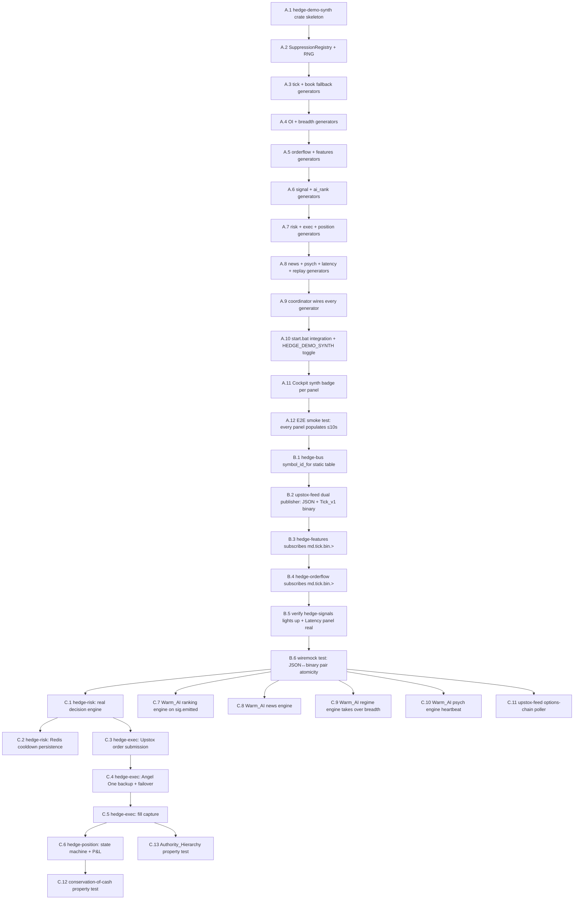

# Implementation Plan — full-cockpit-data

## Overview

Three sequential phases. Phase A delivers a fully populated cockpit in ~2 hours by injecting synthetic data on every cockpit-subscribed subject. Phase B (~2 hours) makes orderflow / features / signals consume real Upstox prices. Phase C (multi-week) replaces scaffolding stubs with real engines and brings up the Warm_AI_Pipeline.

After every phase the cockpit is *more* populated than before, never less. After Phase A every panel renders. After Phase B four panels render with real data. After Phase C every panel renders with real data and synth can be turned off entirely.

## Task Flow



---

## Tasks

## Phase A — Synthetic data injector (~2 hours)

After this phase, running `start.bat` with `HEDGE_DEMO_SYNTH=on` (default) populates every cockpit panel within 10 seconds, regardless of trading hours or live broker state. Each task here is independently shippable.

- [x] A.1 Create `crates/hedge-demo-synth/` skeleton — Cargo.toml inheriting workspace deps, `src/main.rs` with tokio entrypoint that connects to NATS and prints "demo-synth ready", and a workspace member entry — files: `Cargo.toml`, `crates/hedge-demo-synth/Cargo.toml`, `crates/hedge-demo-synth/src/main.rs` — references: REQ-1.1, REQ-4.1, REQ-14.1

- [x] A.2 Implement `SuppressionRegistry` and `mulberry32` RNG — `src/suppression.rs` exposes `record_message`, `allow_publish`, ignores `_synth=true` echoes; `src/rng.rs` exposes a per-stream split from seed `0x5EEDED` — files: `crates/hedge-demo-synth/src/suppression.rs`, `crates/hedge-demo-synth/src/rng.rs`, `crates/hedge-demo-synth/src/symbols.rs` — references: REQ-2.1, REQ-2.2, REQ-2.3, REQ-2.4, REQ-2.5, REQ-3.1

- [x] A.3 Tick + book fallback generators — emit `md.tick.<SYM>` and `md.book.<SYM>` only when no real publisher seen; envelopes match `MarketEvent` `kind:"tick"`/`kind:"book"`; carry `_synth: true` — files: `crates/hedge-demo-synth/src/generators/tick.rs`, `crates/hedge-demo-synth/src/generators/book.rs`, `crates/hedge-demo-synth/src/derive.rs` — references: REQ-1.3, REQ-1.4, REQ-3.3, REQ-3.4

- [x] A.4 OI + breadth + connection generators — `md.oi.<SYM>` derived from rolling LTP; `md.breadth.sector` and `md.breadth.volatility` aggregates; `md.connection.synth` heartbeats — files: `crates/hedge-demo-synth/src/generators/oi.rs`, `crates/hedge-demo-synth/src/generators/breadth.rs`, `crates/hedge-demo-synth/src/generators/connection.rs` — references: REQ-1.2, REQ-1.4

- [x] A.5 Orderflow + features generators — `of.event.<SYM>`, `of.heatmap.<SYM>`, `feat.update.<SYM>` matching cockpit `OrderflowChannel` and `FeatureSnapshot` types — files: `crates/hedge-demo-synth/src/generators/orderflow.rs`, `crates/hedge-demo-synth/src/generators/features.rs` — references: REQ-1.2, REQ-1.4, REQ-3.3

- [x] A.6 Signal + ai_rank generators — `sig.emitted` poisson-spaced 5–30s with random correlation_ids; `ai.rank.<corr_id>` joined to recent signals after 200–800ms; matches `Signal` and `RankedSignal` shapes — files: `crates/hedge-demo-synth/src/generators/signal.rs`, `crates/hedge-demo-synth/src/generators/ai_rank.rs` — references: REQ-1.2, REQ-1.4

- [x] A.7 Risk + exec + position generators — `risk.decision.*`, `risk.cooldown.*`, occasional `risk.killswitch.activated` and `risk.target.reached`; `exec.order.<state>` lifecycle, `exec.fill.<SYM>`, occasional `exec.broker.failover`, `exec.trade.closed` on close; `pos.update.<SYM>` per fill, `pos.risk_state` 1Hz aggregate — files: `crates/hedge-demo-synth/src/generators/risk.rs`, `crates/hedge-demo-synth/src/generators/exec.rs`, `crates/hedge-demo-synth/src/generators/position.rs` — references: REQ-1.2, REQ-1.4

- [x] A.8 News + psych + latency + replay generators — `ai.news.impact.<topic>` cycling fixture headlines 30–120s, `ai.psych.stability` 1Hz, `ai.psych.intervention` ~1/5min, `obs.latency.<stage>` for each of TickIngest/FeatureExtraction/AiScoringFetch/RiskCheck/ExecutionRouting/BrokerSubmit at 1Hz, `obs.budget.breach.<stage>` ~1%, `ops.action.replay` heartbeat every 60s — files: `crates/hedge-demo-synth/src/generators/news.rs`, `crates/hedge-demo-synth/src/generators/psych.rs`, `crates/hedge-demo-synth/src/generators/latency.rs`, `crates/hedge-demo-synth/src/generators/replay.rs` — references: REQ-1.2, REQ-1.4

- [x] A.9 Coordinator wires every generator — `src/coordinator.rs` boots all generators with shared `SuppressionRegistry`, single tokio runtime, graceful shutdown on Ctrl+C — files: `crates/hedge-demo-synth/src/coordinator.rs`, `crates/hedge-demo-synth/src/main.rs` — references: REQ-1.1, REQ-4.4

- [x] A.10 `start.bat` integration + `HEDGE_DEMO_SYNTH` toggle — launch HEDGE-demo-synth window between upstox-feed and ui-gateway when env=on (default on); summary block shows it; gracefully skipped when env=off — files: `start.bat` — references: REQ-4.1, REQ-4.2, REQ-4.3, REQ-14.2, REQ-14.3

- [x] A.11 Cockpit `synth` badge per panel — selector reads `_synth` flag from each panel's most recent envelope; small badge component in panel header — files: `ui/src/components/SynthBadge.tsx`, `ui/src/store/cockpitStore.ts` (track `_synth` per-channel), 16 panel files — references: REQ-13.1, REQ-13.2, REQ-13.3

- [x] A.12 E2E smoke test — boot synth + ui-gateway against test NATS, open WS, assert ≥1 event arrives on each of the 11 cockpit channels within 10s — files: `crates/hedge-demo-synth/tests/full_dashboard_smoke.rs` — references: REQ-1.1, REQ-12.1

**Phase A done when** — outside trading hours, with no Hot_Path engines running, the cockpit populates every panel within 10 seconds of `start.bat` finishing. Every synth-driven panel shows the `synth` badge.

---

## Phase B — Binary tick bridge (~2 hours)

After this phase, real Upstox prices flow through the existing scaffolds in hedge-orderflow / hedge-features / hedge-signals. Four panels (`OrderflowHeatmap`, `Latency` for TickIngest/FeatureExtraction stages, `AiConfidenceScores`, `AiExplanations`) drop the synth badge and show real-data computations. Synth keeps filling the rest.

- [x] B.1 `hedge-bus::symbol_id_for` static table — module `crates/hedge-bus/src/symbol_table.rs` with the 5 large-cap basket plus inverse `symbol_for_id`, exposed at crate root — files: `crates/hedge-bus/src/symbol_table.rs`, `crates/hedge-bus/src/lib.rs` — references: REQ-5.6

- [x] B.2 upstox-feed dual publisher — alongside JSON `md.tick.<SYM>`, encode `Tick_v1` 93-byte FlatBuffer and publish on `md.tick.bin.<SYM>`; both publishes within 1ms; reuses `hedge-schemas::Tick` — files: `crates/hedge-market-data/src/bin/upstox_feed.rs` — references: REQ-5.1, REQ-5.2

- [x] B.3 hedge-features subscribes `md.tick.bin.>` — change subscription pattern, remove `b'{'` JSON sentinel skip — files: `crates/hedge-features/src/bin/main.rs` — references: REQ-5.3, REQ-5.5

- [x] B.4 hedge-orderflow subscribes `md.tick.bin.>` — same change — files: `crates/hedge-orderflow/src/bin/main.rs` — references: REQ-5.4

- [x] B.5 Verify hedge-signals + Latency panel — confirm `feat.update.*` flows, `sig.emitted` fires on real features, `obs.latency.TickIngest` / `obs.latency.FeatureExtraction` arrive at the gateway — files: (verification only — no code changes) — references: REQ-12.2

- [x] B.6 wiremock pair-atomicity test — fake Upstox endpoint, assert that every JSON tick has a matching `Tick_v1` with same `ltp_paise` within 1ms — files: `crates/hedge-market-data/tests/dual_publish.rs` — references: REQ-5.1

**Phase B done when** — during trading hours with synth running, the four panels above show real data (no synth badge), the rest still synthetic. The `Latency` panel shows real TickIngest + FeatureExtraction p50/p95/p99.

---

## Phase C — Real engines + Warm_AI + options chain (multi-week)

Each task here is its own focused work item; tasks marked `*` are property/integration tests and can be deferred. Phase C is sequenced so the trading data path comes online first (risk → exec → position), then the AI panels (Warm_AI), then options-chain.

### Risk_Engine

- [x] C.1 hedge-risk real decision engine — subscribe set, kill-switch + cooldown + priority + sizing logic per design Phase C low-level; publish `risk.decision.approved`/`rejected`/`cooldown` — files: `crates/hedge-risk/src/engine.rs`, `crates/hedge-risk/src/main.rs` — references: REQ-6.1, REQ-6.2, REQ-6.3, REQ-6.4, REQ-6.5, REQ-6.6

- [x] C.2 hedge-risk Redis cooldown persistence — write/read active cooldowns and daily P&L; restart preserves state — files: `crates/hedge-risk/src/persistence.rs` — references: REQ-6.7

### Execution_Engine

- [x] C.3 hedge-exec Upstox order submission — subscribe `risk.decision.approved`, submit via existing `hedge-broker-upstox` adapter, publish `exec.order.submitted` with same `correlation_id` — files: `crates/hedge-exec/src/main.rs`, `crates/hedge-exec/src/router.rs` — references: REQ-7.1, REQ-7.2, REQ-11.1, REQ-11.2

- [x] C.4 hedge-exec Angel One backup + failover — complete `hedge-broker-angelone` adapter beyond stub; on Upstox 5xx/timeout, fail over and publish `exec.broker.failover`; reject on 4xx with `exec.order.rejected` — files: `crates/hedge-broker-angelone/src/lib.rs`, `crates/hedge-exec/src/router.rs` — references: REQ-7.4, REQ-7.5

- [x] C.5 hedge-exec fill capture — subscribe to broker fill streams (Upstox WS, Angel One postback URL); publish `exec.fill.<SYM>` and `exec.trade.closed` — files: `crates/hedge-exec/src/fills.rs` — references: REQ-7.3, REQ-7.6, REQ-7.7

### Position_Engine

- [x] C.6 hedge-position state machine + P&L — subscribe `exec.fill.*` + `md.tick.bin.>`; per-symbol qty/avg_cost/realised/unrealised; publish `pos.update.<SYM>` per fill (within 100ms) and `pos.risk_state` 1Hz — files: `crates/hedge-position/src/engine.rs`, `crates/hedge-position/src/main.rs` — references: REQ-8.1, REQ-8.2, REQ-8.3, REQ-8.4, REQ-8.5, REQ-11.3

### Warm_AI_Pipeline

- [x] C.7 Warm_AI ranking engine — `python -m hedge_warm_ai.ranking.engine` subscribes `sig.emitted`, calls Ollama, publishes `ai.rank.<correlation_id>` within 800ms — files: `python/hedge_warm_ai/src/hedge_warm_ai/ranking/engine.py` (existing — wire to NATS), `start.bat` — references: REQ-9.1, REQ-9.2, REQ-9.6

- [x] C.8 Warm_AI news engine — `python -m hedge_warm_ai.news.engine` publishes `ai.news.impact.<topic>` from configured fetchers — files: `python/hedge_warm_ai/src/hedge_warm_ai/news/engine.py`, `start.bat` — references: REQ-9.1, REQ-9.3

- [x] C.9 Warm_AI regime engine — takes over `md.breadth.sector` + `md.breadth.volatility` from Demo_Synth — files: `python/hedge_warm_ai/src/hedge_warm_ai/regime/engine.py`, `start.bat` — references: REQ-9.1, REQ-9.4

- [x] C.10 Warm_AI psych engine — new lightweight service; publishes `ai.psych.stability` ≥0.2Hz — files: `python/hedge_warm_ai/src/hedge_warm_ai/psych/engine.py` (new), `start.bat` — references: REQ-9.1, REQ-9.5

### Upstox options-chain

- [x] C.11 upstox-feed options-chain poller — 5s cadence per underlying, auto-rotate weekly expiry, publish `md.oi.<UNDERLYING>` matching `OpenInterest` shape; default underlyings `Nifty 50`, `Nifty Bank` — files: `crates/hedge-market-data/src/bin/upstox_feed.rs` (extend) or `crates/hedge-market-data/src/bin/upstox_oi.rs` (new) — references: REQ-10.1, REQ-10.2, REQ-10.3, REQ-10.4, REQ-10.5

### Property tests

- [ ]* C.12 conservation-of-cash property — random fill+tick sequences; assert aggregate P&L invariant — files: `crates/hedge-position/tests/conservation.rs` — references: REQ-8.6

- [ ]* C.13 Authority_Hierarchy property — every `exec.order.submitted` has matching prior `risk.decision.approved` — files: `crates/hedge-exec/tests/authority.rs` — references: REQ-11.1, REQ-11.2

**Phase C done when** — during trading hours with `HEDGE_DEMO_SYNTH=off`, every panel populates with real data. Killing Demo_Synth produces no empty panels.

---

## Definition of Done

**Phase A done when**
- Outside trading hours, `start.bat` populates every cockpit panel within 10 seconds.
- Every panel shows a `synth` badge in its header.
- Killing the synth window leaves every non-LiveMarket panel empty within 5 seconds (suppression window expires, no further publishes).
- `cargo test -p hedge-demo-synth` exits 0.

**Phase B done when**
- During trading hours with synth running, `OrderflowHeatmap`, `AiConfidenceScores`, `AiExplanations` panels show real data without synth badge.
- `Latency` panel shows real `TickIngest` and `FeatureExtraction` rows; other rows still synthetic.
- `LiveMarket` keeps working unchanged.
- Zero `discarded malformed tick payload` warnings in `hedge-features` log.

**Phase C done when**
- During trading hours with `HEDGE_DEMO_SYNTH=off`, every panel populates with real data.
- `Positions` shows live Upstox positions; `LivePnl` shows running P&L; `RiskPanel` shows real approval/rejection events; `ExecutionPanel` shows real broker activity.
- `News`, `AiConfidenceScores`, `AiExplanations`, `TraderStabilityScore` show real Warm_AI output.
- `OptionsChain` shows OI ladders for Nifty 50 and Nifty Bank weekly expiries.
- Property tests C.12 and C.13 pass.

---

## Notes

- Tasks marked `*` are property/integration tests; defer for fastest path to a populated dashboard, run before any release.
- Phase A is the priority. If A works as expected, proceed to B. If B works, proceed to C.
- Phase C is multi-week; treat each engine as its own focused effort with its own follow-up sub-spec if scope grows.
- Every published payload must conform to the cockpit reducer types defined in `ui/src/types/`. Validate by deserialising into the matching type during tests.

## Task Dependency Graph

The waves below encode the same dependencies drawn in the Task Flow diagram above. Tasks within a wave are independent; a wave may only start once all earlier waves complete.

```json
{
  "waves": [
    { "id": 0, "tasks": ["A.1"] },
    { "id": 1, "tasks": ["A.2"] },
    { "id": 2, "tasks": ["A.3"] },
    { "id": 3, "tasks": ["A.4"] },
    { "id": 4, "tasks": ["A.5"] },
    { "id": 5, "tasks": ["A.6"] },
    { "id": 6, "tasks": ["A.7"] },
    { "id": 7, "tasks": ["A.8"] },
    { "id": 8, "tasks": ["A.9"] },
    { "id": 9, "tasks": ["A.10"] },
    { "id": 10, "tasks": ["A.11"] },
    { "id": 11, "tasks": ["A.12"] },
    { "id": 12, "tasks": ["B.1"] },
    { "id": 13, "tasks": ["B.2"] },
    { "id": 14, "tasks": ["B.3"] },
    { "id": 15, "tasks": ["B.4"] },
    { "id": 16, "tasks": ["B.5"] },
    { "id": 17, "tasks": ["B.6"] },
    { "id": 18, "tasks": ["C.1", "C.7", "C.8", "C.9", "C.10", "C.11"] },
    { "id": 19, "tasks": ["C.2", "C.3"] },
    { "id": 20, "tasks": ["C.4"] },
    { "id": 21, "tasks": ["C.5"] },
    { "id": 22, "tasks": ["C.6", "C.13"] },
    { "id": 23, "tasks": ["C.12"] }
  ]
}
```
