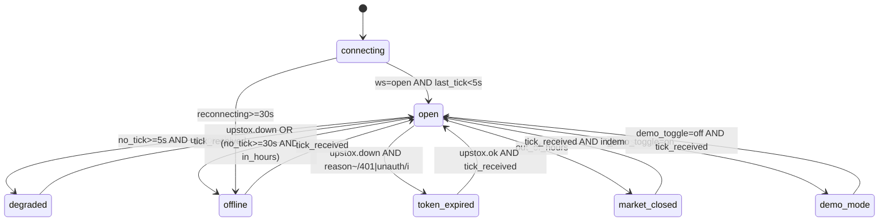
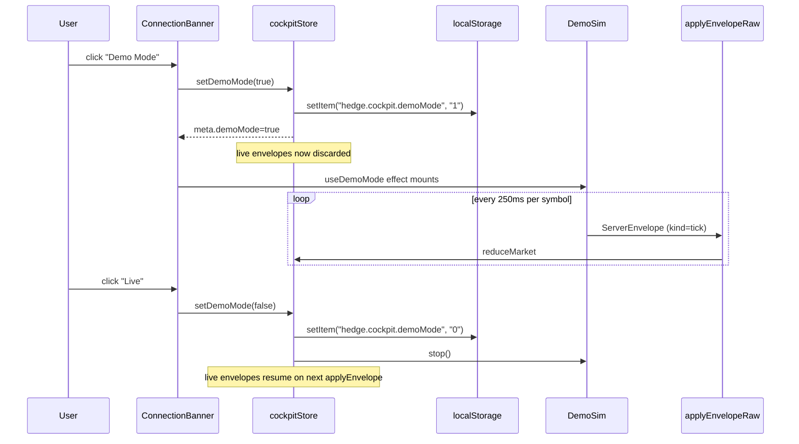
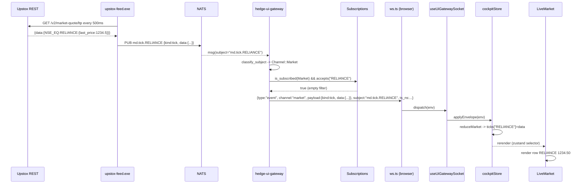

# Design Document

## Overview

The cockpit, gateway, and Upstox feed are all working in isolation. The end-to-end pipe is broken at three places that are individually small and collectively explain every symptom in the requirements doc:

1. **Wire-format mismatch on the cockpit → gateway subscribe message.** `ui/src/lib/ws.ts` sends `{op: "subscribe", channel, symbols}`. The gateway in `crates/hedge-ui-gateway/src/protocol.rs` deserialises with `#[serde(tag = "type", rename_all = "snake_case")]` and reads the topic filter from `topics`. The cockpit's frames fail to deserialise into `ClientMsg::Subscribe`, the dispatcher never calls `Subscriptions::subscribe`, and `handle_nats_event` short-circuits at `if !self.subs.is_subscribed(ch) { continue }`. Nothing reaches the cockpit.
2. **Symbol filter shape mismatch.** Even with the wire format fixed, `useUiGatewaySocket` would forward the `HEDGE_UPSTOX_INSTRUMENTS` ISIN-form keys (`NSE_EQ|INE002A01018`) as topic filters. `Subscriptions::accepts` matches against `topic_suffix`, which `dispatcher.rs` derives as the last segment of the NATS subject — `RELIANCE`, not `NSE_EQ|INE002A01018`. Every event gets dropped at the per-connection filter.
3. **`ServerEnvelope` shape drift between cockpit type and gateway wire.** Cockpit's `ServerEnvelope` declares `{channel, payload, ts_ns?, subject?}` but the gateway's `ServerMsg::Event` only emits `{type: "event", channel, payload}`. `reduceSignalsChannel` branches on `env.subject?.startsWith("ai.priority.changed")` — that branch is unreachable today. The gateway must either include `subject` in the envelope or the cockpit must stop relying on it.

Once those three drops are closed, the LiveMarket panel will populate within a tick or two of `start.bat` finishing during NSE_Trading_Hours. The remaining requirements (Connection_Banner, Empty_State family, Demo_Mode simulator, IST log timestamps, `start.bat` cleanup, freshness indicators) are additive surface work that does not touch the hot path.

This design is a fix plan, not a rewrite. No new crates. No new transports. No protocol redesign. Every change is the minimum needed to make the existing pieces talk.

## Architecture

```mermaid
flowchart LR
    subgraph Native["Native binaries (start.bat)"]
        upstox[upstox-feed.exe<br/>REST poll 500ms / 2s]
        nats[(NATS<br/>md.tick.SYMBOL<br/>md.book.SYMBOL<br/>md.connection.upstox)]
        gw[hedge-ui-gateway.exe<br/>:8088/ws]
    end

    subgraph Browser["Browser (Vite dev :5173)"]
        ws[lib/ws.ts<br/>GatewayClient]
        hook[hooks/useUiGatewaySocket.ts]
        store[(store/cockpitStore.ts<br/>market.ticks[symbol])]
        panel[panels/LiveMarket.tsx]
        sim[lib/demoSim.ts<br/>Demo_Mode simulator]
        banner[components/ConnectionBanner.tsx]
    end

    upstox -- publish --> nats
    nats -- subscribe md.* --> gw
    gw -- ServerEnvelope JSON --> ws
    ws -- onmessage --> hook
    hook -- applyEnvelope --> store
    store -- selector --> panel
    sim -. when active .-> store
    store -- meta.feedStatus --> banner
```

Existing pieces stay where they are. The only new files are `ui/src/components/EmptyState.tsx`, `ui/src/components/ConnectionBanner.tsx`, `ui/src/lib/demoSim.ts`, and `ui/src/lib/feedStatus.ts`. Every other change is in-place.

## Components and Interfaces

### 1. Wire-format alignment (root cause #1, R1.1, R1.7, R10.2)

**File: `ui/src/lib/ws.ts`**

Change `ClientMessage` to use the gateway's `type`-tagged shape, and rename `symbols` → `topics`:

```typescript
// types/control.ts (or local to ws.ts)
type ClientMessage =
  | { type: "subscribe"; channel: ChannelId; topics?: string[]; request_id?: string }
  | { type: "unsubscribe"; channel: ChannelId; request_id?: string }
  | { type: "intent"; kind: IntentKind; payload: unknown; request_id?: string }
  | { type: "ping"; request_id?: string };
```

`sendSubscribe(channel)` becomes:

```typescript
private sendSubscribe(channel: ChannelId): void {
  const useTopics =
    (channel === "market" || channel === "orderflow") && this.symbols && this.symbols.length > 0
      ? this.symbols
      : undefined;
  this.send({ type: "subscribe", channel, ...(useTopics ? { topics: useTopics } : {}) });
}
```

The `intent` send becomes `{type: "intent", kind, payload}` per `IntentKind` in `protocol.rs`. The `unsubscribe` send becomes `{type: "unsubscribe", channel}`.

`handleFrame` reads `env.type`. If `type === "event"`, route by `env.channel` to handlers (existing behaviour). If `type === "ack" | "pong" | "mode" | "error"`, emit on a new internal `meta` event sink — the cockpit only needs `mode { high_volatility }` today (already consumed by `useHighVolMode`'s in-store mirror). For `error { code, message }`, log once at warn level.

### 2. Subscribe with no topic filter (root cause #2, R1.7)

**File: `ui/src/hooks/useUiGatewaySocket.ts`**

Today the hook accepts a `symbols?: string[]` argument and forwards it to `GatewayClient`. The trader's intent is "show every symbol the feed publishes", so the default must be **no topic filter** (empty `topics[]` ⇒ accept all on the gateway side).

The hook stays as-is for the API; the change is at the call-site in `App.tsx` — pass no `symbols`, so `subscribe` frames go out without `topics`. `Subscriptions::accepts` then short-circuits at `Some(set) if set.is_empty() => true`.

When the trader later wants per-symbol filtering, they will pass trading symbols (`RELIANCE`, `INFY`) through `setSymbols`, not ISIN keys. Document that contract in a JSDoc on `setSymbols`.

### 3. Envelope shape & subject propagation (root cause #3, R1.6, R3.6, signal routing)

**File: `crates/hedge-ui-gateway/src/protocol.rs`**

Extend `ServerMsg::Event` to carry the originating subject and gateway timestamp:

```rust
ServerMsg::Event {
    channel: Channel,
    payload: Value,
    #[serde(skip_serializing_if = "Option::is_none")]
    subject: Option<String>,
    ts_ns: u128,
}
```

**File: `crates/hedge-ui-gateway/src/dispatcher.rs`**

In `handle_nats_event`, populate `subject = Some(ev.subject.clone())` and `ts_ns = ev.ts_ns` when constructing each `ServerMsg::Event`. This is the field `reduceSignalsChannel` already reads in cockpit code.

**File: `ui/src/types/envelope.ts`**

Make `subject` and `ts_ns` reflect what the gateway now sends:

```typescript
export interface ServerEnvelope<P = unknown> {
  type: "event";
  channel: ChannelId;
  payload: P;
  subject?: string;
  ts_ns?: number;
}
```

The cockpit's reducers already cope with both being optional; this just makes the optional path live.

### 4. Cockpit `applyEnvelope` schema validation (R1.6)

**File: `ui/src/store/cockpitStore.ts`**

`reduceMarket` currently trusts the discriminated union. Add a guard so a malformed `{kind:"tick", data: {…}}` does not throw inside React's render tree:

```typescript
function reduceMarket(prev: MarketSlice, ev: MarketEvent): MarketSlice {
  if (!ev || typeof ev.kind !== "string") {
    console.warn("[market] dropping malformed envelope", ev);
    return prev;
  }
  switch (ev.kind) {
    case "tick": {
      const t = ev.data as Tick | undefined;
      if (!t || typeof t.symbol !== "string" || typeof t.ltp_paise !== "number") {
        console.warn("[market] dropping invalid tick", t);
        return prev;
      }
      return { ...prev, ticks: { ...prev.ticks, [t.symbol]: t } };
    }
    // …same shape for "book", "oi", "connection"…
  }
}
```

A single warn-level log per drop, no recurring noise (R5.5).

### 5. FeedStatus state machine (R2.1–R2.9, R10)

**New file: `ui/src/lib/feedStatus.ts`**

Pure function over the inputs the cockpit already has:

```typescript
export type FeedStatus =
  | "open"
  | "degraded"
  | "offline"
  | "token_expired"
  | "market_closed"
  | "demo_mode";

export interface FeedStatusInputs {
  gatewayState: "connecting" | "open" | "reconnecting" | "closed";
  /** ms timestamp of most recent md.tick.* applied to the store. */
  lastTickAt: number | undefined;
  /** Most recent ConnectionStatus for "upstox". */
  upstox: { status: "ok" | "degraded" | "down"; reason?: string } | undefined;
  /** Local IST clock in ms-since-epoch (Date.now() suffices). */
  nowMs: number;
  /** True iff Demo_Mode is active. */
  demoMode: boolean;
  /** ms duration the socket has been in `reconnecting` state. */
  reconnectingForMs: number;
}

export function deriveFeedStatus(i: FeedStatusInputs): FeedStatus { /* ... */ }
```

The function follows the EARS rules verbatim. `demo_mode` short-circuits everything (R2.7). `token_expired` requires an explicit 401-bearing ConnectionStatus (R9.5) — never the absence of ticks. `market_closed` is computed from `nowMs` against `09:15`–`15:30` Asia/Kolkata using `Intl.DateTimeFormat("en-IN", {timeZone: "Asia/Kolkata"})` to get the wall-clock IST hour.



**File: `ui/src/store/cockpitStore.ts`**

Add to `GatewayMeta`:

```typescript
export interface GatewayMeta {
  state: "connecting" | "open" | "reconnecting" | "closed";
  lastSeenByChannel: Partial<Record<ChannelId, number>>;
  /** ms timestamp of the most recent md.tick.* envelope applied. */
  lastTickAt?: number;
  /** ms timestamp of the last gateway state transition. */
  stateChangedAt: number;
  /** Resolved by feedStatus selector — never written directly. */
  feedStatus: FeedStatus;
  /** Detail string for the Connection_Banner. */
  feedStatusDetail: string;
  demoMode: boolean;
}
```

Stamp `lastTickAt = Date.now()` inside `reduceMarket` for the `tick` arm. Recompute `feedStatus` and `feedStatusDetail` on every `applyEnvelope`, on `setGatewayState`, and on a 1 Hz interval owned by `useFeedStatusTicker` (so stale-tick transitions fire even when no envelopes arrive).

### 6. Connection_Banner (R2, R8.1, R9.2)

**New file: `ui/src/components/ConnectionBanner.tsx`**

```tsx
export function ConnectionBanner(): JSX.Element {
  const { feedStatus, feedStatusDetail, demoMode } = useCockpitStore((s) => s.meta);
  const setDemoMode = useCockpitStore((s) => s.setDemoMode);
  // tone map: open=ok, degraded=warn, offline=danger, token_expired=danger,
  // market_closed=muted, demo_mode=accent
  return (/* one-line pill + detail + Demo_Mode toggle button */);
}
```

Rendered in `App.tsx` directly under the existing header, replacing the inline `<span className={stateTone}>{gatewayState}</span>` text. The header `gatewayState` line stays but loses the colour coding (banner owns it).

### 7. EmptyState component family (R3, R5.1–R5.5)

**New file: `ui/src/components/EmptyState.tsx`**

```tsx
export type EmptyStateReason =
  | "feed_offline"
  | "market_closed"
  | "token_expired"
  | "engine_not_implemented"
  | "no_events_yet"
  | "demo_mode";

interface EmptyStateProps {
  reason: EmptyStateReason;
  /** e.g. "of.heatmap.*" — required for engine_not_implemented. */
  subjectGroup?: string;
  /** Override the default copy. */
  detail?: string;
}

export function EmptyState({ reason, subjectGroup, detail }: EmptyStateProps): JSX.Element { /* ... */ }
```

Default copy table:

| reason                    | text                                                                |
|---------------------------|---------------------------------------------------------------------|
| `feed_offline`            | `Feed offline · check upstox-feed window`                           |
| `market_closed`           | `Market closed · NSE 09:15–15:30 IST`                               |
| `token_expired`           | `Upstox token expired · refresh HEDGE_UPSTOX_ACCESS_TOKEN in .env`  |
| `engine_not_implemented`  | `Engine not running yet · publishes on {subjectGroup}`              |
| `no_events_yet`           | `No events yet`                                                     |
| `demo_mode`               | `Demo mode · simulated data`                                        |

Every panel gets a small selector that derives the reason from `feedStatus`, the panel's slice emptiness, and a per-panel `subjectGroup` constant. The `Awaiting first md.tick.* frame …` literal is removed everywhere (R3.8).

**File: `ui/src/panels/LiveMarket.tsx`** (replaces the placeholder branch):

```tsx
{symbols.length === 0 ? (
  <EmptyState
    reason={emptyReasonFor("live_data", feedStatus, demoMode)}
    subjectGroup="md.tick.*"
  />
) : ( /* table */ )}
```

`emptyReasonFor` lives in `ui/src/lib/emptyReason.ts` and follows R3.3–R3.7 / R3.10 verbatim. Engine_Backed_Panel mapping (`OrderflowHeatmap` → `of.heatmap.*`, `LatencyDashboard` → `obs.latency.*`, etc.) lives next to it.

### 8. Demo_Mode simulator (R8)

**New file: `ui/src/lib/demoSim.ts`**

Deterministic price walk for a fixed seed (R8.8). 5 NSE symbols, 4 Hz tick cadence, 1 Hz book cadence. Drives the store via the same `applyEnvelope` path that real envelopes use, so reducer regressions surface in demo runs:

```typescript
const DEMO_SYMBOLS = ["RELIANCE", "INFY", "SBIN", "HDFCBANK", "ICICIBANK"];
const SEED = 0xC0CCFEED;

export class DemoSim {
  start(apply: (env: ServerEnvelope) => void): () => void {
    // mulberry32 RNG seeded from SEED, deterministic per symbol
    // emits {type:"event", channel:"market", payload:{kind:"tick", data:{...}}, subject: `md.tick.${sym}`}
    // returns stop function
  }
}
```

**File: `ui/src/store/cockpitStore.ts`**

Add a `demoMode` slice with `setDemoMode(active: boolean)`. Persist to `localStorage["hedge.cockpit.demoMode"]` (R8.5). While active, `applyEnvelope` short-circuits for data channels (R8.3, R8.9) — only meta (`gatewayState`) and `control` ack/error frames are processed.

```typescript
applyEnvelope: (env) => set((s) => {
  if (s.meta.demoMode && DATA_CHANNELS.has(env.channel)) {
    return s; // discard, no buffer
  }
  // … existing dispatch …
})
```

Where `DATA_CHANNELS = new Set(["market","orderflow","signals","risk","exec","news","psych","latency","replay","alerts"])`.

A dedicated hook `useDemoMode()` mounts/unmounts the simulator based on the slice:

```typescript
useEffect(() => {
  if (!demoMode) return;
  const stop = new DemoSim().start((env) => useCockpitStore.getState().applyEnvelopeRaw(env));
  return stop;
}, [demoMode]);
```

`applyEnvelopeRaw` is a private store action that bypasses the demo guard (so the simulator's own envelopes always apply). It is **not** exposed in the public store interface — only `useDemoMode` imports it.

A passive prompt component `DemoModePrompt` watches `(now outside trading hours) AND (no tick in 60s) AND (user hasn't dismissed in this session)` and offers to enable Demo_Mode (R8.6). Dismissal is session-scoped (`sessionStorage`).



### 9. Live tick path — sequence diagram (R1, R4)



### 10. IST timestamps (R6)

**File: `crates/hedge-obs/src/logging.rs`** (add a public helper)

```rust
use chrono::{FixedOffset, Utc};
use tracing_subscriber::fmt::time::FormatTime;

pub struct IstTime;
impl FormatTime for IstTime {
    fn format_time(&self, w: &mut tracing_subscriber::fmt::format::Writer<'_>) -> std::fmt::Result {
        let ist = Utc::now().with_timezone(&FixedOffset::east_opt(5 * 3600 + 30 * 60).unwrap());
        write!(w, "{}", ist.format("%Y-%m-%dT%H:%M:%S%.3f%:z"))
    }
}

pub fn init_ist_tracing() {
    use tracing_subscriber::{fmt, prelude::*, EnvFilter};
    let filter = EnvFilter::try_from_default_env().unwrap_or_else(|_| EnvFilter::new("info"));
    let _ = tracing_subscriber::registry()
        .with(filter)
        .with(fmt::layer().with_timer(IstTime).with_target(true))
        .try_init();
}
```

Bin entry points opt in. **`crates/hedge-ui-gateway/src/main.rs`**: replace `init_tracing()` body with `hedge_obs::logging::init_ist_tracing()`. **`crates/hedge-market-data/src/bin/upstox_feed.rs`**: replace `tracing_subscriber::fmt()…init()` with the same call. Repeat for `hedge-orderflow`, `hedge-features`, `hedge-signals`, `hedge-risk`, `hedge-exec`, `hedge-position`, `hedge-supervisor`, `hedge-session`.

**Browser console (R6.3):** monkey-patch `console.log/info/warn/error` once in `ui/src/main.tsx`:

```typescript
const origLog = console.log;
const istNow = () =>
  new Intl.DateTimeFormat("en-IN", {
    timeZone: "Asia/Kolkata", hour12: false,
    year: "numeric", month: "2-digit", day: "2-digit",
    hour: "2-digit", minute: "2-digit", second: "2-digit", fractionalSecondDigits: 3,
  }).format(new Date()) + "+05:30";
console.log = (...a) => origLog(`[${istNow()}]`, ...a);
// repeat for info/warn/error
```

### 11. `start.bat` cleanup (R7)

**File: `start.bat`**

- Drop `start "HEDGE-replay" cmd /k target\release\hedge-replay.exe` from step 3 and remove its line from the dashboards summary.
- Add a banner comment `REM hedge-replay is an inspector CLI: target\release\hedge-replay.exe replay list` next to the deletion.
- Set `set "TZ=Asia/Kolkata"` before the first `start` call (already present, keep) — also export it as a process env (`setx` not needed; child processes inherit).
- Token guard: when `HEDGE_UPSTOX_ACCESS_TOKEN` is empty, `goto :skip_upstox` instead of starting the feed; print a one-line warning. Banner summary then renders `Upstox Feed: NOT STARTED — set HEDGE_UPSTOX_ACCESS_TOKEN in .env`.
- Replace the giant final summary block with a compact ordered table that lists each window title, lifetime (`long-running` / `one-shot`), and dashboard URL (where applicable). Add a footer line: `If a window says "exited", check it for the error before re-running start.bat.`
- 3-second exit detection: after each `start "HEDGE-…" cmd /k …` call, schedule a `tasklist /v /fi "WINDOWTITLE eq HEDGE-…*"` check after 3 s; if the title is gone, print `[WARN] HEDGE-… exited within 3s — see its console`. Implementation uses a small `:check_alive` subroutine called via `call :check_alive HEDGE-market-data 3`.

### 12. Vite + WebSocket reconnect resilience (R10)

`GatewayClient` already replays subscriptions on `onopen` (line `for (const channel of this.subscribed) this.sendSubscribe(channel);`). The fix in §1 makes that replay land. Add one piece: track `reconnectingSinceMs` in `meta.stateChangedAt`, and tick the `feedStatus` ticker once per second so the 30 s `reconnecting → offline` rule (R10.4) fires.

## Data Models

### Cockpit-side

```typescript
export type FeedStatus =
  | "open" | "degraded" | "offline"
  | "token_expired" | "market_closed" | "demo_mode";

export type EmptyStateReason =
  | "feed_offline" | "market_closed" | "token_expired"
  | "engine_not_implemented" | "no_events_yet" | "demo_mode";

export interface ServerEnvelope<P = unknown> {
  type: "event";
  channel: ChannelId;
  payload: P;
  subject?: string;
  ts_ns?: number;
}

export type ClientMessage =
  | { type: "subscribe"; channel: ChannelId; topics?: string[]; request_id?: string }
  | { type: "unsubscribe"; channel: ChannelId; request_id?: string }
  | { type: "intent"; kind: IntentKind; payload: unknown; request_id?: string }
  | { type: "ping"; request_id?: string };
```

### Gateway-side (Rust, additive)

```rust
ServerMsg::Event {
    channel: Channel,
    payload: Value,
    #[serde(skip_serializing_if = "Option::is_none")]
    subject: Option<String>,
    ts_ns: u128,
}
```

### Demo simulator output

Identical shape to live envelopes, including `subject = "md.tick.<SYMBOL>"`, so reducers cannot distinguish demo from live (this is the point — demo is a regression harness for the reducer).

<!-- prework will be inserted next; correctness properties follow -->


## Correctness Properties

*A property is a characteristic or behavior that should hold true across all valid executions of a system — essentially, a formal statement about what the system should do. Properties serve as the bridge between human-readable specifications and machine-verifiable correctness guarantees.*

The cockpit's market reducer, the FeedStatus selector, the EmptyState reason mapper, and the demo simulator are pure functions over typed inputs — exactly the shape PBT validates well. Gateway subscription routing (`Subscriptions::accepts`, `classify_subject`) is already covered by Rust unit tests in the existing crate; this section adds cockpit-side properties.

### Property 1: Tick/Book reducer correctness

*For any* valid `Market_Event` of `kind="tick"` with a well-formed `Tick` payload, after `useCockpitStore.getState().applyEnvelope({type:"event", channel:"market", payload: ev})` the store satisfies `market.ticks[ev.data.symbol].ltp_paise === ev.data.ltp_paise`, `bid_paise === ev.data.bid_paise`, `ask_paise === ev.data.ask_paise`, and `ts_recv_ns === ev.data.ts_recv_ns`. The same holds for `kind="book"` against `bid_paise`/`ask_paise`/`ts_ns`.

**Validates: Requirements 1.1, 1.2, 4.1**

### Property 2: Reducer robustness under bad input

*For any* envelope (malformed `payload`, unrecognised `kind`, or any envelope while `meta.demoMode === true`, or any envelope while `meta.state === "reconnecting"`), applying it leaves every cockpit-store slice in a structurally valid state — `applyEnvelope` does not throw, does not delete prior keys from `market.ticks`, and does not change keys that the envelope's `data.symbol` does not address.

**Validates: Requirements 1.6, 8.3, 8.9, 10.1**

### Property 3: Zero-guard for book updates

*For any* prior `Tick` for a symbol with `bid_paise > 0` and `ask_paise > 0`, applying a `Market_Event` of `kind="book"` whose `data.bid_paise === 0` leaves `market.ticks[symbol].bid_paise` unchanged; applying one with `data.ask_paise === 0` leaves `market.ticks[symbol].ask_paise` unchanged.

**Validates: Requirements 4.4**

### Property 4: FeedStatus determinism

*For any* `FeedStatusInputs`, `deriveFeedStatus(i)` returns exactly one value from the union `"open" | "degraded" | "offline" | "token_expired" | "market_closed" | "demo_mode"`, and the returned value matches the spec truth table:

- `i.demoMode === true` ⇒ `"demo_mode"`
- else `i.upstox?.status === "down" && /401|unauthorized/i.test(i.upstox.reason ?? "")` ⇒ `"token_expired"`
- else `i.gatewayState === "reconnecting" && i.reconnectingForMs >= 30_000` ⇒ `"offline"`
- else `i.upstox?.status === "down" || (now − lastTickAt >= 30_000 && inHours(i.nowMs))` ⇒ `"offline"`
- else `outOfHours(i.nowMs)` ⇒ `"market_closed"`
- else `now − lastTickAt >= 5_000` ⇒ `"degraded"`
- else ⇒ `"open"`

**Validates: Requirements 2.1, 2.2, 2.3, 2.4, 2.5, 2.6, 2.7, 9.5, 10.4, 10.5**

### Property 5: EmptyState reason mapping

*For any* `(panelKind, feedStatus, hasData, hasPublisher)` tuple, `emptyReasonFor` returns one of the six `EmptyStateReason` values and matches the spec rules: live-data panels with `feedStatus ∈ {offline, market_closed, token_expired}` map to the matching reason; engine-backed panels with `hasPublisher === false` map to `"engine_not_implemented"` regardless of `feedStatus` (R3.10); the demo case wins when active; otherwise the result is `"no_events_yet"`. The rendered `<EmptyState>` output never contains the literal substring `"Awaiting first md.tick.* frame"`.

**Validates: Requirements 3.1, 3.2, 3.3, 3.4, 3.5, 3.6, 3.7, 3.8, 3.10, 4.3, 5.2, 5.3, 5.4**

### Property 6: Demo simulator determinism and cadence

*For any* fixed seed `S` and any duration `N` seconds (`N ≥ 1`), two independent runs of `DemoSim` seeded with `S` over `N` seconds produce byte-identical envelope sequences. Within any such run, every one of the 5 demo symbols emits at least `N` `kind="tick"` envelopes (≥ 1 Hz per symbol).

**Validates: Requirements 8.2, 8.8**

### Property 7: IST timestamp formatter

*For any* call to the `IstTime` formatter (`crates/hedge-obs/src/logging.rs`), the emitted string matches the regex `^\d{4}-\d{2}-\d{2}T\d{2}:\d{2}:\d{2}\.\d{3}\+05:30$`. The same regex match holds for the browser-side `console.log` IST prefix.

**Validates: Requirements 6.1, 6.2, 6.3, 6.6**

### Property 8: Freshness color mapping

*For any* `ageMs ≥ 0` and any `feedStatus`, the freshness color class returned by `freshnessTone(ageMs, feedStatus)` is `"warn"` iff `feedStatus === "open" && ageMs > 10_000 && ageMs ≤ 60_000`, `"danger"` iff `feedStatus === "open" && ageMs > 60_000`, and `"muted"` otherwise.

**Validates: Requirements 11.2, 11.3**

### Property 9: Engine_Not_Implemented log throttling

*For any* number `N ≥ 1` of renders of an engine-backed panel that has been continuously in `engine_not_implemented` state, `console.warn` is invoked at most once across the entire session for that panel.

**Validates: Requirements 5.5**

### Property 10: Demo prompt visibility predicate

*For any* `(inHours, lastTickAgoMs, dismissedThisSession)` tuple, the demo prompt is visible iff `inHours === false && lastTickAgoMs > 60_000 && dismissedThisSession === false`. The predicate is a pure conjunction of the three conditions.

**Validates: Requirements 8.6**

## Error Handling

| Surface | Error | Behaviour |
|---|---|---|
| `GatewayClient.handleFrame` | non-JSON or unknown `type` field | log once at warn, do not crash, do not reset socket |
| `GatewayClient` send | `socket.readyState !== OPEN` | return `false`, caller (subscribe) will retry on next `onopen` |
| `applyEnvelope` | malformed payload | log once at warn naming the violating field, leave slices unchanged (R1.6) |
| `applyEnvelope` | unknown `channel` | ignore silently — gateway will not send unknown channels in production |
| `deriveFeedStatus` | missing `upstox` connection event | falls through to the time/tick branches; never crashes |
| `DemoSim.start` | called twice without intervening stop | second call is a no-op, returns the original stop fn |
| `upstox-feed.exe` | 401 from probe | publish `md.connection.upstox` with `status="down"`, `reason="401 unauthorized: …"`; exit non-zero so supervisor logs it |
| `upstox-feed.exe` | persistent fetch errors | publish `md.connection.upstox` with `status="degraded"` after 1 error, `"down"` after 5; back off to 2 s polling |
| `hedge-ui-gateway` `ServerMsg::Event` send | broadcast lag | `tokio::sync::broadcast` returns `Lagged(n)` — log warn with skipped count, continue (cockpit will resync from next event) |
| `hedge-ui-gateway` NATS `subscribe` failure | startup | abort with context — operator must see this in the gateway window |

## Testing Strategy

PBT applies to the cockpit reducer, the feed-status selector, the empty-reason mapper, the demo simulator, and the IST formatter. It does **not** apply to `start.bat` shell logic, the upstox-feed REST integration, or the per-panel render layout — those use targeted example or smoke tests.

**Library**: `fast-check` for cockpit (TypeScript, already a Vitest-friendly choice); `proptest` for the IST formatter in Rust (already in workspace dev-dependencies). Each property test runs **at least 100 iterations**.

Each property test carries a comment in the form:

```typescript
// Feature: live-cockpit-data, Property 1: For any valid Market_Event of kind=tick…
```

### Cockpit unit tests (Vitest + fast-check)

| File | Covers |
|---|---|
| `ui/src/store/__tests__/marketReducer.property.test.ts` | P1, P2, P3 |
| `ui/src/lib/__tests__/feedStatus.property.test.ts` | P4 |
| `ui/src/lib/__tests__/emptyReason.property.test.ts` | P5 |
| `ui/src/lib/__tests__/demoSim.property.test.ts` | P6 |
| `ui/src/lib/__tests__/freshness.property.test.ts` | P8 |
| `ui/src/lib/__tests__/demoPrompt.property.test.ts` | P10 |
| `ui/src/components/__tests__/EmptyState.test.tsx` | example (R3.8 literal absence) |

Each property file imports `fast-check` and uses `fc.assert(fc.property(arbs, predicate), { numRuns: 100 })`. Arbitraries:

- `arbTick = fc.record({symbol: fc.constantFrom("RELIANCE","INFY","SBIN","HDFCBANK","ICICIBANK"), ltp_paise: fc.integer({min:1, max:1_000_000_00}), bid_paise: fc.integer(...), ask_paise: fc.integer(...), ts_recv_ns: fc.integer({min:0})})`
- `arbFeedStatusInputs = fc.record({gatewayState, lastTickAt, upstox, nowMs, demoMode, reconnectingForMs})`
- `arbBookEvent`, `arbMalformedEnvelope`, `arbDemoSeed`, etc.

### Cockpit integration test (R1.3, R4.2)

**File: `ui/src/__tests__/liveMarket.integration.test.tsx`** (Vitest + jsdom + Testing Library)

```typescript
// Feature: live-cockpit-data, Integration: tick frames render LiveMarket rows
import { render, screen, waitFor } from "@testing-library/react";
import { MockWebSocket, installMockWs } from "../testUtils/mockWs";
import App from "../App";

test("tick envelope renders a LiveMarket row within 10 seconds", async () => {
  const ws = installMockWs();
  render(<App />);
  ws.simulateOpen();
  ws.simulateMessage({
    type: "event",
    channel: "market",
    payload: { kind: "tick", data: { symbol: "RELIANCE", ltp_paise: 123450, bid_paise: 123440, ask_paise: 123460, ts_recv_ns: 0 } },
    subject: "md.tick.RELIANCE",
    ts_ns: 0,
  });
  await waitFor(() => expect(screen.getByText("RELIANCE")).toBeInTheDocument(), { timeout: 10_000 });
  // Placeholder must be gone (R1.5, R3.8)
  expect(screen.queryByText(/Awaiting first md\.tick/)).toBeNull();
});

test("book envelope updates bid/ask without overwriting LTP", async () => {
  // … same harness, send a tick then a book; assert ltp unchanged, bid/ask updated …
});
```

`MockWebSocket` is a tiny in-test class assigned to `globalThis.WebSocket` that exposes `simulateOpen()`, `simulateMessage(env)`, and records `send()` calls so the test can assert subscribe frames went out in the gateway's `{type, channel, topics}` shape (R1.7).

### Rust property test (P7)

**File: `crates/hedge-obs/src/logging.rs`** (in `#[cfg(test)] mod tests`):

```rust
proptest! {
    #[test]
    fn ist_formatter_emits_plus_offset(_seed in any::<u64>()) {
        let mut buf = String::new();
        // … format with IstTime …
        let re = regex::Regex::new(r"^\d{4}-\d{2}-\d{2}T\d{2}:\d{2}:\d{2}\.\d{3}\+05:30$").unwrap();
        prop_assert!(re.is_match(&buf));
    }
}
```

### Rust integration test (R9.1)

**File: `crates/hedge-market-data/tests/upstox_probe.rs`** — uses `wiremock` to serve a 401 response, calls `probe_token`, asserts the published `md.connection.upstox` payload contains `"reason"` with the literal `"401 unauthorized"`.

### Smoke / static tests

A small Vitest file `ui/src/__tests__/startbat.static.test.ts` reads `start.bat` from disk and asserts:

- the `start "HEDGE-replay"` line is absent (R7.2)
- the `REM hedge-replay is an inspector CLI` comment is present (R7.3)
- `set "TZ=Asia/Kolkata"` appears before any `start "HEDGE-…"` call (R6.4)
- `set "VITE_HEDGE_GATEWAY_URL=ws://127.0.0.1:8088/ws"` is present (R7.6)
- the `:check_alive` subroutine name appears (R7.8)
- the launch order regex matches: docker → session → supervisor → upstox-feed → orderflow → features → signals → risk → exec → position → ui-gateway → ui (R7.1)

Static checks are cheap (one disk read, one Vitest file) and catch regressions in `start.bat` without spinning up Docker.

### Test execution

Cockpit tests run via `npm run test --prefix ui -- --run`. Rust tests run via `cargo test -p hedge-obs -p hedge-market-data -p hedge-ui-gateway`. Both are wired into the existing CI workflow `.github/workflows/nightly.yml` (extended by adding the cockpit step).

The integration test runs in jsdom under Vitest's default executor; no real browser is needed. Total wall-clock for the new test surface should stay under 30 s on a developer laptop and under 90 s in CI.
