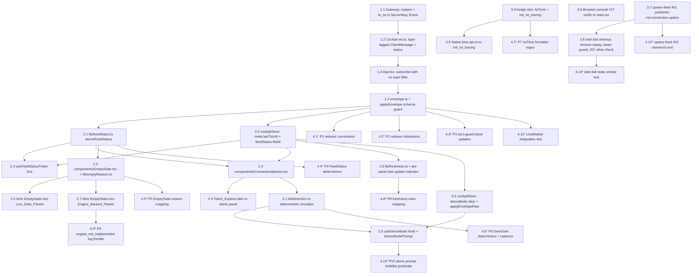

# Implementation Plan: live-cockpit-data

## Overview

The cockpit, gateway, and Upstox feed already work in isolation. This plan closes the three wire-format mismatches that drop every tick on the floor (design §1, §2, §3), then adds the operational surface — FeedStatus, ConnectionBanner, panel-specific empty states, Demo_Mode, IST timestamps, and `start.bat` cleanup — and finally locks the reducer, selector, and simulator behaviour with property tests.

Tasks are ordered so that **stopping at the end of any phase leaves a strictly more functional cockpit than before**. Phase 1 alone is enough to make the LiveMarket panel populate during NSE_Trading_Hours.

## Task Flow (visual)



---

## Tasks

### Phase 1 — Make ticks visible in the UI

The bare minimum. After this phase, during NSE_Trading_Hours the LiveMarket panel populates within a tick or two of `start.bat` finishing. Each task in order produces a visibly improved cockpit on its own.

- [ ] 1.1 Gateway: include `subject` and `ts_ns` on `ServerMsg::Event` — extend the enum variant and populate from each NATS event so cockpit reducers can route by subject — files: `crates/hedge-ui-gateway/src/protocol.rs`, `crates/hedge-ui-gateway/src/dispatcher.rs` — references: REQ-1.6, REQ-3.6, REQ-10.2

- [ ] 1.2 Cockpit ws.ts: switch `ClientMessage` to type-tagged shape and rename `symbols → topics` — change `subscribe`/`unsubscribe`/`intent`/`ping` send shapes to match gateway's `#[serde(tag = "type")]` discriminator; have `handleFrame` read `env.type` and route `event` envelopes by `channel`, log `error/ack/pong/mode` once at info — files: `ui/src/lib/ws.ts`, `ui/src/types/envelope.ts` — references: REQ-1.1, REQ-1.7, REQ-10.2

- [ ] 1.3 App.tsx: subscribe with no topic filter so every published symbol is delivered — remove the ISIN-form `HEDGE_UPSTOX_INSTRUMENTS` symbol list from the `useUiGatewaySocket` call site; document on `setSymbols` JSDoc that filters must be trading symbols (`RELIANCE`), not ISIN keys — files: `ui/src/App.tsx`, `ui/src/hooks/useUiGatewaySocket.ts` — references: REQ-1.7, REQ-1.3

- [ ] 1.4 Cockpit `applyEnvelope` schema guard + `ServerEnvelope` shape alignment — accept `{type, channel, payload, subject?, ts_ns?}` exactly as the gateway now sends; in `reduceMarket` drop malformed `tick`/`book`/`oi`/`connection` payloads with a single warn log per drop and leave prior slices untouched — files: `ui/src/types/envelope.ts`, `ui/src/store/cockpitStore.ts` — references: REQ-1.1, REQ-1.2, REQ-1.5, REQ-1.6, REQ-4.1, REQ-4.4

**Phase 1 checkpoint** — During NSE_Trading_Hours, run `start.bat`, open `http://localhost:5173`, and confirm the LiveMarket panel shows ticking rows for at least one symbol within 10 seconds of `ws gateway: open`. The placeholder `Awaiting first md.tick.* frame …` should be gone.

---

## Phase 2 — FeedStatus, Connection_Banner, and panel-specific Empty states

After Phase 1 the dashboard works during market hours but is silent and ambiguous outside them. Phase 2 adds the status surface so the trader can tell at a glance whether the cockpit is live, degraded, offline, or just outside trading hours.

- [ ] 2.1 `lib/feedStatus.ts`: `deriveFeedStatus(inputs)` pure function — implement the EARS truth table from design §5 (demo wins → 401 → 30s reconnecting → upstox down or 30s no-tick in-hours → out-of-hours → 5s no-tick → open); compute IST hour with `Intl.DateTimeFormat("en-IN", {timeZone: "Asia/Kolkata"})` — files: `ui/src/lib/feedStatus.ts` — references: REQ-2.1, REQ-2.2, REQ-2.3, REQ-2.4, REQ-2.5, REQ-2.6, REQ-2.7, REQ-9.5, REQ-10.4, REQ-10.5 — properties: P-4

- [ ] 2.2 `cockpitStore`: add `meta.lastTickAt`, `meta.stateChangedAt`, `meta.feedStatus`, `meta.feedStatusDetail`, `meta.demoMode` fields — stamp `lastTickAt = Date.now()` inside `reduceMarket` for the `tick` arm; recompute `feedStatus`/`feedStatusDetail` on every `applyEnvelope` and on `setGatewayState` — files: `ui/src/store/cockpitStore.ts` — references: REQ-1.1, REQ-2.1, REQ-2.8, REQ-10.1, REQ-10.3, REQ-11.1

- [ ] 2.3 `hooks/useFeedStatusTicker.ts`: 1 Hz interval that recomputes `feedStatus` even when no envelopes arrive — drives the 5s `degraded`, 30s `offline`, and 30s reconnecting transitions; mounted once at the top of `App.tsx` — files: `ui/src/hooks/useFeedStatusTicker.ts`, `ui/src/App.tsx` — references: REQ-2.3, REQ-2.4, REQ-10.4, REQ-11.4

- [ ] 2.4 `components/ConnectionBanner.tsx`: one-line pill with tone, detail, and Demo_Mode toggle — render under the existing header; tone map `open=ok / degraded=warn / offline=danger / token_expired=danger / market_closed=muted / demo_mode=accent`; remove the inline gateway-state colour from the header — files: `ui/src/components/ConnectionBanner.tsx`, `ui/src/App.tsx` — references: REQ-2.1, REQ-2.8, REQ-2.9, REQ-8.1, REQ-9.2, REQ-10.3

- [ ] 2.5 `components/EmptyState.tsx` + `lib/emptyReason.ts` — implement the six-reason `EmptyState` component with the default copy table from design §7, and `emptyReasonFor(panelKind, feedStatus, hasData, hasPublisher, demoMode)` following R3.3–R3.7 / R3.10; export panel→subject-group mapping (`OrderflowHeatmap → of.heatmap.*`, `LatencyDashboard → obs.latency.*`, `AiConfidenceScores/AiExplanations → sig.emitted + ai.rank.*`, `NewsFeed → ai.news.impact.*`, `TraderStabilityScore → ai.psych.stability`) — files: `ui/src/components/EmptyState.tsx`, `ui/src/lib/emptyReason.ts` — references: REQ-3.1, REQ-3.2, REQ-3.3, REQ-3.4, REQ-3.5, REQ-3.6, REQ-3.7, REQ-3.8, REQ-3.9, REQ-3.10, REQ-5.1, REQ-5.2, REQ-5.3, REQ-5.4 — properties: P-5

- [ ] 2.6 Wire `EmptyState` into every Live_Data_Panel — replace the legacy `Awaiting first md.tick.* frame …` placeholder branch in each panel with `<EmptyState reason={emptyReasonFor("live_data", feedStatus, hasData, true, demoMode)} subjectGroup="md.tick.*" />` — files: `ui/src/panels/LiveMarket.tsx`, `ui/src/panels/OptionsChain.tsx`, `ui/src/panels/LivePnl.tsx`, `ui/src/panels/Positions.tsx`, `ui/src/panels/RiskPanel.tsx`, `ui/src/panels/ExecutionPanel.tsx` — references: REQ-3.3, REQ-3.4, REQ-3.5, REQ-3.8, REQ-4.3

- [ ] 2.7 Wire `EmptyState` into every Engine_Backed_Panel with `hasPublisher=false` — pass each panel's backing subject group; ensure no recurring warn-per-render (single warn-once via `useRef` flag) — files: `ui/src/panels/OrderflowHeatmap.tsx`, `ui/src/panels/LatencyDashboard.tsx`, `ui/src/panels/AiConfidenceScores.tsx`, `ui/src/panels/AiExplanations.tsx`, `ui/src/panels/NewsFeed.tsx`, `ui/src/panels/TraderStabilityScore.tsx`, `ui/src/panels/StrategyToggles.tsx` — references: REQ-3.6, REQ-3.10, REQ-5.1, REQ-5.2, REQ-5.3, REQ-5.4, REQ-5.5 — properties: P-9

- [ ] 2.8 `lib/freshness.ts` + per-panel `last update` indicator — `freshnessTone(ageMs, feedStatus)` returns `warn|danger|muted` per design §8; mount a small `<FreshnessIndicator panelKey="..."/>` reading `meta.lastSeenByChannel` in each Live_Data_Panel and Engine_Backed_Panel header; updates at 1 Hz via `useFeedStatusTicker` — files: `ui/src/lib/freshness.ts`, `ui/src/components/FreshnessIndicator.tsx`, the seven panels touched in 2.6 + 2.7 — references: REQ-11.1, REQ-11.2, REQ-11.3, REQ-11.4 — properties: P-8

- [ ] 2.9 Token_Expired alert in Alerts panel — when `feedStatus === "token_expired"` push a synthetic alert containing the literal strings `Upstox access token expired` and `HEDGE_UPSTOX_ACCESS_TOKEN`; clear within 5s of feedStatus returning to `open` — files: `ui/src/panels/Alerts.tsx`, `ui/src/store/cockpitStore.ts` — references: REQ-9.2, REQ-9.3, REQ-9.4

**Phase 2 checkpoint** — Outside trading hours the banner reads `market_closed`; with the gateway killed it reads `offline` within 30s; with a fake 401 connection event it reads `token_expired` and the Alerts panel shows the recovery hint. Every silent panel says exactly why it is silent.

---

## Phase 3 — Demo Mode, IST timestamps, and `start.bat` cleanup

After Phase 2 the cockpit is honest about being silent. Phase 3 makes it demonstrable when the market is closed, makes every log line legible in IST, and stops `start.bat` from spawning windows that immediately exit.

- [ ] 3.1 `lib/demoSim.ts`: deterministic simulator for 5 NSE symbols at 4 Hz tick / 1 Hz book — mulberry32 RNG seeded from `0xC0CCFEED`; emits `{type:"event", channel:"market", payload:{kind:"tick"|"book", data:{...}}, subject:"md.tick.<SYM>", ts_ns}`; `start(apply)` returns a `stop()` fn; second `start` without `stop` is a no-op — files: `ui/src/lib/demoSim.ts` — references: REQ-8.2, REQ-8.7, REQ-8.8 — properties: P-6

- [ ] 3.2 `cockpitStore`: `demoMode` slice with `setDemoMode`, `localStorage` persistence, and private `applyEnvelopeRaw` — `applyEnvelope` short-circuits for `DATA_CHANNELS` while `demoMode === true` (no buffer); `applyEnvelopeRaw` bypasses the guard for the simulator — files: `ui/src/store/cockpitStore.ts` — references: REQ-8.1, REQ-8.3, REQ-8.4, REQ-8.5, REQ-8.9 — properties: P-2

- [ ] 3.3 `hooks/useDemoMode.ts` + `components/DemoModePrompt.tsx` — hook mounts/unmounts `DemoSim` on `demoMode` toggle; passive prompt visible iff `outOfHours && lastTickAgoMs > 60_000 && !sessionStorage["hedge.cockpit.demoPromptDismissed"]`; dismissal is session-scoped — files: `ui/src/hooks/useDemoMode.ts`, `ui/src/components/DemoModePrompt.tsx`, `ui/src/App.tsx` — references: REQ-8.1, REQ-8.4, REQ-8.6, REQ-8.7 — properties: P-10

- [ ] 3.4 `hedge-obs`: add `IstTime` `FormatTime` impl + `init_ist_tracing()` helper — render with `chrono::FixedOffset::east_opt(5*3600 + 30*60)`; format `%Y-%m-%dT%H:%M:%S%.3f%:z` → `2025-12-04T10:14:33.482+05:30` — files: `crates/hedge-obs/src/logging.rs`, `crates/hedge-obs/Cargo.toml` (chrono feature) — references: REQ-6.5, REQ-6.6 — properties: P-7

- [ ] 3.5 Native binaries opt in to `init_ist_tracing()` — replace each binary's `tracing_subscriber::fmt()…init()` (or `init_tracing()`) call with `hedge_obs::logging::init_ist_tracing()` — files: `crates/hedge-ui-gateway/src/main.rs`, `crates/hedge-market-data/src/bin/upstox_feed.rs`, `crates/hedge-orderflow/src/main.rs`, `crates/hedge-features/src/main.rs`, `crates/hedge-signals/src/main.rs`, `crates/hedge-risk/src/main.rs`, `crates/hedge-exec/src/main.rs`, `crates/hedge-position/src/main.rs`, `crates/hedge-supervisor/src/main.rs`, `crates/hedge-session/src/main.rs` — references: REQ-6.1, REQ-6.2, REQ-6.5

- [ ] 3.6 Browser console IST prefix — in `ui/src/main.tsx` monkey-patch `console.log/info/warn/error` once with an `Intl.DateTimeFormat("en-IN", {timeZone:"Asia/Kolkata", hour12:false, …, fractionalSecondDigits:3})` prefix + `+05:30` suffix — files: `ui/src/main.tsx` — references: REQ-6.3, REQ-6.6

- [ ] 3.7 `upstox-feed`: 401 publishes `md.connection.upstox` with `status="down"` and `reason` containing `401 unauthorized` — fail-fast on startup probe 401; on persistent fetch errors publish `degraded` after 1, `down` after 5, back off to 2s polling — files: `crates/hedge-market-data/src/bin/upstox_feed.rs` — references: REQ-9.1, REQ-9.5

- [ ] 3.8 `start.bat` cleanup: remove `hedge-replay`, add token guard, IST env, alive-check subroutine, compact summary — drop the `start "HEDGE-replay"` line; add `REM hedge-replay is an inspector CLI: target\release\hedge-replay.exe replay list`; ensure `set "TZ=Asia/Kolkata"` precedes the first `start "HEDGE-…"`; if `HEDGE_UPSTOX_ACCESS_TOKEN` is empty `goto :skip_upstox` and print warning; ensure `set "VITE_HEDGE_GATEWAY_URL=ws://127.0.0.1:8088/ws"` is set before the UI launch; add `:check_alive` subroutine called as `call :check_alive HEDGE-<name> 3` after each long-running `start`; replace the final summary block with an ordered table of window title / lifetime / dashboard URL plus the footer `If a window says "exited", check it for the error before re-running start.bat.` — files: `start.bat` — references: REQ-6.4, REQ-7.1, REQ-7.2, REQ-7.3, REQ-7.4, REQ-7.5, REQ-7.6, REQ-7.7, REQ-7.8

**Phase 3 checkpoint** — Toggling Demo_Mode populates the cockpit deterministically with no live feed running. Every log line in every gateway / engine window starts with an IST timestamp. Running `start.bat` with an empty `HEDGE_UPSTOX_ACCESS_TOKEN` skips Upstox_Feed cleanly and the summary table reflects it.

---

## Phase 4 — Property and integration tests

Phase 4 locks behaviour. Every task here is a test (sub-tasks marked `*` and skipped by the executor unless explicitly run); they do not alter shipped behaviour, only protect it.

- [ ]* 4.1 P1 reducer correctness — fast-check property: tick/book envelopes update `market.ticks[symbol]` to the exact field values — files: `ui/src/store/__tests__/marketReducer.property.test.ts` — references: REQ-1.1, REQ-1.2, REQ-4.1 — properties: P-1

- [ ]* 4.2 P2 reducer robustness under bad input — fast-check property: malformed payloads, unknown `kind`, demo-mode envelopes, and `reconnecting`-state envelopes leave every slice structurally valid; `applyEnvelope` never throws and never deletes prior keys — files: `ui/src/store/__tests__/marketReducer.property.test.ts` — references: REQ-1.6, REQ-8.3, REQ-8.9, REQ-10.1 — properties: P-2

- [ ]* 4.3 P3 zero-guard for book updates — fast-check property: book event with `bid_paise=0` (or `ask_paise=0`) leaves prior non-zero bid (or ask) unchanged — files: `ui/src/store/__tests__/marketReducer.property.test.ts` — references: REQ-4.4 — properties: P-3

- [ ]* 4.4 P4 FeedStatus determinism — fast-check property: `deriveFeedStatus(inputs)` returns exactly one of the six union members and matches the EARS truth table — files: `ui/src/lib/__tests__/feedStatus.property.test.ts` — references: REQ-2.1, REQ-2.2, REQ-2.3, REQ-2.4, REQ-2.5, REQ-2.6, REQ-2.7, REQ-9.5, REQ-10.4, REQ-10.5 — properties: P-4

- [ ]* 4.5 P5 EmptyState reason mapping — fast-check property: `emptyReasonFor` returns a valid reason; engine-backed `hasPublisher=false` always wins (R3.10); rendered `<EmptyState>` never contains `Awaiting first md.tick.* frame` — files: `ui/src/lib/__tests__/emptyReason.property.test.ts`, `ui/src/components/__tests__/EmptyState.test.tsx` — references: REQ-3.1, REQ-3.2, REQ-3.3, REQ-3.4, REQ-3.5, REQ-3.6, REQ-3.7, REQ-3.8, REQ-3.10, REQ-4.3, REQ-5.2, REQ-5.3, REQ-5.4 — properties: P-5

- [ ]* 4.6 P6 DemoSim determinism + cadence — fast-check property: two runs with the same seed produce byte-identical envelope sequences; every demo symbol emits ≥ N `kind=tick` events over N ≥ 1 seconds — files: `ui/src/lib/__tests__/demoSim.property.test.ts` — references: REQ-8.2, REQ-8.8 — properties: P-6

- [ ]* 4.7 P7 IstTime formatter regex — proptest property in Rust: emitted timestamp matches `^\d{4}-\d{2}-\d{2}T\d{2}:\d{2}:\d{2}\.\d{3}\+05:30$` — files: `crates/hedge-obs/src/logging.rs` (under `#[cfg(test)] mod tests`) — references: REQ-6.1, REQ-6.2, REQ-6.3, REQ-6.6 — properties: P-7

- [ ]* 4.8 P8 freshness color mapping — fast-check property: `freshnessTone(ageMs, feedStatus)` is `warn` iff `feedStatus="open" && 10_000 < ageMs ≤ 60_000`, `danger` iff `feedStatus="open" && ageMs > 60_000`, `muted` otherwise — files: `ui/src/lib/__tests__/freshness.property.test.ts` — references: REQ-11.2, REQ-11.3 — properties: P-8

- [ ]* 4.9 P9 engine_not_implemented log throttle — fast-check property: across N renders of an engine-backed panel continuously in `engine_not_implemented`, `console.warn` is called at most once per panel per session — files: `ui/src/panels/__tests__/engineNotImplemented.property.test.tsx` — references: REQ-5.5 — properties: P-9

- [ ]* 4.10 P10 demo prompt visibility predicate — fast-check property: prompt visible iff `inHours=false && lastTickAgoMs > 60_000 && dismissedThisSession=false` (pure conjunction) — files: `ui/src/lib/__tests__/demoPrompt.property.test.ts` — references: REQ-8.6 — properties: P-10

- [ ]* 4.11 LiveMarket integration test — Vitest + jsdom + Testing Library + `MockWebSocket`: simulating an `open` then a `tick` envelope renders a `RELIANCE` row within 10s and removes the `Awaiting first md.tick` placeholder; assert the outgoing subscribe frame uses `{type:"subscribe", channel:"market"}` (no `topics`) — files: `ui/src/__tests__/liveMarket.integration.test.tsx`, `ui/src/testUtils/mockWs.ts` — references: REQ-1.3, REQ-1.5, REQ-1.7, REQ-3.8, REQ-4.2

- [ ]* 4.12 upstox-feed 401 wiremock test — Rust integration test: stub a 401 response, call the probe, assert the published `md.connection.upstox` payload contains `reason` with literal `401 unauthorized` — files: `crates/hedge-market-data/tests/upstox_probe.rs` — references: REQ-9.1, REQ-9.5

- [ ]* 4.13 `start.bat` static smoke test — Vitest reads `start.bat` from disk and asserts: `start "HEDGE-replay"` line absent (R7.2); `REM hedge-replay is an inspector CLI` present (R7.3); `set "TZ=Asia/Kolkata"` precedes the first `start "HEDGE-…"` (R6.4); `set "VITE_HEDGE_GATEWAY_URL=ws://127.0.0.1:8088/ws"` present (R7.6); `:check_alive` subroutine present (R7.8); launch order regex matches docker → session → supervisor → upstox-feed → orderflow → features → signals → risk → exec → position → ui-gateway → ui (R7.1) — files: `ui/src/__tests__/startbat.static.test.ts` — references: REQ-6.4, REQ-7.1, REQ-7.2, REQ-7.3, REQ-7.6, REQ-7.8

**Phase 4 checkpoint** — `npm run test --prefix ui -- --run` and `cargo test -p hedge-obs -p hedge-market-data -p hedge-ui-gateway` both pass on a clean checkout in under 90 s in CI.

---

## Notes

- Tasks marked with `*` are property and integration tests; skip for fastest path to a working dashboard, run before any release.
- Phase 1 alone fixes the three root-cause drops from design §1, §2, §3 — a complete-but-minimal cockpit ships at the end of Phase 1.
- Every task references specific requirement clauses (granular sub-requirements, not user stories) and, where applicable, the design property number it implements or supports.
- Checkpoints are by-eye verifiable; see Definition of Done below.
- No new crates, no new transports, no protocol redesign. This is a fix plan.

---

## Definition of Done

The trader can verify each phase by eye in the running cockpit:

**Phase 1 done when**
- During NSE_Trading_Hours, within 10 seconds of `ws gateway: open`, the LiveMarket panel shows at least one ticking row (LTP, bid, ask, age).
- The literal placeholder `Awaiting first md.tick.* frame …` is not visible anywhere in the UI.
- Killing the gateway and restarting it (without reloading the page) resumes ticks within 1 second of reconnect.

**Phase 2 done when**
- The Connection_Banner shows exactly one of `open / degraded / offline / token_expired / market_closed / demo_mode` with the correct tone, at every observable moment.
- Outside trading hours the banner reads `market_closed`; killing the gateway flips it to `offline` within 30 s; a synthetic 401 `md.connection.upstox` event flips it to `token_expired` and the Alerts panel shows `Upstox access token expired … HEDGE_UPSTOX_ACCESS_TOKEN`.
- Every silent panel renders an `EmptyState` whose reason matches the rules in REQ-3.3–3.7 and REQ-3.10. No two panels share an identical placeholder string.
- Each Live_Data_Panel and Engine_Backed_Panel header shows a `last update` indicator that turns warn at 10 s and danger at 60 s when `feedStatus = open`.

**Phase 3 done when**
- Toggling Demo_Mode from the Connection_Banner populates LiveMarket with 5 ticking symbols within 1 second, with no live gateway running. Toggling back restores live behaviour within 1 second.
- Demo_Mode survives a page reload (persisted in `localStorage`).
- Outside trading hours with no recent tick, an unobtrusive prompt offers Demo_Mode; dismissing it hides it for the rest of the browser session.
- Every native binary's log line begins with an `IST` timestamp matching `\d{4}-\d{2}-\d{2}T\d{2}:\d{2}:\d{2}\.\d{3}\+05:30`. The browser console shows the same prefix on `console.log/info/warn/error`.
- `start.bat` does not open a `HEDGE-replay` window. With `HEDGE_UPSTOX_ACCESS_TOKEN` empty, the script skips Upstox_Feed and the summary table reflects it. Any window that exits within 3 s prints a `[WARN] HEDGE-… exited within 3s` line.

**Phase 4 done when**
- `npm run test --prefix ui -- --run` exits 0 with all P1–P6, P8, P9, P10 property tests passing at ≥ 100 iterations each, plus the LiveMarket integration test and the `start.bat` static smoke test.
- `cargo test -p hedge-obs -p hedge-market-data -p hedge-ui-gateway` exits 0 with the IST formatter proptest and the upstox-feed 401 wiremock test passing.
- Total wall-clock for the new test surface is under 30 s on a developer laptop and under 90 s in CI.

---

## Task Dependency Graph

```json
{
  "waves": [
    { "id": 0, "tasks": ["1.1"] },
    { "id": 1, "tasks": ["1.2"] },
    { "id": 2, "tasks": ["1.3"] },
    { "id": 3, "tasks": ["1.4"] },
    { "id": 4, "tasks": ["2.1", "2.2", "3.4", "3.7"] },
    { "id": 5, "tasks": ["2.3", "2.5", "3.2", "3.5", "3.6", "3.8", "4.1", "4.2", "4.3", "4.7", "4.11", "4.12", "4.13"] },
    { "id": 6, "tasks": ["2.4", "2.6", "2.7", "2.8", "3.1", "4.4", "4.5"] },
    { "id": 7, "tasks": ["2.9", "3.3", "4.6", "4.8", "4.9"] },
    { "id": 8, "tasks": ["4.10"] }
  ]
}
```
