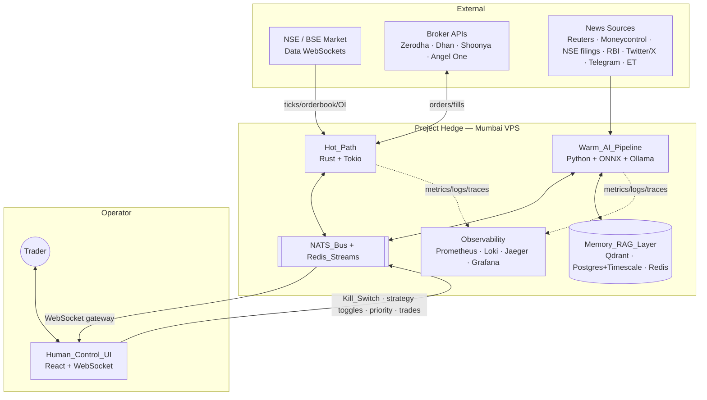
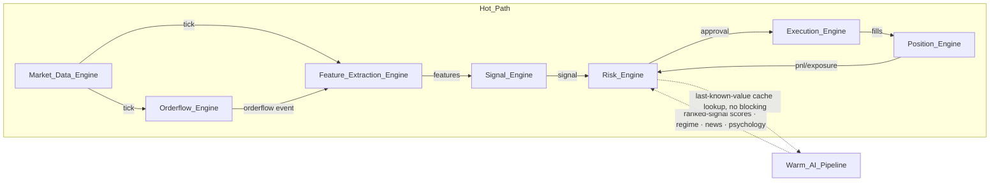
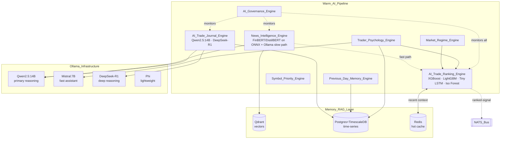
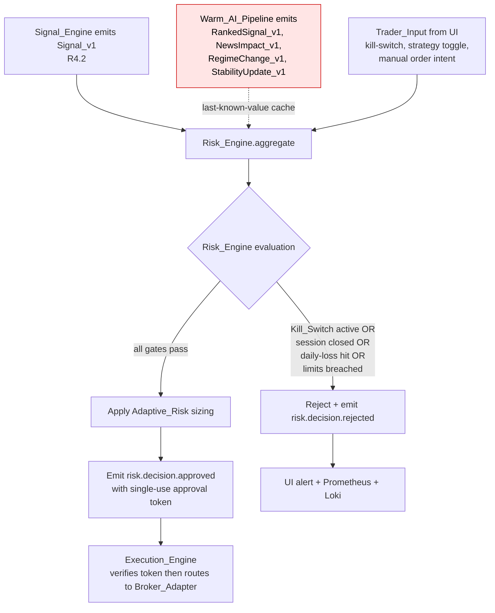
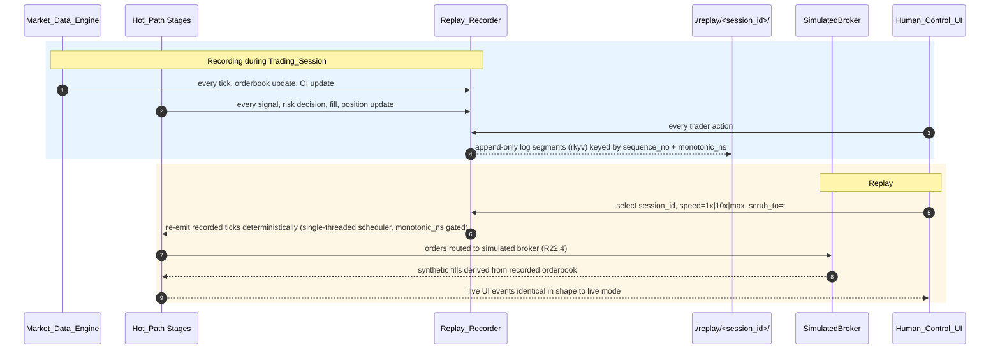
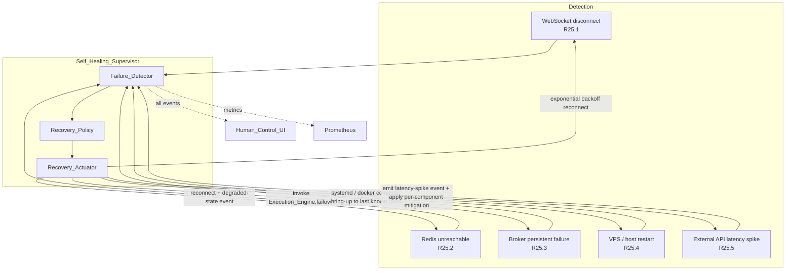

# Design Document

## Overview

PROJECT HEDGE is a four-layer, event-driven, ultra-low-latency trading operating system for NSE/BSE intraday trading. The system is engineered around a single non-negotiable invariant: **the Hot_Path is deterministic, allocation-free in steady state, and finishes tick-to-trade in under 50 ms p99**, while a logically separate Warm_AI_Pipeline supplies asynchronous reasoning that can advise but never execute.

The four layers and their primary responsibilities:

| Layer | Language / Runtime | Primary Responsibility | Latency Class |
|-------|--------------------|------------------------|---------------|
| Hot_Path | Rust 1.78+ on Tokio | Tick ingest → orderflow → features → signals → risk → execution → positions | Sub-millisecond per stage, < 50 ms p99 end-to-end |
| Warm_AI_Pipeline | Python 3.11 + ONNX Runtime + Ollama | News, regime, ranking, journal, psychology, RAG reasoning | 10–500 ms (off the order path) |
| Memory_RAG_Layer | PostgreSQL/TimescaleDB, Qdrant, Redis | Persistent embeddings, time-series, hot cache | Async, no Hot_Path coupling |
| Human_Control_UI | React 18 + TypeScript + Tailwind | Cockpit driven exclusively by WebSockets | 60 fps target, push-only |

The contract between layers is one-way: the Warm_AI_Pipeline publishes scores, news impacts, regime, and rankings onto the NATS_Bus; the Hot_Path consumes the **last-known-value cache** of those scores at risk-check time. The Hot_Path never blocks on the Warm_AI_Pipeline. The Risk_Engine has final authority — every order, every override, every cooldown, every Kill_Switch passes through it.

This design covers all 32 requirements. Cross-references to specific acceptance criteria are made inline as **(R<n>.<m>)** and consolidated in the Requirements Traceability table at the end of the document.

### Goals

- **Determinism**: replayable, reproducible execution decisions given the same tick stream and configuration (R22).
- **Hard latency budgets per stage** with continuous measurement and breach events (R9, R28).
- **Single source of authority**: Risk_Engine > Execution_Engine > Signal_Engine > Warm_AI_Pipeline > Trader_Input (R21).
- **Local-first AI**: zero cloud LLM dependencies; all inference on Ollama or ONNX Runtime (R10, R30.4, R30.5).
- **Operability**: full observability through Prometheus, Loki, Jaeger, Grafana with correlation IDs end-to-end (R27).
- **Recoverability**: self-healing across WebSocket, Redis, broker, and host failures (R25).

### Non-Goals (Architectural Prohibitions, R30)

- No Pine Script execution anywhere in the system.
- No TradingView dependency for any execution decision.
- No polling loops in the Hot_Path steady state — all flow is push/event-driven.
- No LLM inference on the per-tick path.
- No per-tick AI inference of the size of Qwen2.5:14B, DeepSeek-R1, or comparable models.
- No direct order submission from the Warm_AI_Pipeline to the Execution_Engine.
- No blocking external HTTP API on the per-tick path.
- No pandas, no NumPy, no Python runtime in the Hot_Path.
- No cloud-hosted services on the execution decision path.

These prohibitions are enforced both by component boundary (Warm_AI_Pipeline lives in a separate process and reaches the Hot_Path only through NATS subjects with restricted writers) and by code-level lints (a `forbid_modules` CI check on the Hot_Path crates).

### System Context



The diagram captures R29 (microservices, NATS as primary bus, Redis Streams for ordered intra-Hot_Path flow), R20.2 (UI exclusively via WebSocket), R19.7 (Memory_RAG_Layer not synchronously called by the Hot_Path), and R30.6 (no cloud dependency on the decision path).

---

## Architecture

### Hot_Path Architecture (R9, R28, R30)

The Hot_Path is a single Tokio-based async runtime composed of seven services that communicate primarily through:

- **In-process MPSC channels** (`tokio::sync::mpsc`) between co-located stages where ordering matters and zero serialization overhead is required.
- **Redis_Streams** (`hedge.hot.<stream>`) for ordered intra-Hot_Path distribution that must survive a service restart (R29.3).
- **NATS_Bus subjects** for fan-out of normalized events to non-Hot_Path consumers (Warm_AI_Pipeline, UI gateway, observability).

All Hot_Path crates share two foundational libraries:

- **`hedge-bus`**: typed wrappers over NATS and Redis Streams with FlatBuffers (R1.5) and rkyv codecs, FORBID list of modules, and zero-copy receive paths.
- **`hedge-core`**: lock-free SPSC/MPSC ring buffers (`crossbeam`), atomic clocks (`quanta::Instant`), bounded `ArrayVec` and `SmallVec`, and a no-alloc fixed-decimal `Px` type for prices.



The arrow from Warm_AI_Pipeline into the Hot_Path is dashed deliberately: the Hot_Path **never awaits** a Warm_AI_Pipeline response. It reads from a thread-local last-known-value cache populated asynchronously by a `WarmCacheUpdater` task subscribed to NATS subjects (`ai.rank.*`, `ai.regime.*`, `ai.news.*`, `ai.psych.*`).

### Latency Budget Allocation (R9.1, R28)

| Stage | Owner | p99 Budget | Measurement Strategy |
|-------|-------|------------|----------------------|
| Tick ingest | Market_Data_Engine | 2 ms | `quanta::Instant` from socket recv to NATS publish |
| Feature extraction | Feature_Extraction_Engine | 3 ms | from incoming tick channel recv to feature emit |
| AI scoring fetch (cache lookup) | Risk_Engine | < 50 µs | atomic load on `WarmCache` (Warm_AI_Pipeline ranking p95 ≤ 5 ms is measured separately) |
| Risk check | Risk_Engine | 2 ms | from signal-arrival to approve/reject decision |
| Execution routing | Execution_Engine | 5 ms | from approval to broker-adapter dispatch |
| **End-to-end tick-to-trade** | Hot_Path | **50 ms p99** | per-order correlation timeline assembled in `Latency_Tracer` |

Each stage publishes a `LatencyRecord` (FlatBuffers) on `obs.latency.<stage>` with `correlation_id`, `symbol`, `nanos`, and `breach: bool`. When a stage exceeds its budget, the component additionally emits `obs.budget.breach.<stage>` (R28.6) and increments `hedge_budget_breach_total{stage="..."}` in Prometheus (R27.1).

### Warm_AI_Pipeline Architecture (R10–R18, R23, R24)

The Warm_AI_Pipeline is a set of Python microservices, each owning one bounded responsibility and communicating only through NATS:



Key constraints:

- All Ollama models run as **independent microservices** with model-specific GPU pinning (R10.5).
- Models are loaded in **GGUF Q4_K_M** quantization on GPU (R10.6), exposed via Ollama's streaming HTTP API (R10.7).
- Ollama_Infrastructure makes **no outbound calls to any cloud LLM provider** (R10.8). Egress is firewalled at the host level.
- Fast NLP scoring (FinBERT, DistilBERT) runs on **ONNX Runtime** with p95 ≤ 10 ms (R11.3, R11.4, R12.2).
- A **slow-path** reasoning request from the News_Intelligence_Engine to Ollama is dispatched asynchronously and never blocks the fast path (R12.3).

### Authority Hierarchy and Decision Flow (R21)



The Authority_Hierarchy is enforced structurally:

1. The Execution_Engine accepts orders **only** from a `RiskApproval { token: ApprovalToken, ... }` message. The token is a single-use HMAC over the order intent and is minted by the Risk_Engine. No other component holds the signing key.
2. The Warm_AI_Pipeline has **no NATS publish permission** on `risk.*` or `exec.*` subjects; the broker enforces this with NATS subject ACLs (R21.3).
3. The Warm_AI_Pipeline writes only to `ai.*` subjects, which are consumed by the Risk_Engine, Signal_Engine gating logic, and the UI (R21.4).
4. Trader_Input arriving from the UI is published to `trader.intent.*` and is treated as the lowest-precedence input by the Risk_Engine (R21.1, R21.2).

### Replay and Recording Flow (R22)



Determinism is achieved by (a) recording every input event with a strict monotonically increasing `sequence_no` and a high-resolution `monotonic_ns`; (b) a single-threaded replay scheduler that releases events in `sequence_no` order; (c) seeded RNG for any stochastic component; (d) a `ReplayMode` flag that forces the Execution_Engine to bind to `SimulatedBroker` rather than any live Broker_Adapter (R22.4).

### Self-Healing Flow (R25)



Detection is event-driven, not poll-driven (R30.3): WebSocket libraries surface disconnect callbacks, Redis client surfaces connection-error callbacks, and Broker_Adapter surfaces error-rate via a sliding window kept on each request. The supervisor is a separate Rust process so a Hot_Path crash does not take its supervisor with it.

### Deployment Topology (R29)

- **Mumbai VPS (primary)**: hosts Hot_Path microservices (Rust binaries) + NATS server + Redis + UI gateway + observability collectors. All Hot_Path services are packaged as Docker images (R29.4) and deployed via `docker compose` on Ubuntu (R29.5).
- **Local GPU node (optional)**: hosts Ollama_Infrastructure and ONNX Runtime workers. Connected to the Mumbai VPS over a private NATS link. The Hot_Path remains operational if the GPU node is down — Warm_AI_Pipeline scores simply become stale, and the AI_Governance_Engine reduces their influence (R24).
- **Independent failure**: each microservice is its own systemd-managed container; failure of one does not stop others (R29.6).

### Operating Modes

- **Normal**: default Trading_Session behavior.
- **Market_Open_War_Mode**: active 09:15:00–09:45:00 IST every Trading_Session (R26.1). Increases scan frequency, orderflow sensitivity, and breakout detection sensitivity per `WarMode` profile (R26.2). UI applies a reduced-clutter profile and suppresses signals below `war_mode_min_confidence` (R26.3). Mode transitions are emitted to NATS (R26.4).
- **Replay**: forces SimulatedBroker (R22.4); identical UI event shapes.
- **AI_Shadow_Mode** (per component): outputs are persisted but not surfaced to the trader's ranking display (R23.2).

---

## Components and Interfaces

This section defines the responsibilities, internal structure, and primary interfaces of every component. Type signatures are given in Rust (Hot_Path) or Python (Warm_AI_Pipeline) where useful as design contracts.

### Hot_Path Components

#### Market_Data_Engine (R1, R28.1)

**Responsibility**: Ingest NSE/BSE WebSocket feeds, parse tick / orderbook / options-chain / OI data, normalize, and publish to consumers.

**Internal structure**:

- `WsAdapter<NseTickProto>`, `WsAdapter<BseTickProto>`, `WsAdapter<OptionsChainProto>` — one task per upstream connection, each owning a `tokio_tungstenite::WebSocketStream`.
- `TickNormalizer` — produces `Tick_v1` with all timestamps normalized to monotonic ns (`quanta`).
- `Distributor` — fans out to per-symbol `tokio::broadcast` channels (lock-free, zero-copy). Subscribers register at startup; no polling (R1.8).
- `BreadthAggregator` — incremental sector and volatility breadth (R1.7).

**Outputs**:

- `md.tick.<symbol>` (NATS, FlatBuffers, R1.5) carrying `Tick_v1`.
- `md.book.<symbol>` carrying `OrderBook_v1`.
- `md.oi.<symbol>` carrying `OpenInterest_v1`.
- `md.breadth.sector` and `md.breadth.volatility`.
- `md.connection.<source>` for connection status (R1.6).

**Constraints**: zero-copy and lock-free in steady state (R1.4); reconnection on disconnect with backoff via Self_Healing_Supervisor (R1.6, R25.1); no allocations on the steady-state path (R2.6 applies to Orderflow but the same rule is followed throughout).

#### Orderflow_Engine (R2)

**Responsibility**: Compute orderflow metrics, detect liquidity events, maintain the orderflow heatmap.

**Interface**:

```rust
pub struct OrderflowSnapshot {
    pub symbol: SymbolId,
    pub bid_ask_imbalance: f32,        // [-1.0, 1.0]
    pub aggressive_buyer_volume: u64,
    pub aggressive_seller_volume: u64,
    pub rolling_delta: i64,
    pub liquidity_pressure: f32,        // [-1.0, 1.0]  (R2.5)
    pub events: ArrayVec<OrderflowEvent, 4>, // bounded, no heap
}

pub enum OrderflowEvent {
    LiquidityGap { side: Side, level: Px, size: u64 },
    Absorption { side: Side, level: Px, size: u64 },
    HiddenLiquidity { side: Side, level: Px },
    Spoofing { side: Side, level: Px, evidence_score: f32 }, // R2.3
}
```

The heatmap is exposed via a `tokio::sync::watch` channel that is read by the UI gateway and pushed to the UI on each update (R2.4).

#### Feature_Extraction_Engine (R3, R28.2)

**Responsibility**: Incrementally compute technical features per symbol on every tick or book update.

**Computed features**: VWAP, ATR, EMA, EMA slope, realized volatility, momentum, rolling delta (R3.1); liquidity imbalance, orderflow strength, candle structure, breakout pressure, compression-zone indicators, liquidity-sweep indicators (R3.2).

**Internal structure**:

- One `FeatureState` per symbol stored in a `dashmap::DashMap<SymbolId, FeatureState>`.
- All windows implemented as ring buffers on `ArrayVec` to preserve no-alloc semantics.
- All features updated incrementally — never recomputed from a window slice (R3.4).

**Output**: `feat.update.<symbol>` (NATS, FlatBuffers) carrying `FeatureSnapshot_v1`. Co-located Signal_Engine receives the same data via in-process MPSC for lower latency (R3.5).

**Hard prohibition**: no pandas, no NumPy, no Python (R3.6, R30.8).

#### Signal_Engine (R4, R26.2)

**Responsibility**: Evaluate the configured strategy set on every feature update and emit signals.

**Strategies (R4.1)**: `Opening_Range_Breakout`, `VWAP_Pullback`, `Momentum_Breakout`, `Liquidity_Sweep_Reversal`, `Options_OI_Expansion_Breakout`, `Volatility_Compression_Breakout`.

**Interface**:

```rust
pub trait Strategy: Send + Sync {
    fn id(&self) -> StrategyId;
    fn evaluate(&self, snap: &FeatureSnapshot, ctx: &StrategyContext) -> Option<Signal_v1>;
    fn enabled_in(&self, regime: Regime) -> bool;
}

pub struct StrategyContext<'a> {
    pub regime: Regime,                 // R4.6
    pub trader_config: &'a StrategyToggles, // R4.5
    pub war_mode: bool,                 // R26.2
    pub previous_day: &'a PreviousDayMemory, // R15.2
}
```

**Signal output (R4.2)**:

```rust
pub struct Signal_v1 {
    pub correlation_id: CorrelationId,
    pub strategy: StrategyId,
    pub symbol: SymbolId,
    pub side: Side,
    pub base_probability: f32,    // [0.0, 1.0]   (R4.3)
    pub confidence: f32,          // [0.0, 1.0]   (R4.3)
    pub risk_profile: RiskProfile,
    pub generated_at_ns: u64,
}
```

Strategies are evaluated **on each feature update** through the in-process channel; there is no scheduler poll (R4.4).

#### Risk_Engine (R5, R28.4, R31)

**Responsibility**: Final authority on every order decision; evaluates limits, computes Adaptive_Risk, mints approval tokens, and arbitrates Authority_Hierarchy conflicts.

**Code-level interface**:

```rust
pub struct RiskEngine {
    config: RiskConfig,
    state: RiskState,
    warm_cache: Arc<WarmCache>,
    approval_signer: HmacSha256,
}

pub struct RiskConfig {
    pub capital_base_inr: i64,           // default 20_000      (R32.1)
    pub daily_profit_target_min: i64,    // default 300         (R32.2)
    pub daily_profit_target_max: i64,    // default 1_000       (R32.2)
    pub max_daily_loss_inr: i64,                                // R5.2
    pub max_position_per_symbol: u64,                           // R5.3
    pub max_position_portfolio: u64,                            // R5.3
    pub max_leverage_per_symbol: f32,                           // R5.4
    pub max_leverage_account: f32,                              // R5.4
    pub max_drawdown_inr: i64,                                  // R5.5
    pub max_trades_per_minute: u32,                             // R5.6
    pub max_trades_per_hour: u32,                               // R5.6
    pub max_trades_per_session: u32,                            // R5.6
    pub max_exposure_per_symbol: i64,                           // R5.7
    pub max_exposure_per_sector: i64,                           // R5.7
    pub slippage_threshold_bps: u16,                            // R5.8
    pub slippage_cooldown_ms: u32,                              // R5.8
    pub volatility_block_threshold: f32,                        // R5.10
    pub broker_latency_block_ms: u32,                           // R5.11
    pub session_start_ist: NaiveTime,    // 09:15:00            (R31.1)
    pub session_end_ist: NaiveTime,      // 15:30:00            (R31.1)
    pub post_target_policy: PostTargetPolicy,                   // R32.3
}

impl RiskEngine {
    /// R5.12: produce an approve-or-reject decision within 2 ms p99.
    pub fn evaluate(&mut self, signal: &Signal_v1) -> RiskDecision { ... }

    /// R5.13: BaseRisk × MarketStability × SignalConfidence × TraderDiscipline.
    pub fn adaptive_risk(&self, sig: &Signal_v1) -> AdaptiveRisk {
        let base = self.config.base_risk_per_trade(sig.symbol);
        let market_stability = self.warm_cache.market_stability();   // [0,1]
        let signal_confidence = self.warm_cache.trade_confidence(sig.correlation_id)
            .unwrap_or(sig.confidence as f64);                       // [0,1]
        let trader_discipline = self.warm_cache.trader_stability();  // [0,1]
        AdaptiveRisk {
            value: base * market_stability * signal_confidence * trader_discipline,
            base, market_stability, signal_confidence, trader_discipline,
        }
    }
}

pub enum RiskDecision {
    Approved {
        token: ApprovalToken,           // single-use HMAC over order intent
        sized_quantity: u64,            // sized using AdaptiveRisk        (R5.13)
        rationale: RiskRationale,
    },
    Rejected {
        reason: RejectReason,
        rationale: RiskRationale,
    },
}
```

**Kill_Switch (R5.5, R5.9, R16.7)**: a single atomic `KillSwitchState` with reasons. Activation blocks all new orders and emits `risk.killswitch.activated` to NATS.

**Session-time gate (R31.1)**: every `evaluate` call first checks the IST clock; outside `[09:15, 15:30]` the decision is `Rejected { reason: SessionClosed }`.

**Authority arbitration (R5.14, R21)**: Risk_Engine holds the only HMAC key for `ApprovalToken`; thus it is the only source of valid approvals. It overrides Warm_AI_Pipeline rankings, Signal_Engine emissions, Execution_Engine retries, and trader inputs that conflict with limits.

#### Execution_Engine (R6, R7, R28.5)

**Responsibility**: Submit Risk_Engine-approved orders to the active Broker_Adapter, track lifecycle, retry, and fail over.

**Internal structure**:

- `BrokerRouter` — holds active and backup `Box<dyn BrokerAdapter>` and a `BrokerHealthState`.
- `OrderLifecycleTracker` — owns each order's state machine: `New → Submitted → Partially_Filled → Filled | Cancelled | Rejected` (R6.6) and publishes state-transition events on `exec.order.<state>`.
- `Retry` — bounded retries with exponential backoff for retryable errors (R6.4).

**Failover policy (R6.5)**: the router keeps a sliding window of latencies and error rates; when either crosses a configured threshold, it atomically swaps active to backup, emits `exec.broker.failover`, and drains pending orders to the new adapter.

**Adaptive routing (R6.7)**: order type and aggressiveness are taken from the Risk_Engine's approval `RiskApproval.execution_params`.

**Hard rule (R6.8)**: every `submit()` first verifies the `ApprovalToken`'s HMAC. Submission without valid approval is unrepresentable in the type system because `submit(ApprovalToken, OrderIntent)` is the only public method.

#### Broker_Adapter Abstraction (R7)

```rust
pub trait BrokerAdapter: Send + Sync {
    fn id(&self) -> BrokerId;             // Zerodha | Dhan | Shoonya | AngelOne   (R7.1)

    async fn submit(&self, token: &ApprovalToken, intent: &OrderIntent) -> Result<BrokerOrderId, BrokerError>;
    async fn modify(&self, broker_order_id: &BrokerOrderId, modify: &OrderModify) -> Result<(), BrokerError>;
    async fn cancel(&self, broker_order_id: &BrokerOrderId) -> Result<(), BrokerError>;
    async fn status(&self, broker_order_id: &BrokerOrderId) -> Result<OrderStatus, BrokerError>;

    fn metrics(&self) -> BrokerMetrics;   // latency, error rate (R7.4)
    fn ready(&self) -> ReadyState;        // R7.5: ConfigError if creds missing/invalid
}
```

Concrete implementations live in `hedge-broker-zerodha`, `hedge-broker-dhan`, `hedge-broker-shoonya`, `hedge-broker-angelone`. Each maps the uniform `OrderIntent` to broker-specific REST or WebSocket API calls (R7.3) and emits `broker.metric.<broker>` on every request (R7.4). Credentials are loaded at startup; missing or invalid credentials cause `ready()` to return `ConfigError` and `submit()` to fail closed (R7.5).

A `SimulatedBroker` adapter is used in replay mode and in tests (R22.4).

#### Position_Engine (R8)

**Responsibility**: Live positions, realized + unrealized PnL, exposure, used margin, per-strategy capital allocation.

**Interface**:

```rust
pub struct Position {
    pub symbol: SymbolId,
    pub quantity: i64,
    pub avg_entry_px: Px,
    pub realized_pnl: i64,    // paise
    pub unrealized_pnl: i64,  // paise, last-mark
}

pub struct TraderRiskState {           // R8.5
    pub aggregate_exposure_inr: i64,
    pub drawdown_inr: i64,
    pub available_margin_inr: i64,
}
```

The Position_Engine subscribes to `exec.fill.*` and `md.tick.*`; a fill triggers PnL recompute within 5 ms (R8.2); a tick on a held symbol updates unrealized PnL (R8.3); aggregated `TraderRiskState` is published on `pos.risk_state` (R8.5).

### Warm_AI_Pipeline Components

#### News_Intelligence_Engine (R12)

**Responsibility**: Ingest news (R12.1), run a fast path on FinBERT/DistilBERT via ONNX (R12.2, R11.2, R11.3), and dispatch slow-path reasoning to Ollama asynchronously (R12.3). Emit `ai.news.impact.<symbol>` events with sentiment and impact magnitude (R12.4).

**Pipeline**: `Source_Adapter` (per source) → `Dedup` → `Fast_Path { entity_extract, finbert_sentiment, impact_score, symbol_map }` → `NewsImpact_v1` → optionally `Slow_Path { ollama_reasoning }` → `NewsImpactExtended_v1`.

#### Market_Regime_Engine (R13)

**Responsibility**: Classify the current regime among `Trending`, `Sideways`, `Panic`, `High_Volatility`, `News_Driven`, `Liquidity_Crisis`, `Low_Participation` (R13.1) on each evaluation interval (R13.2). On regime change emit `ai.regime.changed` (R13.3); the Signal_Engine and Risk_Engine consume this event for strategy gating (R13.4) and `MarketStability` factor updates (R13.5).

#### Symbol_Priority_Engine (R14)

Assigns each symbol to one of `P1 | P2 | P3 | P4` (R14.1), allocates CPU, AI inference budget, scan frequency, and alert frequency per a `PriorityAllocationTable` (R14.2). On change, emits `ai.priority.changed.<symbol>` (R14.3); Hot_Path components apply the new allocation by reading from the WarmCache (R14.4).

#### Previous_Day_Memory_Engine (R15)

Persists for each symbol the previous Trading_Session's high, low, close, failed-breakout markers, gap reactions, delivery volume, trend continuation indicators, institutional behavior indicators, and significant news reactions (R15.1). Exposes both query (`mem.prev_day.query`) and subscription (`mem.prev_day.<symbol>`) (R15.2). Computes and persists the next-session dataset between session end and next session start (R15.3).

#### Trader_Psychology_Engine (R16)

**Behavioral monitors (R16.1)**: revenge trading, FOMO entries, overconfidence, tilt, impulsive trading, rapid re-entry, stop-loss removal, discipline deviation.

**Trader_Stability_Score (R16.2)**:

```python
def compute_trader_stability_score(s: BehaviorState) -> float:
    raw = (
        0.35 * s.discipline +
        0.25 * s.emotional_control +
        0.20 * s.risk_consistency +
        0.20 * s.patience
    )
    return clamp(raw, 0.0, 1.0)
```

**Threshold ladder (R16.4 → R16.7)**:

```python
@dataclass
class StabilityThresholds:
    warning: float    # R16.4 — emit UI warning
    cooldown: float   # R16.5 — request Risk_Engine cooldown
    suppression: float# R16.6 — request Risk_Engine size reduction
    critical: float   # R16.7 — request Risk_Engine Kill_Switch
```

The engine emits `ai.psych.stability` on every behavioral event (R16.3) and `ai.psych.intervention` for warning/cooldown/suppression/critical actions.

#### AI_Trade_Ranking_Engine (R17, R28.3)

**Trade_Confidence_Score (R17.1)**:

```python
def compute_trade_confidence_score(c: TradeContext) -> float:
    raw = (
        0.30 * c.orderflow +
        0.25 * c.technical_strength +
        0.20 * c.news_sentiment +
        0.15 * c.market_regime +
        0.10 * c.trader_discipline
    )
    return clamp(raw, 0.0, 1.0)   # R17.2
```

Subscribes to `sig.emitted`, computes `Trade_Confidence_Score`, and emits `ai.rank.<correlation_id>` with original signal id and the score (R17.3). Targets p95 ≤ 5 ms (R17.5, R28.3) and runs asynchronously, never on the Hot_Path (R17.4).

The score is used by the Risk_Engine via WarmCache as the `SignalConfidence` factor in Adaptive_Risk; the original Signal_Engine `confidence` is used as fallback if the cache entry is stale.

#### AI_Trade_Journal_Engine (R18)

On `exec.trade.closed`, produces a journal entry with outcome, contributing strategy/signal, trader emotional state at entry/exit, prevailing regime, identified missed opportunities, and execution-quality metrics (R18.1). Persists to Memory_RAG_Layer (R18.2) and exposes via `ai.journal.entry` and the journal query API (R18.3).

#### Ollama_Infrastructure (R10)

Each model runs as an independent microservice with its own Docker container and its own GPU allocation (R10.5):

| Model | Role | Container |
|-------|------|-----------|
| Qwen2.5:14B (Q4_K_M GGUF) | Primary reasoning (R10.1) | `ollama-qwen` |
| Mistral:7B (Q4_K_M GGUF) | Fast assistant (R10.2) | `ollama-mistral` |
| DeepSeek-R1 (Q4_K_M GGUF) | Deep reasoning (R10.3) | `ollama-deepseek` |
| Phi (Q4_K_M GGUF) | Lightweight (R10.4) | `ollama-phi` |

Streaming inference is exposed via Ollama's HTTP API (R10.7). Egress to public LLM providers is firewalled at the host level (R10.8). On unresponsive service, an `ai.ollama.degraded` event is emitted and a configured fallback model serves the request (R10.9).

#### AI_Governance_Engine (R23, R24)

Tracks model drift, confidence stability, hallucination indicators, and prediction quality per AI component (R24.1). Compares shadowed AI outputs against actual subsequent market outcomes to produce per-component accuracy metrics (R23.3). When degradation thresholds are crossed, reduces influence weight in `Trade_Confidence_Score` and `Adaptive_Risk` per the configured policy (R24.2); when critical thresholds are crossed, places the affected component into AI_Shadow_Mode (R24.3). Emits `ai.gov.action` events to the UI (R24.4).

### Memory_RAG_Layer (R19)

- **Qdrant (R19.2)**: vector embeddings for trades, news, journal entries, market memory, psychology history.
- **PostgreSQL + TimescaleDB (R19.3)**: hypertables for ticks (sampled), fills, orders, AI scores, regime history, psychology timeline, broker metrics.
- **Redis (R19.4)**: hot read-path cache for recent context (last N trades, last N news per symbol, current regime, current stability score).

**Retrieval pipeline (R19.5)** triggered on a trader-event reasoning request:

```
trader_event_lookup → memory_retrieval (Qdrant kNN + Timescale window) →
context_assembly → ollama_reasoning → recommendation_generation
```

The Memory_RAG_Layer is reachable from the Warm_AI_Pipeline only and is **not** invoked synchronously by the Hot_Path (R19.7).

### Human_Control_UI (R20)

- React 18 + TypeScript + Tailwind (R20.1).
- Live data exclusively via WebSocket through the `ui-gateway` Rust service (R20.2). The gateway is a thin NATS-to-WebSocket bridge that subscribes to a curated subject set and forwards events to authenticated UI sessions.
- UI panels (R20.3): Live Market, Orderflow Heatmap, Options Chain, Positions, Live PnL, Execution Panel, Risk Panel, AI Confidence Scores, Trader_Stability_Score, News Feed, Alerts, Replay Controls, AI Explanations, Symbol Priority Controls, Strategy Toggles, Latency Dashboard.
- High-volatility presentation mode: when `md.breadth.volatility` exceeds `ui.high_vol_threshold`, the UI increases refresh rate for critical panels and reduces secondary visual elements (R20.4).
- Critical alerts surface above non-critical alerts (R20.5).
- Trader controls (R20.6, R20.7, R20.8): Kill_Switch toggle, per-strategy enable/disable, per-symbol priority change. All controls publish to `trader.intent.*` and are subject to Authority_Hierarchy.

### Replay_Engine (R22)

```rust
pub struct ReplayEngine {
    recorder: Recorder,
    player: Player,
    storage: Arc<dyn ReplayStorage>,
}

pub struct ReplayRecord {
    pub session_id: SessionId,
    pub sequence_no: u64,             // strict monotonic, gap-free
    pub monotonic_ns: u64,            // quanta::Instant nanos at record time
    pub wallclock_utc: i64,
    pub kind: RecordKind,
    pub payload: Bytes,               // rkyv-encoded typed payload
}

pub enum RecordKind {
    Tick, OrderBook, OpenInterest,
    NewsEvent,
    SignalEmitted, RiskDecision,
    OrderSubmitted, OrderModified, OrderCancelled, Fill,
    TraderAction,
    AIDecision { source: AISource },
    MarketConditionSnapshot,
}
```

Recording is append-only on disk; segments roll on session boundary or 1 GiB. Replay is a single-threaded scheduler that releases events in `sequence_no` order at a configurable speed multiplier (`1x`, `10x`, `max`). The Execution_Engine binds to `SimulatedBroker` whenever `ReplayMode::On` is set (R22.4).

### Self_Healing_Supervisor (R25)

A separate Rust process running outside the Hot_Path that owns:

- `Failure_Detector` — subscribes to `obs.error.*`, `md.connection.*`, `cache.redis.*`, `broker.metric.*`, `obs.latency.*`.
- `Recovery_Policy` — declarative rules, e.g. `on broker.error_rate>0.2 for 30s ⇒ failover`.
- `Recovery_Actuator` — publishes commands on `ops.action.*` consumed by the relevant component.

---

## Data Models

This section defines the canonical event schemas for the NATS_Bus, Redis_Streams, and WebSocket channels. All Hot_Path payloads are FlatBuffers (R1.5) for zero-copy reads. All Warm_AI_Pipeline payloads are JSON for ergonomics, except embeddings which are CBOR. Every event carries a correlation_id for end-to-end tracing.

### Common Types

```rust
pub type CorrelationId = u128;        // ULID
pub type SymbolId = u32;              // interned symbol id
pub type SessionId = u64;
pub type Px = i64;                    // paise, fixed-point
pub type Qty = u64;

pub enum Side { Buy, Sell }
pub enum Regime { Trending, Sideways, Panic, HighVolatility, NewsDriven, LiquidityCrisis, LowParticipation }
pub enum BrokerId { Zerodha, Dhan, Shoonya, AngelOne, Simulated }
pub enum Priority { P1, P2, P3, P4 }
```

### Hot_Path Events (FlatBuffers)

```fbs
table Tick_v1 {
  correlation_id: [ubyte:16];
  symbol: uint;
  exchange: byte;          // 0=NSE 1=BSE
  ltp_paise: long;
  bid_paise: long;
  ask_paise: long;
  ltq: ulong;
  total_buy_qty: ulong;
  total_sell_qty: ulong;
  ts_exchange_ns: ulong;
  ts_recv_ns: ulong;
}

table OrderBook_v1 { ... level-2 up to 20 levels ... }

table FeatureSnapshot_v1 {
  correlation_id: [ubyte:16];
  symbol: uint;
  vwap: long; atr: long; ema_fast: long; ema_slow: long; ema_slope: float;
  realized_vol: float; momentum: float; rolling_delta: long;
  liquidity_imbalance: float; orderflow_strength: float;
  candle_structure: ubyte; breakout_pressure: float;
  compression_zone: float; liquidity_sweep: float;
  ts_ns: ulong;
}

table Signal_v1 {
  correlation_id: [ubyte:16];
  strategy: ubyte;
  symbol: uint;
  side: ubyte;
  base_probability: float; confidence: float;
  risk_profile: RiskProfile_v1;
  ts_ns: ulong;
}

table RiskApproval_v1 {
  correlation_id: [ubyte:16];
  approval_token: [ubyte:32];   // HMAC-SHA256 over canonical OrderIntent
  intent: OrderIntent_v1;
  sized_quantity: ulong;
  rationale_code: ubyte;
  ts_ns: ulong;
}

table OrderIntent_v1 {
  correlation_id: [ubyte:16];
  symbol: uint; side: ubyte; quantity: ulong;
  order_type: ubyte;        // 0=Market 1=Limit
  limit_paise: long;
  exchange: byte;
}

table OrderState_v1 {
  correlation_id: [ubyte:16];
  broker_order_id: string;
  state: ubyte;             // New, Submitted, PartiallyFilled, Filled, Cancelled, Rejected
  filled_qty: ulong; avg_fill_paise: long;
  ts_ns: ulong;
}

table LatencyRecord_v1 {
  correlation_id: [ubyte:16];
  stage: ubyte;             // TickIngest, FeatureExtraction, RiskCheck, ExecutionRouting, etc.
  nanos: ulong;
  budget_nanos: ulong;
  breach: bool;
}
```

### Warm_AI_Pipeline Events (JSON)

```json
// ai.rank.<correlation_id>
{
  "correlation_id": "01J...",
  "signal_id": "01J...",
  "trade_confidence_score": 0.71,
  "factors": {
    "orderflow": 0.8, "technical_strength": 0.6,
    "news_sentiment": 0.7, "market_regime": 0.5,
    "trader_discipline": 0.9
  },
  "shadow": false,
  "ts_ns": 1730000000000000000
}

// ai.news.impact.<symbol>
{
  "correlation_id": "01J...",
  "symbol": "RELIANCE",
  "headline_id": "...",
  "sentiment": -0.6,
  "impact_magnitude": 0.8,
  "fast_path": true,
  "slow_path_pending": true,
  "ts_ns": ...
}

// ai.regime.changed
{ "from": "Trending", "to": "Panic", "ts_ns": ... }

// ai.psych.stability
{
  "score": 0.42,
  "components": {"discipline":0.5,"emotional_control":0.3,"risk_consistency":0.4,"patience":0.5},
  "behaviors": ["revenge_trading", "rapid_re_entry"],
  "ts_ns": ...
}

// ai.psych.intervention
{ "action": "cooldown" | "size_reduction" | "kill_switch" | "warning",
  "trigger_score": 0.42, "ts_ns": ... }

// ai.priority.changed.<symbol>
{ "symbol": "RELIANCE", "from": "P3", "to": "P1", "ts_ns": ... }

// ai.gov.action
{ "component": "AI_Trade_Ranking_Engine",
  "action": "reduce_influence" | "shadow_mode",
  "metric": "drift", "value": 0.41, "threshold": 0.35, "ts_ns": ... }
```

### NATS Subject Naming Convention

A strict three-segment-minimum hierarchy: `<domain>.<entity>.<action_or_id>`.

| Domain | Subjects | Producer | Consumers |
|--------|----------|----------|-----------|
| `md.*` | `md.tick.<sym>`, `md.book.<sym>`, `md.oi.<sym>`, `md.breadth.sector`, `md.breadth.volatility`, `md.connection.<source>` | Market_Data_Engine | Orderflow, Features, Position, UI |
| `of.*` | `of.event.<sym>`, `of.heatmap.<sym>` | Orderflow_Engine | Features, UI |
| `feat.*` | `feat.update.<sym>` | Feature_Extraction_Engine | Signal_Engine |
| `sig.*` | `sig.emitted` | Signal_Engine | Risk_Engine, Warm_AI_Pipeline, UI |
| `risk.*` | `risk.decision.approved`, `risk.decision.rejected`, `risk.killswitch.activated`, `risk.target.reached`, `risk.cooldown.<sym>` | Risk_Engine | Execution, UI |
| `exec.*` | `exec.order.<state>`, `exec.fill.<sym>`, `exec.broker.failover`, `exec.trade.closed` | Execution_Engine | Position, UI, Replay |
| `pos.*` | `pos.update.<sym>`, `pos.risk_state` | Position_Engine | Risk, UI |
| `ai.*` | `ai.rank.<cid>`, `ai.news.impact.<sym>`, `ai.regime.changed`, `ai.psych.stability`, `ai.psych.intervention`, `ai.priority.changed.<sym>`, `ai.journal.entry`, `ai.gov.action`, `ai.ollama.degraded` | Warm_AI_Pipeline | Risk, Signal (gating), UI |
| `mem.*` | `mem.prev_day.<sym>` | Previous_Day_Memory_Engine | Signal, Risk, UI |
| `trader.*` | `trader.intent.killswitch`, `trader.intent.strategy_toggle`, `trader.intent.priority`, `trader.intent.order` | UI gateway | Risk |
| `ops.*` | `ops.session.start`, `ops.session.end`, `ops.warmode.start`, `ops.warmode.end`, `ops.action.<target>` | Session manager, Self_Healing_Supervisor | All |
| `obs.*` | `obs.latency.<stage>`, `obs.budget.breach.<stage>`, `obs.error.<source>` | All Hot_Path stages | Prometheus exporter, UI |

ACLs: Warm_AI_Pipeline credentials are denied publish on `risk.*`, `exec.*`, `trader.*` (R21.3, R30.6).

### Redis_Streams Usage

Used where ordered, persistent intra-Hot_Path delivery is required (R29.3):

| Stream | Producer | Consumer | Purpose |
|--------|----------|----------|---------|
| `hedge.hot.signals` | Signal_Engine | Risk_Engine | Ordered signal queue with consumer-group ack so a Risk_Engine restart does not drop in-flight signals |
| `hedge.hot.approvals` | Risk_Engine | Execution_Engine | Ordered approvals; consumer-group ensures exactly-once routing |
| `hedge.hot.fills` | Execution_Engine | Position_Engine | Ordered fills for deterministic PnL update |
| `hedge.hot.replay_record` | Replay_Recorder | (none — sink) | Append-only ledger backing the replay log |

The intra-stage hot loops (e.g. `Tick → Features`) use in-process MPSC channels because Redis adds ~100 µs and is not needed for cross-restart durability there.

### WebSocket Channels (UI Gateway)

The `ui-gateway` exposes a single WebSocket endpoint with a topic-subscription protocol; payloads are JSON for UI ergonomics. Subscriptions follow NATS subject patterns:

| Channel | Carries |
|---------|---------|
| `ws://.../market` | `md.*` events filtered to subscribed symbols |
| `ws://.../orderflow` | Orderflow heatmap deltas (R2.4, R20.3) |
| `ws://.../signals` | `sig.emitted` and `ai.rank.*` joined by correlation_id (R20.3) |
| `ws://.../risk` | `risk.*`, `pos.risk_state`, `pos.update.*` (R20.3) |
| `ws://.../exec` | `exec.*` (R20.3) |
| `ws://.../news` | `ai.news.impact.*` (R20.3) |
| `ws://.../psych` | `ai.psych.*` (R20.3) |
| `ws://.../alerts` | UI-formatted alerts, severity-sorted (R20.5) |
| `ws://.../replay` | Replay control plane and frame stream (R20.3, R22.3) |
| `ws://.../latency` | `obs.latency.*` aggregated for the Latency Dashboard (R20.3, R27.4) |
| `ws://.../control` | Trader → server: kill-switch, strategy toggle, priority change, manual intent (R20.6, R20.7, R20.8) |

### Configuration Surface and Defaults (R32, supporting R5, R20, R26)

Configuration is YAML, loaded at process start, validated by a Serde + JSON Schema check, and reloadable via SIGHUP for non-Hot_Path processes. Hot_Path processes pin config at start to avoid mid-session changes.

```yaml
# /etc/hedge/config.yaml
capital:
  base_inr: 20000               # R32.1 — default ₹20,000
  daily_profit_target_min_inr: 300   # R32.2
  daily_profit_target_max_inr: 1000  # R32.2
  post_target_policy: reduce_size_to_zero   # R32.3 (alternatives: stop_for_session, halve_size, continue)

risk:
  max_daily_loss_inr: 600
  max_position_per_symbol: 200
  max_position_portfolio: 500
  max_leverage_per_symbol: 5.0
  max_leverage_account: 5.0
  max_drawdown_inr: 1000
  max_trades_per_minute: 4
  max_trades_per_hour: 30
  max_trades_per_session: 60
  max_exposure_per_symbol_inr: 20000
  max_exposure_per_sector_inr: 30000
  slippage_threshold_bps: 25
  slippage_cooldown_ms: 60000
  volatility_block_threshold: 0.06
  broker_latency_block_ms: 250
  base_risk_per_trade_inr: 100

session:
  start_ist: "09:15:00"
  end_ist:   "15:30:00"

war_mode:
  start_ist: "09:15:00"
  end_ist:   "09:45:00"
  min_confidence: 0.6
  scan_multiplier: 2.0

ui:
  high_vol_threshold: 0.05

ai:
  shadow_components: []
  governance:
    drift_warn:   0.20
    drift_critical: 0.35
  rank_p95_budget_ms: 5
  ranking_factors:    # for surface inspection only — formula constants are fixed in R17.1
    orderflow: 0.30
    technical_strength: 0.25
    news_sentiment: 0.20
    market_regime: 0.15
    trader_discipline: 0.10

trader_psychology:
  thresholds: { warning: 0.6, cooldown: 0.5, suppression: 0.4, critical: 0.3 }

brokers:
  primary: zerodha
  backup:  dhan
  failover_error_rate: 0.20
  failover_latency_ms: 250

ollama:
  models:
    - { name: qwen2.5:14b,  role: primary,    quant: q4_k_m }
    - { name: mistral:7b,   role: fast,       quant: q4_k_m }
    - { name: deepseek-r1,  role: deep,       quant: q4_k_m }
    - { name: phi,          role: lightweight,quant: q4_k_m }

observability:
  retention:
    metrics_days: 30
    logs_days: 14
    traces_days: 7
  degraded_mode:
    drop_low_severity_logs_at_loki_unavailable: true
    sample_traces_at_jaeger_overload: 0.1
```

The Risk_Engine's defaults are tuned to the ₹20,000 capital base (R32.4): max daily loss is 3% (₹600), max drawdown is 5% (₹1,000), trade frequency limits prevent blowing the daily-profit-target window in a single session.

---

## Correctness Properties

*A property is a characteristic or behavior that should hold true across all valid executions of a system — essentially, a formal statement about what the system should do. Properties serve as the bridge between human-readable specifications and machine-verifiable correctness guarantees.*

The following 12 properties were derived from the prework analysis above. Limit checks, latency budgets, authority enforcement, score bounds, edge-triggered emissions, gating, persistence, self-healing, and replay determinism each consolidate into one comprehensive property to avoid logical redundancy.

### Property 1: Risk Limit Invariant (Approval Implies All Limits Respected)

*For any* sequence of generated signals, fills, market ticks, news impacts, broker latency samples, and trader inputs, and any `RiskApproval` issued by the `Risk_Engine`, the post-approval projected portfolio state respects **every** active limit configured at approval time: max daily loss, max position per symbol, max position per portfolio, max leverage per symbol, max leverage per account, max drawdown, trade-frequency caps (per minute, hour, session), max exposure per symbol and per sector, slippage cooldown, volatility block, broker-latency block, session-time gate, daily-profit-target post-target policy, and capital-base × max-leverage-per-symbol sizing constraint. If any limit would be breached, **no** approval is issued for that intent.

**Validates: Requirements 5.2, 5.3, 5.4, 5.5, 5.6, 5.7, 5.8, 5.9, 5.10, 5.11, 5.13, 31.1, 31.4, 32.3, 32.4**

### Property 2: Authority Hierarchy and Hot_Path Purity (No Order Without Risk Approval, No Forbidden Hot_Path Calls)

*For any* sequence of generated inputs from all authority levels (Risk_Engine, Execution_Engine, Signal_Engine, Warm_AI_Pipeline, Trader_Input), every order submitted by the `Execution_Engine` to a `Broker_Adapter` carries an `ApprovalToken` whose HMAC verifies under the Risk_Engine's signing key, the token has not been previously consumed, and the order's intent is byte-equal to the intent the token was minted over; **and** *for any* tick processed by the Hot_Path, no Hot_Path code path performs an LLM inference call, a blocking external HTTP call, a synchronous `Memory_RAG_Layer` call, or invokes pandas / NumPy / Python.

**Validates: Requirements 5.1, 5.14, 6.8, 9.4, 9.5, 17.4, 19.7, 21.1, 21.2, 21.3, 21.4, 30.1, 30.2, 30.3, 30.4, 30.5, 30.6, 30.7, 30.8**

### Property 3: Latency Budget Compliance (Per-Stage and End-to-End)

*For any* generated tick → signal → approval → submit chain through the in-memory test harness with a mock broker, the per-stage latencies satisfy: tick ingest p99 < 2 ms, feature extraction p99 < 3 ms, AI ranking p95 < 5 ms (measured in the Warm_AI_Pipeline test harness), risk check p99 < 2 ms, execution routing p99 < 5 ms, and end-to-end tick-to-trade p99 < 50 ms; **and** every order request produces exactly one `LatencyRecord` per traversed stage tagged with the same `correlation_id`; **and** every per-stage latency exceeding its budget produces exactly one `obs.budget.breach.<stage>` event.

**Validates: Requirements 1.2, 1.3, 3.3, 5.12, 6.1, 8.2, 9.1, 9.7, 11.4, 12.2, 17.5, 27.4, 28.1, 28.2, 28.3, 28.4, 28.5, 28.6**

### Property 4: Score and Formula Equivalence (Adaptive_Risk, Trader_Stability_Score, Trade_Confidence_Score, Bounded Outputs)

*For any* generated factor inputs in [0.0, 1.0]:
- `Adaptive_Risk = BaseRisk × MarketStability × SignalConfidence × TraderDiscipline` exactly, and `Adaptive_Risk ∈ [0, BaseRisk]`.
- `Trader_Stability_Score = clamp(0.35×Discipline + 0.25×EmotionalControl + 0.20×RiskConsistency + 0.20×Patience, 0.0, 1.0)`.
- `Trade_Confidence_Score = clamp(0.30×Orderflow + 0.25×TechnicalStrength + 0.20×NewsSentiment + 0.15×MarketRegime + 0.10×TraderDiscipline, 0.0, 1.0)`.
- `liquidity_pressure(book) ∈ [-1.0, 1.0]` for any generated `OrderBook_v1`.
- `signal.base_probability ∈ [0.0, 1.0]` and `signal.confidence ∈ [0.0, 1.0]` for any generated `Signal_v1`.

**Validates: Requirements 2.5, 4.3, 5.13, 16.2, 17.1, 17.2**

### Property 5: Serialization and Persistence Round-Trip

*For any* generated `Tick_v1`, `OrderBook_v1`, `FeatureSnapshot_v1`, `Signal_v1`, `RiskApproval_v1`, `OrderIntent_v1`, `OrderState_v1`, `LatencyRecord_v1`, `PreviousDayMemory`, `JournalEntry`, or `Trade`, encoding then decoding via the configured serializer (FlatBuffers for Hot_Path, CBOR for embeddings, the typed Memory_RAG_Layer codec for persisted records) returns a value structurally equal to the original; and writing then reading the value through `Memory_RAG_Layer` returns an equivalent value.

**Validates: Requirements 1.5, 15.1, 18.2, 19.1**

### Property 6: Incremental Feature Computation Equals Reference

*For any* generated tick stream and any feature in {VWAP, ATR, EMA, EMA slope, realized volatility, momentum, rolling delta, liquidity imbalance, orderflow strength, candle structure, breakout pressure, compression-zone indicator, liquidity-sweep indicator, bid/ask imbalance, aggressive buyer volume, aggressive seller volume, sector breadth, volatility breadth}, the value produced by the incremental Hot_Path implementation equals the value produced by a window-based reference implementation, within a defined floating-point tolerance.

**Validates: Requirements 1.7, 2.1, 3.1, 3.2**

### Property 7: Strategy Gating Respects Toggles, Regime, News, and War_Mode

*For any* generated feature stream, regime stream, news-impact stream, war-mode timeline, and strategy-toggle configuration, the `Signal_Engine` emits zero signals from any strategy that is currently disabled by trader configuration, disabled by regime, blocked by an active news-gate matching its sector, or below the war-mode confidence threshold while war mode is active.

**Validates: Requirements 4.4, 4.5, 4.6, 12.6, 13.4, 26.2, 26.3**

### Property 8: Edge-Triggered Emission of State Changes

*For any* generated stream of state observations (regime, priority tier, war-mode active, session active, AI governance level, Kill_Switch active, daily-profit-target reached), the count of emitted change events on the corresponding NATS subject equals the count of distinct adjacent-pair changes in the observation stream, and each change event carries the prior and current values.

**Validates: Requirements 5.9, 13.3, 14.3, 22.1, 24.4, 26.4, 31.2, 31.3, 32.3**

### Property 9: Order Lifecycle FSM Validity and Position Aggregation

*For any* generated sequence of broker responses (acknowledgements, partial fills, full fills, cancels, rejections), the observed `OrderState_v1` transitions form a valid path through the FSM `New → Submitted → {Partially_Filled → Filled, Filled, Cancelled, Rejected}`; every transition emits exactly one `exec.order.<state>` event; **and** for any sequence of partial fills summing to the original quantity, the resulting `Position` quantity equals the signed sum of fill quantities and `avg_entry_px` equals the volume-weighted average — equivalent to a single full-fill outcome (modulo timestamps).

**Validates: Requirements 6.3, 6.6, 8.1, 8.3, 8.4**

### Property 10: Subscriber Receives Every Event Exactly Once Per Subscribed Subject

*For any* generated set of (subject, subscriber) pairs and any generated event stream, every event published on a subject is delivered to every subscriber of that subject exactly once and is not delivered to any subscriber that did not subscribe to that subject — covering tick distribution, fill distribution, ranked-signal delivery, priority-change application, news-impact incorporation, and journal-entry persistence.

**Validates: Requirements 1.8, 3.5, 7.4, 12.5, 14.4, 17.3, 18.1, 24.4, 27.1**

### Property 11: Self-Healing Policy (Backoff, Failover, Degraded-State Announcement)

*For any* generated failure timeline:
- WebSocket reconnect attempt times satisfy `t_n ≤ min(max_delay, base_delay × 2^n)` with no attempts skipped while disconnected (R25.1, R1.6).
- Broker_Adapter error rate or latency over the configured window crossing the threshold causes exactly one `exec.broker.failover` event and a single atomic switch to the configured backup adapter (R6.5, R25.3).
- Redis unavailability triggers reconnection and exactly one `cache.redis.degraded` event (R25.2).
- External API latency above threshold triggers exactly one latency-spike event with the configured per-component mitigation applied (R25.5).
- The Ollama model unresponsive condition triggers exactly one `ai.ollama.degraded` event and routes new requests to the configured fallback model (R10.9).

**Validates: Requirements 1.6, 6.5, 10.9, 25.1, 25.2, 25.3, 25.5, 29.6**

### Property 12: Replay Determinism, Recording Completeness, and Simulated-Broker Routing

*For any* generated trading session:
- The replay ledger contains exactly one record per emitted recordable event (ticks, orderbook updates, OI updates, news events, signals, risk decisions, orders, fills, trader actions, AI decisions, market condition snapshots), and the multiset of records equals the multiset of emitted events of those kinds (R22.1).
- Replaying the same recorded session twice through the Hot_Path with identical configuration produces identical sequences of `Signal_v1`, `RiskDecision`, `OrderIntent_v1`, and `OrderState_v1` outputs (R22.2).
- While `ReplayMode::On`, every approval issued by the Risk_Engine is routed to `SimulatedBroker` and never to a live broker (R22.4).

**Validates: Requirements 22.1, 22.2, 22.4**

---

## Error Handling

The system distinguishes four classes of errors and handles each with a stable, type-driven contract.

### Error Classes

| Class | Examples | Containment | Surface |
|-------|----------|-------------|---------|
| Transient external | WebSocket disconnect, broker 5xx, Redis blip | Self_Healing_Supervisor with bounded exponential backoff (R25.1, R25.2) | `obs.error.<source>`, UI degraded banner |
| Persistent external | Broker auth failure, exchange-rejected order, Ollama model crash | Failover (R6.5, R10.9), refusal to accept new work (R7.5), per-component mitigation (R25.5) | `exec.broker.failover`, `ai.ollama.degraded`, `cfg.error` |
| Internal logic | Approval token verification failure, FSM violation, budget breach | Reject the operation, emit a typed event, never silently fall through | `risk.decision.rejected`, `obs.budget.breach.*`, `obs.error.<source>` |
| Configuration | Missing creds, invalid YAML, schema violation | Fail closed at startup (R7.5, R29.6); refuse to accept orders | `cfg.error` event + structured log + non-zero process exit |

### Hot_Path Error Discipline

- Every fallible Hot_Path operation returns a typed `Result<T, HotPathError>`. Panics in Hot_Path crates are configured as `panic = "abort"` so the supervisor restarts a clean process rather than continue in an undefined state.
- The Hot_Path **never** swallows an error. Each `Result::Err` is mapped to a typed event on `obs.error.<source>` with the originating `correlation_id`, severity, and a stable error code.
- The Risk_Engine treats any internal error as an immediate `Rejected { reason: InternalError }`. It never approves under uncertainty.
- The Execution_Engine drops any approval whose token does not verify and emits `obs.error.exec.invalid_token`.

### Warm_AI_Pipeline Error Discipline

- Every model call has a hard timeout. On timeout, the originating event proceeds with the **last-known-value** in the WarmCache; the Hot_Path is unaffected.
- Persistent model degradation drives the AI_Governance_Engine to reduce influence (R24.2) or place the component into AI_Shadow_Mode (R24.3); no model failure stops the Hot_Path.

### Observability of Errors

All error events feed Prometheus counters (R27.1) tagged `severity`, `source`, `code`, are shipped to Loki (R27.2), and create OpenTelemetry spans tagged `error=true`. Error retention follows the observability retention table (metrics 30 d, logs 14 d, traces 7 d). Critical errors render above non-critical alerts in the UI (R20.5).

### Degraded Telemetry

Telemetry-pipeline failures are themselves failure-tolerant:
- If Loki is unavailable, low-severity logs are dropped at the source and high-severity logs are buffered in a bounded local ring; the Hot_Path is never blocked on log shipping.
- If Jaeger is unavailable or overloaded, traces are downsampled to 10 % per the configured `degraded_mode.sample_traces_at_jaeger_overload`.
- Prometheus exporters are pull-based and lossless within the configured scrape window; counter values are not lost on collector restart because exporters retain in-memory state.

---

## Testing Strategy

The testing strategy combines property-based tests for universal invariants with example-based unit tests for specific behaviors and integration tests for external service wiring. Both are necessary and complementary.

### Test Categories

- **Property-based tests (PBT)** — encode the 12 Correctness Properties above. Each PBT runs **a minimum of 100 iterations** per case in CI and **5,000 iterations** in nightly soak. Configured via `proptest` (Rust) and `hypothesis` (Python).
- **Example-based unit tests** — specific scenarios such as "credentials missing causes adapter to refuse orders" (R7.5), "market vs limit order paths" (R6.2), "war-mode begins at 09:15:00 IST" (R26.1 specific instant), "trader clicks Kill_Switch toggle" (R20.6).
- **Integration tests** — wired-up checks against recorded WebSocket fixtures (R1.1, R12.1), live Redis, live NATS, live PostgreSQL+Timescale, live Qdrant, a stub `SimulatedBroker`, and a local Ollama model harness for fast NLP and a single Phi instance.
- **Smoke tests** — startup, version endpoints, config defaults loaded (R32.1, R32.2), Prometheus scrape, Grafana dashboards present, dependency manifest does not include forbidden modules (R3.6, R30.8).
- **Soak / chaos** — kill a service mid-session and verify R29.6 holds; throttle Redis and verify R25.2; inject broker error storm and verify R6.5 / R25.3.
- **Replay regression** — every nightly run replays the previous trading day's recorded ledger and asserts Property 12.

### Property-Based Testing Library Choice

- **Rust Hot_Path**: `proptest` 1.x with `proptest-derive` for typed generators on all FlatBuffers schemas. We do not implement PBT from scratch.
- **Python Warm_AI_Pipeline**: `hypothesis` 6.x with `hypothesis-jsonschema` for event-schema generators.

### Property Test Configuration

- Each property test runs **minimum 100 iterations** (≥ 5,000 nightly).
- Each property test is tagged with a comment of the form:
  ```
  // Feature: project-hedge, Property 1: Risk Limit Invariant
  ```
  matching the property number and title in this design.
- Generators for `Tick_v1`, `OrderBook_v1`, `FeatureSnapshot_v1`, `Signal_v1`, etc. are derived from the FlatBuffers schemas so that schema evolution forces test-generator evolution.

### Where Property-Based Testing Does **Not** Apply

Per the prework analysis, the following are **not** property-tested and are instead covered by smoke or integration tests:

- Lock-free / zero-copy / no-alloc structural requirements (R1.4, R2.6, R3.4) — covered by allocation benchmarks.
- "Implemented in Rust + Tokio" (R9.2), "uses NATS" (R29.2), "uses Redis Streams" (R29.3), "Docker on Ubuntu" (R29.4), "Mumbai VPS topology" (R29.5) — deployment smoke tests.
- "No outbound calls to cloud LLM provider" (R10.8) — egress firewall smoke test in CI sandbox.
- Grafana dashboards and panel layouts (R20.3, R27.3) — JSON snapshot tests.
- React + TypeScript + Tailwind toolchain choice (R20.1) — package-manifest smoke test.
- Default config values (R32.1, R32.2) — config-loading smoke test.

### Coverage Targets

- 100 % of acceptance criteria mapped to at least one test of an appropriate type via the Requirements Traceability table below.
- 100 % of the 12 Correctness Properties implemented with a single passing PBT each.
- All Hot_Path stage latency assertions enforced as PBT properties **and** as Prometheus alerts in production.

---

## Requirements Traceability

The table below maps each acceptance criterion to the design elements that satisfy it (component, schema/event, configuration item, and/or correctness property).

| Req | Design Element(s) | Correctness Property |
|-----|-------------------|----------------------|
| 1.1 | Market_Data_Engine § Components — `WsAdapter<*>` | — (Integration) |
| 1.2 | Market_Data_Engine § Components — `TickNormalizer`, NATS subject `md.tick.<sym>` | Property 3 |
| 1.3 | Market_Data_Engine § Components — `Distributor` | Property 3 |
| 1.4 | `hedge-core` lock-free SPSC/MPSC ring buffers | — (Smoke / benchmark) |
| 1.5 | `Tick_v1` FlatBuffers schema | Property 5 |
| 1.6 | Self_Healing_Supervisor § Self-Healing Flow | Property 11 |
| 1.7 | Market_Data_Engine § `BreadthAggregator`; `md.breadth.*` subjects | Property 6 |
| 1.8 | Market_Data_Engine § `Distributor`; per-symbol `tokio::broadcast` | Property 10 |
| 2.1 | Orderflow_Engine § `OrderflowSnapshot` | Property 6 |
| 2.2 | Orderflow_Engine § `OrderflowEvent::{LiquidityGap, Absorption, HiddenLiquidity}` | Property 6 |
| 2.3 | Orderflow_Engine § `OrderflowEvent::Spoofing` | Property 6 |
| 2.4 | Orderflow heatmap `tokio::sync::watch` → `ws://.../orderflow` | — (Integration) |
| 2.5 | `OrderflowSnapshot.liquidity_pressure: f32 ∈ [-1,1]` | Property 4 |
| 2.6 | `hedge-core` no-alloc rule | — (Smoke / benchmark) |
| 3.1 | Feature_Extraction_Engine § `FeatureState` incremental updates | Property 6 |
| 3.2 | Feature_Extraction_Engine § secondary indicators | Property 6 |
| 3.3 | `feat.update.<sym>` budget = 3 ms | Property 3 |
| 3.4 | `dashmap::DashMap<SymbolId, FeatureState>` in-memory | — (Smoke) |
| 3.5 | In-process MPSC + `feat.update.<sym>` | Property 10 |
| 3.6 | CI dependency check on Hot_Path crates | Property 2 + Smoke |
| 4.1 | Signal_Engine § strategy list | — (Example) |
| 4.2 | `Signal_v1` FlatBuffers schema | Property 4, Property 5 |
| 4.3 | `Signal_v1.base_probability/confidence ∈ [0,1]` | Property 4 |
| 4.4 | Signal_Engine in-process channel evaluation | Property 7, Property 10 |
| 4.5 | `StrategyContext.trader_config: &StrategyToggles` | Property 7 |
| 4.6 | `StrategyContext.regime: Regime` | Property 7 |
| 5.1 | `RiskEngine` + `ApprovalToken` (HMAC) | Property 2 |
| 5.2 | `RiskConfig.max_daily_loss_inr` | Property 1 |
| 5.3 | `RiskConfig.max_position_per_*` | Property 1 |
| 5.4 | `RiskConfig.max_leverage_*` | Property 1 |
| 5.5 | `RiskConfig.max_drawdown_inr` + `KillSwitchState` | Property 1, Property 8 |
| 5.6 | `RiskConfig.max_trades_per_*` | Property 1 |
| 5.7 | `RiskConfig.max_exposure_per_*` | Property 1 |
| 5.8 | `RiskConfig.slippage_threshold_bps`, `slippage_cooldown_ms` | Property 1 |
| 5.9 | `KillSwitchState` + `risk.killswitch.activated` | Property 1, Property 8 |
| 5.10 | `RiskConfig.volatility_block_threshold` | Property 1 |
| 5.11 | `RiskConfig.broker_latency_block_ms` | Property 1 |
| 5.12 | `RiskEngine::evaluate` p99 ≤ 2 ms | Property 3 |
| 5.13 | `RiskEngine::adaptive_risk` formula | Property 1, Property 4 |
| 5.14 | `ApprovalToken` HMAC; NATS ACLs | Property 2 |
| 6.1 | `Execution_Engine` § BrokerRouter routing budget 5 ms | Property 3 |
| 6.2 | `OrderIntent_v1.order_type` Market / Limit | — (Example) |
| 6.3 | `OrderLifecycleTracker` partial-fill handling | Property 9 |
| 6.4 | `Execution_Engine.Retry` bounded retries | Property 11 |
| 6.5 | `BrokerRouter` failover; `exec.broker.failover` | Property 11 |
| 6.6 | `OrderState_v1` FSM states + `exec.order.<state>` | Property 9 |
| 6.7 | `RiskApproval.execution_params` | Property 2 |
| 6.8 | `submit(&ApprovalToken, &OrderIntent)` signature | Property 2 |
| 7.1 | `BrokerAdapter` impls Zerodha / Dhan / Shoonya / AngelOne | — (Example) |
| 7.2 | `BrokerAdapter` trait | Property 9 (substitution) |
| 7.3 | Per-broker `submit/modify/cancel/status` mapping | — (Example) |
| 7.4 | `BrokerAdapter::metrics()` + `broker.metric.<broker>` | Property 10 |
| 7.5 | `BrokerAdapter::ready() -> ConfigError` | — (Example) |
| 8.1 | `Position_Engine` § `Position` | Property 9 |
| 8.2 | Position update budget 5 ms | Property 3 |
| 8.3 | Position_Engine subscribes to `md.tick.*` | Property 9 |
| 8.4 | `TraderRiskState` | Property 9 |
| 8.5 | `pos.risk_state` NATS subject | Property 10 |
| 9.1 | Hot_Path § stage budgets | Property 3 |
| 9.2 | Hot_Path § Rust + Tokio | — (Smoke) |
| 9.3 | NATS_Bus + Redis_Streams; no polling | Property 2 + Smoke |
| 9.4 | Hot_Path purity rule | Property 2 |
| 9.5 | Hot_Path purity rule | Property 2 |
| 9.6 | Hot_Path purity rule | Property 2 + Smoke |
| 9.7 | `LatencyRecord_v1` per stage on `obs.latency.<stage>` | Property 3 |
| 10.1 | Ollama_Infrastructure § `ollama-qwen` | — (Smoke) |
| 10.2 | Ollama_Infrastructure § `ollama-mistral` | — (Smoke) |
| 10.3 | Ollama_Infrastructure § `ollama-deepseek` | — (Smoke) |
| 10.4 | Ollama_Infrastructure § `ollama-phi` | — (Smoke) |
| 10.5 | Independent Docker microservices | — (Smoke) |
| 10.6 | GGUF Q4_K_M on GPU | — (Smoke) |
| 10.7 | Ollama streaming HTTP | — (Integration) |
| 10.8 | Egress firewall on host | Property 2 + Smoke |
| 10.9 | `ai.ollama.degraded` + fallback routing | Property 11 |
| 11.1 | Warm_AI_Pipeline § XGBoost / LightGBM / IsoForest / Tiny LSTM | — (Smoke) |
| 11.2 | Warm_AI_Pipeline § FinBERT / DistilBERT | — (Smoke) |
| 11.3 | ONNX Runtime | — (Smoke) |
| 11.4 | Fast NLP p95 ≤ 10 ms | Property 3 |
| 12.1 | News_Intelligence_Engine § `Source_Adapter` | — (Integration) |
| 12.2 | Fast path on FinBERT/ONNX p95 ≤ 10 ms | Property 3 |
| 12.3 | Slow-path async dispatch to Ollama | Property 2 (purity) |
| 12.4 | `ai.news.impact.<sym>` event | Property 4 (bounds), Property 8 |
| 12.5 | WarmCache `MarketStability` factor | Property 1, Property 4 |
| 12.6 | Signal_Engine news gating | Property 7 |
| 13.1 | Market_Regime_Engine § `Regime` enum | Property 7 |
| 13.2 | Market_Regime_Engine evaluation interval | — (Smoke) |
| 13.3 | `ai.regime.changed` subject | Property 8 |
| 13.4 | Signal_Engine regime gating | Property 7 |
| 13.5 | Risk_Engine `MarketStability` factor | Property 4 |
| 14.1 | Symbol_Priority_Engine § `Priority` totality | Property 10 |
| 14.2 | `PriorityAllocationTable` | Property 10 |
| 14.3 | `ai.priority.changed.<sym>` | Property 8 |
| 14.4 | WarmCache priority lookup in Hot_Path | Property 10 |
| 15.1 | Previous_Day_Memory_Engine § persisted dataset | Property 5 |
| 15.2 | Query and subscription APIs | — (Integration) + Property 5 |
| 15.3 | Pre-session compute job | Property 5 |
| 16.1 | Trader_Psychology_Engine behavior monitors | Property 8, Property 10 |
| 16.2 | `compute_trader_stability_score` | Property 4 |
| 16.3 | `ai.psych.stability` per behavioral event | Property 10 |
| 16.4 | `StabilityThresholds.warning` | Property 8 (threshold ladder) |
| 16.5 | `StabilityThresholds.cooldown` | Property 8 |
| 16.6 | `StabilityThresholds.suppression` | Property 8 |
| 16.7 | `StabilityThresholds.critical` ⇒ Kill_Switch | Property 1, Property 8 |
| 17.1 | `compute_trade_confidence_score` | Property 4 |
| 17.2 | Score ∈ [0,1] | Property 4 |
| 17.3 | `ai.rank.<cid>` event | Property 10 |
| 17.4 | Ranking Engine async; no Hot_Path block | Property 2 |
| 17.5 | p95 ≤ 5 ms | Property 3 |
| 18.1 | AI_Trade_Journal_Engine on `exec.trade.closed` | Property 10 |
| 18.2 | `Memory_RAG_Layer` persistence | Property 5 |
| 18.3 | `ai.journal.entry` + journal query API | — (Integration) |
| 19.1 | Memory_RAG_Layer § persisted entities | Property 5 |
| 19.2 | Qdrant | — (Smoke) |
| 19.3 | PostgreSQL + TimescaleDB | — (Smoke) |
| 19.4 | Redis hot cache | — (Smoke) |
| 19.5 | Retrieval pipeline (5 stages) | Property 10 |
| 19.6 | Retrieval API exposed to Warm_AI_Pipeline | — (Integration) |
| 19.7 | Memory_RAG_Layer not on Hot_Path | Property 2 |
| 20.1 | UI § React + TypeScript + Tailwind | — (Smoke) |
| 20.2 | UI § WebSocket-only data delivery | Property 10 + Smoke |
| 20.3 | UI § panel list | — (Example) |
| 20.4 | UI § high-volatility presentation mode | Property 8 |
| 20.5 | UI § alert ordering | Property 4 (alert ordering covered by combined ordering check), Smoke |
| 20.6 | `trader.intent.killswitch` | Property 10 |
| 20.7 | `trader.intent.strategy_toggle` | Property 10 |
| 20.8 | `trader.intent.priority` | Property 10 |
| 21.1 | Authority Hierarchy § decision flow | Property 2 |
| 21.2 | `ApprovalToken` HMAC | Property 2 |
| 21.3 | NATS ACLs deny `risk.*`, `exec.*` to Warm_AI_Pipeline | Property 2 + Smoke |
| 21.4 | Warm_AI_Pipeline writes only `ai.*` | Property 2 |
| 22.1 | Replay_Engine § `ReplayRecord` | Property 12 |
| 22.2 | Replay_Engine § single-threaded scheduler + seeded RNG | Property 12 |
| 22.3 | UI replay control plane | — (Example) |
| 22.4 | `ReplayMode` ⇒ `SimulatedBroker` | Property 12 |
| 23.1 | AI_Shadow_Mode persistence with timestamp | Property 5, Property 10 |
| 23.2 | UI gateway filter for shadowed sources | Property 10 |
| 23.3 | AI_Governance_Engine accuracy metrics | Property 10 |
| 24.1 | AI_Governance_Engine tracked metrics | Property 10 |
| 24.2 | Influence reduction on degradation | Property 8 (threshold ladder), Property 1 |
| 24.3 | Critical threshold ⇒ AI_Shadow_Mode | Property 8 |
| 24.4 | `ai.gov.action` events | Property 8, Property 10 |
| 25.1 | Self_Healing_Supervisor backoff policy | Property 11 |
| 25.2 | Redis reconnect + degraded-state event | Property 11 |
| 25.3 | Broker failover invocation | Property 11 |
| 25.4 | systemd / docker compose bring-up | — (Integration) |
| 25.5 | Latency-spike event + per-component mitigation | Property 11 |
| 26.1 | War_Mode time-window membership | Property 8 |
| 26.2 | Hot_Path war-mode profile application | Property 7 |
| 26.3 | UI suppression below `war_mode_min_confidence` | Property 7 |
| 26.4 | `ops.warmode.start` / `ops.warmode.end` | Property 8 |
| 27.1 | Prometheus exporter for named metrics | Property 10 + Smoke |
| 27.2 | Loki + Jaeger via OTel | — (Smoke) |
| 27.3 | Grafana dashboards | — (Smoke / snapshot) |
| 27.4 | Per-stage `LatencyRecord_v1` per order | Property 3 |
| 28.1 | Tick ingest p99 ≤ 2 ms | Property 3 |
| 28.2 | Feature extraction p99 ≤ 3 ms | Property 3 |
| 28.3 | AI ranking p95 ≤ 5 ms | Property 3 |
| 28.4 | Risk check p99 ≤ 2 ms | Property 3 |
| 28.5 | Execution routing p99 ≤ 5 ms | Property 3 |
| 28.6 | `obs.budget.breach.<stage>` event | Property 3 |
| 29.1 | Microservice packaging | — (Smoke) |
| 29.2 | NATS_Bus primary | — (Smoke) |
| 29.3 | Redis_Streams for ordered intra-Hot_Path | — (Smoke) |
| 29.4 | Docker on Ubuntu | — (Smoke) |
| 29.5 | Mumbai VPS + optional GPU node | — (Smoke) |
| 29.6 | Independent service failure tolerance | Property 11 |
| 30.1 | Hot_Path purity rule (no Pine Script) | Property 2 + Smoke |
| 30.2 | Hot_Path purity rule (no TradingView) | Property 2 + Smoke |
| 30.3 | Hot_Path purity rule (no polling) | Property 2 + Smoke |
| 30.4 | Hot_Path purity rule (no LLM call) | Property 2 + Smoke |
| 30.5 | Hot_Path purity rule (no per-tick large AI) | Property 2 + Smoke |
| 30.6 | NATS ACL: Warm_AI_Pipeline cannot publish to `exec.*` | Property 2 + Smoke |
| 30.7 | Hot_Path purity rule (no blocking external HTTP) | Property 2 + Smoke |
| 30.8 | Hot_Path purity rule (no pandas/NumPy/Python) | Property 2 + Smoke |
| 31.1 | `RiskConfig.session_start_ist/end_ist` gate | Property 1 |
| 31.2 | `ops.session.start` event | Property 8 |
| 31.3 | `ops.session.end` event | Property 8 |
| 31.4 | Session-end cancel of non-persistent open orders | Property 1 |
| 32.1 | `capital.base_inr: 20000` default | — (Smoke) |
| 32.2 | `daily_profit_target_min/max_inr: 300/1000` defaults | — (Smoke) |
| 32.3 | `risk.target.reached` + `post_target_policy` | Property 1, Property 8 |
| 32.4 | Risk_Engine sizing under `capital.base_inr` | Property 1 |

