# Implementation Plan: PROJECT HEDGE

## Overview

Convert the feature design into a series of prompts for a code-generation LLM that will implement each step with incremental progress. Each prompt builds on the previous prompts and ends with wiring things together. There is no hanging or orphaned code that isn't integrated into a previous step. Focus is **only** on tasks that involve writing, modifying, or testing code.

The plan is organised bottom-up across seven groups:

- **A. Foundation** — workspace, `hedge-core`, `hedge-bus`, FlatBuffers schemas, observability scaffolding, config loader, NATS ACLs, dependency-forbid CI.
- **B. Hot_Path** — Market_Data → Orderflow → Feature_Extraction → Signal_Engine → Risk_Engine → Execution_Engine → Position_Engine → Broker_Adapters (Rust + Tokio).
- **C. Warm_AI_Pipeline** — Ollama, ONNX, News, Regime, Priority, Previous_Day, Psychology, Ranking, Journal, Governance, Shadow_Mode (Python).
- **D. Memory_RAG_Layer** — Qdrant, TimescaleDB, Redis, retrieval pipeline.
- **E. UI Gateway + Human_Control_UI** — `ui-gateway` Rust bridge + React/TypeScript/Tailwind cockpit.
- **F. Cross-Cutting** — Replay_Engine, Self_Healing_Supervisor, Market_Open_War_Mode, Session manager, Grafana dashboards, WarmCache.
- **G. Integration & PBT Validation** — the 12 Correctness Properties realised as `proptest` (Rust) and `hypothesis` (Python) suites plus end-to-end replay regression.

Tests pair with each implementation: Rust Hot_Path uses `proptest` 1.x; Python Warm_AI_Pipeline uses `hypothesis` 6.x. Each test task cites the Correctness Property number and title from the design (e.g. **Property 1: Risk Limit Invariant**). Test sub-tasks marked `*` are optional under the spec workflow but **must be implemented** to satisfy this design's testing strategy in CI.

---

## Visual Dependency Graph

The Mermaid diagram below shows logical dependencies for human readability. The machine-readable wave schedule is in the `## Task Dependency Graph` section at the end of this file.

```mermaid
graph TD
    %% Foundation
    A1[A1 Workspace scaffold]
    A2[A2 hedge-core primitives]
    A3[A3 hedge-bus NATS + Redis]
    A4[A4 FlatBuffers schemas]
    A5[A5 Observability scaffolding]
    A6[A6 Config loader + defaults]
    A7[A7 NATS ACLs]
    A8[A8 CI forbid-modules]

    A1 --> A2
    A1 --> A6
    A2 --> A3
    A2 --> A4
    A3 --> A7
    A4 --> A5
    A1 --> A8

    %% Hot_Path
    B1[B1 Market_Data_Engine]
    B2[B2 Orderflow_Engine]
    B3[B3 Feature_Extraction_Engine]
    B4[B4 Signal_Engine]
    B5[B5 Risk_Engine]
    B6[B6 Execution_Engine]
    B7[B7 Position_Engine]
    B8[B8 Broker_Adapters]

    A2 --> B1
    A3 --> B1
    A4 --> B1
    A5 --> B1
    B1 --> B2
    B1 --> B3
    B2 --> B3
    B3 --> B4
    B4 --> B5
    B5 --> B6
    B6 --> B8
    B6 --> B7
    B1 --> B7

    %% Warm_AI_Pipeline (parallel to Hot_Path after foundation)
    C1[C1 Ollama_Infrastructure]
    C2[C2 ONNX classical ML + NLP]
    C3[C3 News_Intelligence]
    C4[C4 Market_Regime]
    C5[C5 Symbol_Priority]
    C6[C6 Previous_Day_Memory]
    C7[C7 Trader_Psychology]
    C8[C8 AI_Trade_Ranking]
    C9[C9 AI_Trade_Journal]
    C10[C10 AI_Governance]
    C11[C11 AI_Shadow_Mode]

    A3 --> C1
    A3 --> C2
    C1 --> C3
    C2 --> C3
    C2 --> C4
    C2 --> C8
    C1 --> C9
    C7 --> C8
    C4 --> C8
    C3 --> C8
    C8 --> C10
    C9 --> C10
    C3 --> C11
    C8 --> C11

    %% Memory_RAG_Layer
    D1[D1 Qdrant]
    D2[D2 Timescale + Postgres]
    D3[D3 Redis hot cache]
    D4[D4 Retrieval pipeline]

    A6 --> D1
    A6 --> D2
    A6 --> D3
    D1 --> D4
    D2 --> D4
    D3 --> D4
    C1 --> D4

    C3 --> D1
    C9 --> D2
    C6 --> D2

    %% UI
    E1[E1 ui-gateway WebSocket bridge]
    E2[E2 Human_Control_UI React app]
    E3[E3 Trader controls]

    A3 --> E1
    B7 --> E1
    C8 --> E1
    E1 --> E2
    E2 --> E3
    E3 --> B5

    %% Cross-cutting
    F1[F1 Replay_Engine]
    F2[F2 Self_Healing_Supervisor]
    F3[F3 War_Mode]
    F4[F4 Session manager]
    F5[F5 Grafana dashboards]
    F6[F6 WarmCache last-known-value]

    A4 --> F1
    B6 --> F1
    A3 --> F2
    B1 --> F2
    B6 --> F2
    B5 --> F3
    B5 --> F4
    A5 --> F5
    A3 --> F6
    C8 --> F6
    C4 --> F6
    C3 --> F6
    C7 --> F6
    F6 --> B5

    %% Integration & PBT
    G1[G1 PBT Property 1 Risk Limits]
    G2[G2 PBT Property 2 Authority + Purity]
    G3[G3 PBT Property 3 Latency Budgets]
    G4[G4 PBT Property 4 Score Formulas]
    G5[G5 PBT Property 5 Serialization]
    G6[G6 PBT Property 6 Incremental Features]
    G7[G7 PBT Property 7 Strategy Gating]
    G8[G8 PBT Property 8 Edge Triggers]
    G9[G9 PBT Property 9 FSM + Positions]
    G10[G10 PBT Property 10 Subscriber Delivery]
    G11[G11 PBT Property 11 Self-Healing]
    G12[G12 PBT Property 12 Replay Determinism]
    G13[G13 End-to-end replay regression]

    B5 --> G1
    F4 --> G1
    B6 --> G2
    A8 --> G2
    B6 --> G3
    A5 --> G3
    B5 --> G4
    C7 --> G4
    C8 --> G4
    A4 --> G5
    D2 --> G5
    B3 --> G6
    B2 --> G6
    B4 --> G7
    F3 --> G7
    C4 --> G7
    C3 --> G7
    F4 --> G8
    F3 --> G8
    C10 --> G8
    C7 --> G8
    B1 --> G10
    B7 --> G10
    C8 --> G10
    F2 --> G11
    C1 --> G11
    F1 --> G12
    G1 --> G13
    G2 --> G13
    G3 --> G13
    G12 --> G13
```



---

## Tasks

### A. Foundation

- [x] 1. Workspace scaffold and project structure
  - [x] 1.1 Create the Cargo workspace with Hot_Path crates and the Python `pyproject.toml` for the Warm_AI_Pipeline
    - Create root `Cargo.toml` workspace listing `hedge-core`, `hedge-bus`, `hedge-schemas`, `hedge-obs`, `hedge-config`, `hedge-market-data`, `hedge-orderflow`, `hedge-features`, `hedge-signals`, `hedge-risk`, `hedge-exec`, `hedge-position`, `hedge-broker-zerodha`, `hedge-broker-dhan`, `hedge-broker-shoonya`, `hedge-broker-angelone`, `hedge-broker-simulated`, `hedge-warmcache`, `hedge-replay`, `hedge-supervisor`, `hedge-session`, `hedge-ui-gateway`
    - Set `panic = "abort"` and `lto = "thin"` for release profile in the Hot_Path crates
    - Create `pyproject.toml` for `hedge_warm_ai` Python package and `hedge_memory_rag` package
    - Create `docker/` directory with one `Dockerfile` per Hot_Path service and one per Warm_AI_Pipeline service, plus a top-level `docker-compose.yml` deploying NATS, Redis, Postgres+Timescale, Qdrant, Prometheus, Loki, Jaeger, Grafana, and all hedge services
    - Add `ui/` React + TypeScript + Tailwind app scaffold via Vite
    - _Requirements: 9.2, 20.1, 29.1, 29.4, 29.5_
    - _Design: Architecture § Deployment Topology; Components § Hot_Path Components; Components § Human_Control_UI_

- [x] 2. `hedge-core` foundational library
  - [x] 2.1 Implement `hedge-core` primitives
    - Define `CorrelationId` (u128 ULID), `SymbolId` (u32), `SessionId` (u64), `Px` (i64 paise fixed-decimal with non-allocating arithmetic), `Qty` (u64), `Side`, `Regime`, `BrokerId`, `Priority` enums
    - Implement lock-free SPSC and MPSC ring buffers wrapping `crossbeam` with bounded `ArrayVec`-backed payload windows for no-alloc steady-state
    - Implement `quanta::Instant`-based monotonic clock helpers and a `LatencyTimer` RAII guard
    - Implement bounded `SmallVec`-backed event payloads and a no-alloc `RingWindow<T, const N: usize>` for incremental feature buffers
    - Add allocation-counting test harness using `stats_alloc::Region` to enforce the no-alloc rule on hot loops
    - _Requirements: 1.4, 2.6, 3.4_
    - _Design: Architecture § Hot_Path Architecture (`hedge-core` foundational library)_
  - [ ]* 2.2 Write `proptest` suite for `hedge-core` primitives
    - Property: `Px` round-trip arithmetic conserves paise (no fractional drift)
    - Property: `RingWindow` push/pop never allocates and never panics for any sequence within capacity
    - Property: `LatencyTimer` records monotonic, non-decreasing deltas
    - _Requirements: 1.4, 2.6, 3.4_
    - _Design: Architecture § Hot_Path Architecture_

- [x] 3. `hedge-bus` NATS + Redis Streams transport layer
  - [x] 3.1 Implement typed NATS publisher/subscriber wrappers and Redis Streams consumer-group helpers
    - Wrap `async_nats` 0.x with typed `Subject<T>` newtypes for every subject domain in design (`md.*`, `of.*`, `feat.*`, `sig.*`, `risk.*`, `exec.*`, `pos.*`, `ai.*`, `mem.*`, `trader.*`, `ops.*`, `obs.*`)
    - Wrap `redis::aio::ConnectionManager` with `RedisStreamProducer<T>` and `RedisStreamConsumer<T>` exposing consumer-group ack semantics for `hedge.hot.signals`, `hedge.hot.approvals`, `hedge.hot.fills`, `hedge.hot.replay_record`
    - Implement zero-copy receive path: payloads bind directly to FlatBuffers `&[u8]` without intermediate `Vec` allocation
    - Implement a `forbid_modules` build-time check that fails the crate build if any Hot_Path crate transitively depends on `pyo3`, `numpy`, `pandas`, `reqwest::blocking`, or any cloud LLM SDK
    - _Requirements: 1.5, 1.8, 9.3, 29.2, 29.3, 30.6, 30.7, 30.8_
    - _Design: Architecture § Hot_Path Architecture; Data Models § NATS Subject Naming Convention; Data Models § Redis_Streams Usage_
  - [ ]* 3.2 Write `proptest` and integration tests for `hedge-bus`
    - Property: every event published on subject S is delivered to every active subscriber of S exactly once and to no subscriber of any other subject (subscriber identity exact-once delivery)
    - Property: Redis Stream consumer-group ack guarantees exactly-once routing across producer restart
    - Integration: zero-copy path receives a recorded `Tick_v1` payload without heap allocation in steady state
    - _Requirements: 1.5, 1.8, 29.2, 29.3_
    - _Design: Data Models § NATS Subject Naming Convention; Data Models § Redis_Streams Usage_
    - _Property: 10 — Subscriber Receives Every Event Exactly Once Per Subscribed Subject_

- [x] 4. FlatBuffers and JSON event schemas (`hedge-schemas`)
  - [x] 4.1 Define and code-generate every wire schema
    - Define `.fbs` files for `Tick_v1`, `OrderBook_v1` (level-2 up to 20 levels), `OpenInterest_v1`, `FeatureSnapshot_v1`, `Signal_v1`, `RiskApproval_v1`, `OrderIntent_v1`, `OrderState_v1`, `LatencyRecord_v1`, `RiskProfile_v1`
    - Run `flatc` in `build.rs` to generate Rust bindings under `hedge-schemas`
    - Define matching JSON schemas for `ai.rank.*`, `ai.news.impact.*`, `ai.regime.changed`, `ai.psych.stability`, `ai.psych.intervention`, `ai.priority.changed.*`, `ai.gov.action`, `ai.ollama.degraded`, `ai.journal.entry`, `mem.prev_day.*`, `trader.intent.*`, `ops.*`, `obs.*`
    - Mirror the JSON schemas as `pydantic` models in the Python package using `hypothesis-jsonschema`-compatible definitions
    - _Requirements: 1.5_
    - _Design: Data Models § Hot_Path Events (FlatBuffers); Data Models § Warm_AI_Pipeline Events (JSON)_
  - [ ]* 4.2 Write round-trip property tests for every schema
    - Property: encode-decode round-trip equals the original for every FlatBuffers and JSON schema (Rust + Python)
    - Property: every JSON event payload validates against its JSON Schema
    - _Requirements: 1.5_
    - _Design: Data Models § Hot_Path Events (FlatBuffers); Data Models § Warm_AI_Pipeline Events (JSON)_
    - _Property: 5 — Serialization and Persistence Round-Trip_

- [x] 5. Observability scaffolding (`hedge-obs`)
  - [x] 5.1 Wire Prometheus, Loki, and Jaeger via OpenTelemetry
    - Implement a `LatencyTracer` that emits `LatencyRecord_v1` to `obs.latency.<stage>` and `obs.budget.breach.<stage>` when budgets are exceeded
    - Register Prometheus counters and histograms: `hedge_tick_ingest_ns`, `hedge_feature_extract_ns`, `hedge_risk_check_ns`, `hedge_exec_route_ns`, `hedge_broker_latency_ns`, `hedge_slippage_bps`, `hedge_websocket_drops_total`, `hedge_risk_anomaly_total`, `hedge_trader_emotional_risk`, `hedge_ai_drift`, `hedge_budget_breach_total{stage}`
    - Implement structured logging shipped to Loki and OTel tracing exported to Jaeger with end-to-end `correlation_id` propagation
    - Implement degraded-telemetry behaviour: bounded ring buffer for high-severity logs when Loki is down; trace downsampling at 0.1 when Jaeger is overloaded
    - _Requirements: 9.7, 27.1, 27.2, 27.4, 28.6_
    - _Design: Architecture § Latency Budget Allocation; Error Handling § Degraded Telemetry_
  - [ ]* 5.2 Write tests for budget-breach event emission
    - Property: every per-stage latency exceeding its configured budget produces exactly one `obs.budget.breach.<stage>` event with the same `correlation_id`
    - Property: every order request produces exactly one `LatencyRecord` per traversed stage tagged with the same `correlation_id`
    - _Requirements: 9.7, 27.4, 28.6_
    - _Design: Architecture § Latency Budget Allocation_
    - _Property: 3 — Latency Budget Compliance_

- [x] 6. Configuration loader (`hedge-config`)
  - [x] 6.1 Implement YAML config loader with defaults and JSON Schema validation
    - Define typed `RiskConfig`, `SessionConfig`, `WarModeConfig`, `UiConfig`, `AiConfig`, `TraderPsychologyConfig`, `BrokerConfig`, `OllamaConfig`, `ObservabilityConfig`, `CapitalConfig` mirrored in Python
    - Load from `/etc/hedge/config.yaml`, validate with `serde` + JSON Schema, expose default values matching the design's configuration surface
    - Default `capital.base_inr = 20000`, `daily_profit_target_min_inr = 300`, `daily_profit_target_max_inr = 1000`
    - Default `session.start_ist = "09:15:00"`, `session.end_ist = "15:30:00"`, `war_mode.start_ist = "09:15:00"`, `war_mode.end_ist = "09:45:00"`
    - Pin Hot_Path config at process start; allow SIGHUP reload only for non-Hot_Path processes
    - Fail closed at startup on any schema violation; emit `cfg.error` and exit non-zero
    - _Requirements: 32.1, 32.2, 32.4_
    - _Design: Data Models § Configuration Surface and Defaults; Error Handling § Configuration_
  - [ ]* 6.2 Write tests for default values and schema-violation behaviour
    - Unit: loading default config yields `capital.base_inr == 20000`, `daily_profit_target_min_inr == 300`, `daily_profit_target_max_inr == 1000`
    - Unit: loading config with a missing required field exits non-zero with `cfg.error` event
    - _Requirements: 32.1, 32.2_
    - _Design: Data Models § Configuration Surface and Defaults_

- [x] 7. NATS ACL configuration
  - [x] 7.1 Provision NATS user accounts and subject ACLs
    - Define accounts: `hot_path`, `warm_ai`, `ui_gateway`, `supervisor`, `obs_collector`
    - Grant `hot_path` publish/subscribe on `md.*`, `of.*`, `feat.*`, `sig.*`, `risk.*`, `exec.*`, `pos.*`, `obs.*`, `ops.*`
    - Grant `warm_ai` publish on `ai.*` only; deny publish on `risk.*`, `exec.*`, `trader.*`; allow subscribe on `md.*`, `sig.*`, `exec.*`, `pos.*`, `mem.*`, `ops.*`
    - Grant `ui_gateway` publish on `trader.*`; subscribe on the curated UI subject set
    - Provision the NATS server config and the per-account credentials files
    - _Requirements: 21.1, 21.3, 21.4, 30.6_
    - _Design: Authority Hierarchy and Decision Flow; Data Models § NATS Subject Naming Convention (ACLs)_
  - [ ]* 7.2 Write integration test for ACL enforcement
    - Integration: a `warm_ai` credential publishing on `risk.decision.approved` is rejected by NATS and produces no message
    - Integration: a `warm_ai` credential publishing on `exec.order.submitted` is rejected
    - _Requirements: 21.3, 30.6_
    - _Design: Data Models § NATS Subject Naming Convention (ACLs)_
    - _Property: 2 — Authority Hierarchy and Hot_Path Purity_

- [x] 8. CI dependency-forbid check
  - [x] 8.1 Implement Hot_Path purity CI gate
    - Add a CI workflow that runs `cargo metadata` on every Hot_Path crate and fails the build if its transitive dependency closure contains `pyo3`, `numpy`, `pandas`, `python`, any `pine-script-*` crate, any TradingView SDK, or any cloud LLM SDK
    - Add a CI job that grep-fails on `reqwest::blocking::Client::*` usage in any Hot_Path crate (no blocking external HTTP)
    - Add a CI job that grep-fails on `tokio::time::interval` polling loops in Hot_Path steady-state code paths (allow only in supervisor/recovery code)
    - _Requirements: 3.6, 9.4, 9.5, 9.6, 30.1, 30.2, 30.3, 30.4, 30.5, 30.7, 30.8_
    - _Design: Non-Goals (Architectural Prohibitions, R30); Architecture § Hot_Path Architecture_
  - [ ]* 8.2 Write CI assertion test
    - Smoke: introduce a temporary commit that adds `numpy` to `hedge-features` and confirm CI fails the build
    - Smoke: introduce a temporary commit that uses `reqwest::blocking::Client` in `hedge-market-data` and confirm CI fails
    - _Requirements: 3.6, 30.4, 30.7, 30.8_
    - _Design: Non-Goals (Architectural Prohibitions, R30)_
    - _Property: 2 — Authority Hierarchy and Hot_Path Purity_

- [x] 9. Foundation checkpoint
  - Ensure all foundation tests pass, ask the user if questions arise.

---

### B. Hot_Path

- [x] 10. Market_Data_Engine (`hedge-market-data`)
  - [x] 10.1 Implement WebSocket adapters, tick normalizer, distributor, and breadth aggregator
    - Implement `WsAdapter<NseTickProto>`, `WsAdapter<BseTickProto>`, `WsAdapter<OptionsChainProto>` each owning a `tokio_tungstenite::WebSocketStream`
    - Implement `TickNormalizer` producing `Tick_v1` with monotonic-ns timestamps and per-tick `correlation_id`
    - Implement `Distributor` fanning out to per-symbol `tokio::broadcast` channels with no polling
    - Implement `BreadthAggregator` computing sector and volatility breadth incrementally on each tick batch and publishing to `md.breadth.sector` and `md.breadth.volatility`
    - Publish `md.tick.<sym>`, `md.book.<sym>`, `md.oi.<sym>` as FlatBuffers payloads on NATS
    - On WebSocket disconnect emit `md.connection.<source>` with status and re-attempt connection
    - _Requirements: 1.1, 1.2, 1.3, 1.4, 1.5, 1.6, 1.7, 1.8_
    - _Design: Components § Market_Data_Engine_
  - [ ]* 10.2 Write `proptest` for Market_Data_Engine
    - Property: tick ingest p99 < 2 ms over a generated tick storm
    - Property: per-symbol distribution delivers every tick to every active subscriber exactly once
    - Property: WebSocket disconnect produces exactly one `md.connection.<source>` event per disconnect
    - _Requirements: 1.2, 1.3, 1.6, 1.8_
    - _Design: Components § Market_Data_Engine_
    - _Property: 3 — Latency Budget Compliance; Property: 10 — Subscriber Receives Every Event Exactly Once Per Subscribed Subject; Property: 11 — Self-Healing Policy_

- [x] 11. Orderflow_Engine (`hedge-orderflow`)
  - [x] 11.1 Implement orderflow metrics, event detection, and live heatmap
    - Compute bid/ask imbalance, aggressive buyer/seller volume, rolling delta on each `md.book.*`
    - Detect liquidity gaps, absorption, hidden liquidity, and spoofing patterns into `OrderflowEvent` variants
    - Compute `liquidity_pressure: f32` clamped to `[-1.0, 1.0]` per symbol per book update
    - Maintain a `tokio::sync::watch`-exposed orderflow heatmap consumed by the UI gateway
    - Use `ArrayVec<OrderflowEvent, 4>` for events and ensure no heap allocation on the steady-state path (assert via `stats_alloc::Region`)
    - Publish `of.event.<sym>` and `of.heatmap.<sym>` on NATS
    - _Requirements: 2.1, 2.2, 2.3, 2.4, 2.5, 2.6_
    - _Design: Components § Orderflow_Engine_
  - [ ]* 11.2 Write `proptest` for Orderflow_Engine
    - Property: `liquidity_pressure ∈ [-1.0, 1.0]` for any generated `OrderBook_v1`
    - Property: orderflow steady-state loop performs zero heap allocations under a generated stream of book updates
    - Property: spoofing detection emits exactly one `OrderflowEvent::Spoofing` per generated spoofing pattern
    - _Requirements: 2.1, 2.2, 2.3, 2.5, 2.6_
    - _Design: Components § Orderflow_Engine_
    - _Property: 4 — Score and Formula Equivalence; Property: 6 — Incremental Feature Computation Equals Reference_

- [x] 12. Feature_Extraction_Engine (`hedge-features`)
  - [x] 12.1 Implement incremental per-symbol feature computation
    - Implement incremental `VWAP`, `ATR`, `EMA` (fast and slow), `EMA slope`, `realized volatility`, `momentum`, `rolling delta` on `RingWindow`-backed buffers
    - Implement liquidity imbalance, orderflow strength, candle structure, breakout pressure, compression-zone indicator, and liquidity-sweep indicator
    - Store one `FeatureState` per symbol in a `dashmap::DashMap<SymbolId, FeatureState>`
    - Publish `feat.update.<sym>` (FlatBuffers) on NATS and on an in-process MPSC channel to the Signal_Engine
    - Forbid pandas, NumPy, and any Python runtime dependency in this crate
    - _Requirements: 3.1, 3.2, 3.3, 3.4, 3.5, 3.6, 30.8_
    - _Design: Components § Feature_Extraction_Engine_
  - [ ]* 12.2 Write `proptest` for Feature_Extraction_Engine
    - Property: feature extraction p99 < 3 ms over a generated tick stream
    - Property: incremental output equals a window-based reference implementation within FP tolerance for every feature
    - _Requirements: 3.1, 3.2, 3.3_
    - _Design: Components § Feature_Extraction_Engine_
    - _Property: 3 — Latency Budget Compliance; Property: 6 — Incremental Feature Computation Equals Reference_

- [x] 13. Signal_Engine (`hedge-signals`)
  - [x] 13.1 Implement the strategy trait and the six configured strategies
    - Define `Strategy` trait, `StrategyId`, `StrategyContext`, `StrategyToggles`, and the typed `Signal_v1`
    - Implement `Opening_Range_Breakout`, `VWAP_Pullback`, `Momentum_Breakout`, `Liquidity_Sweep_Reversal`, `Options_OI_Expansion_Breakout`, `Volatility_Compression_Breakout`
    - Evaluate strategies on each `feat.update.<sym>` (no scheduler poll) via the in-process MPSC channel
    - Apply strategy toggles, regime gating, news gating, and War_Mode confidence threshold
    - Constrain `base_probability ∈ [0,1]` and `confidence ∈ [0,1]` at the type-level boundary
    - Publish `sig.emitted` to NATS and to the `hedge.hot.signals` Redis Stream consumer group
    - _Requirements: 4.1, 4.2, 4.3, 4.4, 4.5, 4.6, 12.6, 13.4, 26.2, 26.3_
    - _Design: Components § Signal_Engine_
  - [ ]* 13.2 Write `proptest` for Signal_Engine
    - Property: for any generated feature stream and toggle/regime/news/war-mode configuration, zero signals emit from disabled strategies, regime-blocked strategies, news-gated strategies, or below the war-mode confidence threshold
    - Property: every emitted `Signal_v1` has `base_probability ∈ [0,1]` and `confidence ∈ [0,1]`
    - _Requirements: 4.3, 4.4, 4.5, 4.6, 12.6, 13.4, 26.2, 26.3_
    - _Design: Components § Signal_Engine_
    - _Property: 4 — Score and Formula Equivalence; Property: 7 — Strategy Gating Respects Toggles, Regime, News, and War_Mode_

- [x] 14. Risk_Engine (`hedge-risk`)
  - [x] 14.1 Implement the Risk_Engine, ApprovalToken, and limit checks
    - Implement `RiskEngine`, `RiskConfig`, `RiskState`, `RiskDecision`, `ApprovalToken` (HMAC-SHA256 over canonical `OrderIntent_v1` bytes), and the single-source-of-truth signing key
    - Implement every limit gate: max daily loss, max position per symbol/portfolio, max leverage per symbol/account, max drawdown, max trades per minute/hour/session, max exposure per symbol/sector, slippage cooldown, volatility block, broker latency block, session-time gate, daily-profit-target post-target policy
    - Implement `Adaptive_Risk = BaseRisk × MarketStability × SignalConfidence × TraderDiscipline` using `WarmCache` (last-known-value, never blocking)
    - Implement `KillSwitchState` with reasons; activation blocks all new orders and emits `risk.killswitch.activated`
    - Consume `hedge.hot.signals` consumer group; publish `risk.decision.approved` and `risk.decision.rejected`; mint single-use `ApprovalToken` only on approve
    - Subscribe to `pos.risk_state`, `ai.regime.changed`, `ai.psych.intervention`, `ai.news.impact.*`, `broker.metric.*`, `trader.intent.*`, `ops.session.*` and update internal state edge-triggered
    - _Requirements: 5.1, 5.2, 5.3, 5.4, 5.5, 5.6, 5.7, 5.8, 5.9, 5.10, 5.11, 5.12, 5.13, 5.14, 13.5, 16.5, 16.6, 16.7, 21.1, 21.2, 24.2, 31.1, 31.4, 32.3, 32.4_
    - _Design: Components § Risk_Engine; Authority Hierarchy and Decision Flow; Configuration Surface and Defaults_
  - [ ]* 14.2 Write `proptest` for Risk_Engine
    - Property: risk check p99 < 2 ms over a generated signal stream
    - Property: for every approved order, post-approval projected portfolio state respects every active limit; if any limit would be breached, no approval is issued
    - Property: `Adaptive_Risk = BaseRisk × MarketStability × SignalConfidence × TraderDiscipline` exactly, and `Adaptive_Risk ∈ [0, BaseRisk]`
    - Property: outside `[09:15, 15:30]` IST, every signal is rejected with `SessionClosed`
    - Property: when daily-profit-target upper bound is reached, the configured `post_target_policy` is applied and `risk.target.reached` is emitted exactly once
    - _Requirements: 5.2, 5.3, 5.4, 5.5, 5.6, 5.7, 5.8, 5.9, 5.10, 5.11, 5.12, 5.13, 31.1, 31.4, 32.3, 32.4_
    - _Design: Components § Risk_Engine; Authority Hierarchy and Decision Flow_
    - _Property: 1 — Risk Limit Invariant; Property: 3 — Latency Budget Compliance; Property: 4 — Score and Formula Equivalence_

- [x] 15. Execution_Engine (`hedge-exec`)
  - [x] 15.1 Implement BrokerRouter, OrderLifecycleTracker, retry, and failover
    - Define `submit(&ApprovalToken, &OrderIntent)` as the only public entry point so submission without valid approval is unrepresentable
    - Verify `ApprovalToken` HMAC against the canonical `OrderIntent_v1` bytes; reject on mismatch and emit `obs.error.exec.invalid_token`
    - Implement `OrderLifecycleTracker` FSM `New → Submitted → {Partially_Filled → Filled, Filled, Cancelled, Rejected}` and publish `exec.order.<state>` per transition
    - Implement bounded exponential-backoff retry for retryable broker errors up to a configured max attempts
    - Implement `BrokerRouter` with active+backup adapter, sliding-window error-rate and latency tracking; on threshold breach atomically swap and emit `exec.broker.failover`
    - Apply adaptive routing using `RiskApproval.execution_params`
    - Consume `hedge.hot.approvals` Redis Stream consumer group; produce `hedge.hot.fills` Redis Stream
    - When `ReplayMode::On`, bind to `SimulatedBroker` instead of any live adapter
    - _Requirements: 6.1, 6.2, 6.3, 6.4, 6.5, 6.6, 6.7, 6.8, 22.4_
    - _Design: Components § Execution_Engine; Components § Broker_Adapter Abstraction_
  - [ ]* 15.2 Write `proptest` for Execution_Engine
    - Property: execution routing p99 < 5 ms from approval to broker dispatch
    - Property: every order submitted to a broker carries an `ApprovalToken` whose HMAC verifies, that has not been previously consumed, and whose intent is byte-equal to the intent the token was minted over
    - Property: for any sequence of broker responses, observed `OrderState_v1` transitions form a valid path through the FSM and each transition emits exactly one `exec.order.<state>` event
    - Property: on configured broker error-rate or latency breach, exactly one `exec.broker.failover` event is emitted and the active adapter is the configured backup
    - _Requirements: 6.1, 6.3, 6.4, 6.5, 6.6, 6.8_
    - _Design: Components § Execution_Engine_
    - _Property: 2 — Authority Hierarchy and Hot_Path Purity; Property: 3 — Latency Budget Compliance; Property: 9 — Order Lifecycle FSM Validity and Position Aggregation; Property: 11 — Self-Healing Policy_

- [x] 16. Position_Engine (`hedge-position`)
  - [x] 16.1 Implement live position tracking and TraderRiskState aggregation
    - Maintain `Position { symbol, quantity, avg_entry_px, realized_pnl, unrealized_pnl }` per symbol
    - Subscribe to `hedge.hot.fills` consumer group: a fill triggers PnL recompute within 5 ms
    - Subscribe to `md.tick.*` for held symbols and update unrealized PnL on each tick
    - Compute and publish `pos.update.<sym>` and `pos.risk_state` (aggregate exposure, drawdown, available margin) to NATS
    - Expose per-strategy capital allocation accessors
    - _Requirements: 8.1, 8.2, 8.3, 8.4, 8.5_
    - _Design: Components § Position_Engine_
  - [ ]* 16.2 Write `proptest` for Position_Engine
    - Property: position update p99 < 5 ms per fill
    - Property: for any sequence of partial fills summing to the original quantity, resulting `Position.quantity` equals the signed sum of fill quantities and `avg_entry_px` equals the volume-weighted average — equivalent to a single full-fill outcome modulo timestamps
    - _Requirements: 8.1, 8.2, 8.3, 8.4_
    - _Design: Components § Position_Engine_
    - _Property: 3 — Latency Budget Compliance; Property: 9 — Order Lifecycle FSM Validity and Position Aggregation_

- [x] 17. Broker_Adapters (Zerodha, Dhan, Shoonya, AngelOne, Simulated)
  - [x] 17.1 Implement the `BrokerAdapter` trait and concrete adapters
    - Define the `BrokerAdapter` trait with `submit`, `modify`, `cancel`, `status`, `metrics`, `ready` and the per-broker `OrderIntent` translation
    - Implement `hedge-broker-zerodha`, `hedge-broker-dhan`, `hedge-broker-shoonya`, `hedge-broker-angelone` mapping `OrderIntent_v1` to broker-specific REST/WebSocket APIs
    - Implement `hedge-broker-simulated` deriving synthetic fills from a recorded orderbook for replay and tests
    - Emit `broker.metric.<broker>` (latency, error rate) on every request
    - On startup, if credentials are missing or invalid, `ready()` returns `ConfigError` and `submit()` fails closed
    - _Requirements: 7.1, 7.2, 7.3, 7.4, 7.5, 22.4_
    - _Design: Components § Broker_Adapter Abstraction_
  - [ ]* 17.2 Write tests for Broker_Adapter trait substitutability and credential handling
    - Property: any sequence of `submit/modify/cancel/status` calls satisfies the FSM `New → Submitted → {PartiallyFilled → Filled, Filled, Cancelled, Rejected}` regardless of which adapter implementation is plugged in
    - Property: every adapter request emits exactly one `broker.metric.<broker>` event with `latency_ms` and `error: bool`
    - Unit: an adapter constructed without credentials returns `ReadyState::ConfigError` from `ready()` and refuses `submit()`
    - _Requirements: 7.2, 7.4, 7.5_
    - _Design: Components § Broker_Adapter Abstraction_
    - _Property: 9 — Order Lifecycle FSM Validity and Position Aggregation; Property: 10 — Subscriber Receives Every Event Exactly Once Per Subscribed Subject_

- [x] 18. Hot_Path checkpoint
  - Ensure all Hot_Path tests pass, ask the user if questions arise.

---

### C. Warm_AI_Pipeline

- [x] 19. Ollama_Infrastructure
  - [x] 19.1 Provision Ollama microservices and a local egress firewall
    - Create independent Docker containers `ollama-qwen` (Qwen2.5:14B), `ollama-mistral` (Mistral:7B), `ollama-deepseek` (DeepSeek-R1), `ollama-phi` (Phi), each with GGUF Q4_K_M weights, GPU pinning, and Ollama's streaming HTTP API exposed on the private network
    - Configure host-level egress firewall rules denying outbound traffic to known cloud LLM provider domains
    - Implement the Python `ollama_client` module exposing async streaming inference and a configurable per-model timeout, with fallback routing on unresponsive service emitting `ai.ollama.degraded`
    - _Requirements: 10.1, 10.2, 10.3, 10.4, 10.5, 10.6, 10.7, 10.8, 10.9_
    - _Design: Components § Ollama_Infrastructure_
  - [ ]* 19.2 Write `hypothesis` test for Ollama unresponsiveness
    - Property: when an Ollama model is made unresponsive, exactly one `ai.ollama.degraded` event is emitted and subsequent requests are routed to the configured fallback model
    - Smoke: verify each container loads its Q4_K_M GGUF model and exposes the streaming endpoint
    - Smoke: verify host firewall blocks outbound egress to the configured cloud-LLM domain list
    - _Requirements: 10.6, 10.7, 10.8, 10.9_
    - _Design: Components § Ollama_Infrastructure_
    - _Property: 11 — Self-Healing Policy_

- [x] 20. ONNX classical ML and fast NLP runtime (`hedge_warm_ai.onnx_runtime`)
  - [x] 20.1 Wrap ONNX Runtime for XGBoost, LightGBM, Isolation Forest, Tiny LSTM, FinBERT, DistilBERT
    - Convert XGBoost / LightGBM / Isolation Forest / Tiny LSTM models to ONNX and load via `onnxruntime` Python bindings
    - Convert FinBERT and DistilBERT checkpoints to ONNX and expose async inference functions
    - Add a `LatencyTracer` integration in Python that emits per-call `obs.latency.ai_*` records
    - _Requirements: 11.1, 11.2, 11.3, 11.4_
    - _Design: Components § News_Intelligence_Engine (fast path); Architecture § Warm_AI_Pipeline Architecture_
  - [ ]* 20.2 Write `hypothesis` latency test for fast NLP and classical ML
    - Property: fast NLP scoring (FinBERT/DistilBERT on ONNX) p95 < 10 ms over a generated input batch
    - Property: classical ML scoring p95 within configured budget
    - _Requirements: 11.4, 12.2_
    - _Design: Components § News_Intelligence_Engine_
    - _Property: 3 — Latency Budget Compliance_

- [ ] 21. News_Intelligence_Engine (`hedge_warm_ai.news`)
  - [~] 21.1 Implement source adapters, dedup, fast path, slow path, and emission
    - Implement `Source_Adapter` per source: Reuters, Moneycontrol, NSE filings, RBI, Twitter/X, Telegram, Economic Times, broker feeds
    - Implement headline `Dedup` keyed by content hash
    - Implement `Fast_Path { entity_extract, finbert_sentiment, impact_score, symbol_map }` producing `NewsImpact_v1` with `sentiment ∈ [-1,1]` and `impact_magnitude ∈ [0,1]`
    - Dispatch `Slow_Path { ollama_reasoning }` asynchronously; never block the fast path
    - Emit `ai.news.impact.<sym>` on NATS tagged with `symbol`, `sentiment`, `impact_magnitude`
    - Persist headline embeddings into Qdrant
    - _Requirements: 12.1, 12.2, 12.3, 12.4, 12.5, 12.6_
    - _Design: Components § News_Intelligence_Engine_
  - [ ]* 21.2 Write `hypothesis` tests for News_Intelligence_Engine
    - Property: fast-path p95 < 10 ms over a generated headline stream
    - Property: every emitted `ai.news.impact.<sym>` event has bounded `sentiment ∈ [-1,1]` and `impact_magnitude ∈ [0,1]`
    - Property: slow-path dispatch never blocks fast-path emission
    - _Requirements: 12.2, 12.3, 12.4_
    - _Design: Components § News_Intelligence_Engine_
    - _Property: 3 — Latency Budget Compliance; Property: 4 — Score and Formula Equivalence_

- [ ] 22. Market_Regime_Engine (`hedge_warm_ai.regime`)
  - [~] 22.1 Implement regime classifier and edge-triggered emission
    - Classify the current regime at each evaluation interval into `Trending`, `Sideways`, `Panic`, `High_Volatility`, `News_Driven`, `Liquidity_Crisis`, `Low_Participation`
    - Emit `ai.regime.changed` to NATS only on transitions, with prior and current values
    - Update the `MarketStability` factor exposed via WarmCache for Risk_Engine consumption
    - _Requirements: 13.1, 13.2, 13.3, 13.4, 13.5_
    - _Design: Components § Market_Regime_Engine_
  - [ ]* 22.2 Write `hypothesis` test for Market_Regime_Engine
    - Property: count of emitted `ai.regime.changed` events equals count of distinct adjacent-pair changes in the observation stream; each event carries prior and current values
    - _Requirements: 13.3_
    - _Design: Components § Market_Regime_Engine_
    - _Property: 8 — Edge-Triggered Emission of State Changes_

- [ ] 23. Symbol_Priority_Engine (`hedge_warm_ai.priority`)
  - [~] 23.1 Implement priority assignment and allocation
    - Assign each tracked symbol exactly one of `P1 | P2 | P3 | P4` (totality)
    - Maintain `PriorityAllocationTable` mapping tier → CPU budget, AI inference budget, scan frequency, alert frequency
    - Edge-emit `ai.priority.changed.<sym>` with prior and current tier when trader, regime, or news inputs change a symbol's priority
    - Hot_Path components apply the new allocation by reading from WarmCache
    - _Requirements: 14.1, 14.2, 14.3, 14.4_
    - _Design: Components § Symbol_Priority_Engine_
  - [ ]* 23.2 Write `hypothesis` test for Symbol_Priority_Engine
    - Property: every tracked symbol is assigned exactly one priority tier at all times (totality)
    - Property: count of emitted `ai.priority.changed.<sym>` equals count of adjacent-pair tier changes for that symbol
    - _Requirements: 14.1, 14.3, 14.4_
    - _Design: Components § Symbol_Priority_Engine_
    - _Property: 8 — Edge-Triggered Emission of State Changes; Property: 10 — Subscriber Receives Every Event Exactly Once Per Subscribed Subject_

- [ ] 24. Previous_Day_Memory_Engine (`hedge_warm_ai.prev_day`)
  - [~] 24.1 Implement persistence and exposure of previous-session structural data
    - Persist per-symbol previous-session: high, low, close, failed-breakout markers, gap reactions, delivery volume, trend continuation indicators, institutional behavior indicators, significant news reactions
    - Expose `mem.prev_day.query` (request-reply) and `mem.prev_day.<sym>` (subscription) to Signal_Engine, Risk_Engine, and UI
    - On `ops.session.end`, schedule a job that computes and persists the next-session dataset before the next `ops.session.start`
    - _Requirements: 15.1, 15.2, 15.3_
    - _Design: Components § Previous_Day_Memory_Engine_
  - [ ]* 24.2 Write `hypothesis` round-trip test for previous-day memory
    - Property: encode/decode round-trip and write/read through Memory_RAG_Layer returns a structurally equal value for any generated `PreviousDayMemory` record
    - Property: exactly one persisted next-session record per symbol per day
    - _Requirements: 15.1, 15.3_
    - _Design: Components § Previous_Day_Memory_Engine_
    - _Property: 5 — Serialization and Persistence Round-Trip_

- [ ] 25. Trader_Psychology_Engine (`hedge_warm_ai.psychology`)
  - [~] 25.1 Implement behavior detection, stability score, and threshold ladder
    - Detect revenge trading, FOMO entries, overconfidence, tilt, impulsive trading, rapid re-entry, stop-loss removal, discipline deviation from trader actions
    - Implement `compute_trader_stability_score` exactly as `clamp(0.35×Discipline + 0.25×EmotionalControl + 0.20×RiskConsistency + 0.20×Patience, 0.0, 1.0)`
    - Emit `ai.psych.stability` on each behavioral event with score and components
    - Emit `ai.psych.intervention` for `warning`, `cooldown`, `size_reduction`, `kill_switch` actions when configured thresholds are crossed
    - Risk_Engine consumes interventions: `cooldown` blocks new entries; `size_reduction` reduces position sizing per configured factor; `kill_switch` activates the Kill_Switch
    - _Requirements: 16.1, 16.2, 16.3, 16.4, 16.5, 16.6, 16.7_
    - _Design: Components § Trader_Psychology_Engine_
  - [ ]* 25.2 Write `hypothesis` test for stability score and threshold ladder
    - Property: `Trader_Stability_Score = clamp(0.35×D + 0.25×E + 0.20×R + 0.20×P, 0.0, 1.0)` exactly for any factor inputs in `[0,1]`
    - Property: count of emitted `ai.psych.intervention` events with each action equals count of distinct threshold-crossing transitions in the configured threshold ladder
    - _Requirements: 16.2, 16.3, 16.4, 16.5, 16.6, 16.7_
    - _Design: Components § Trader_Psychology_Engine_
    - _Property: 4 — Score and Formula Equivalence; Property: 8 — Edge-Triggered Emission of State Changes_

- [ ] 26. AI_Trade_Ranking_Engine (`hedge_warm_ai.ranking`)
  - [~] 26.1 Implement Trade_Confidence_Score and asynchronous ranking
    - Subscribe to `sig.emitted`; compute `Trade_Confidence_Score = clamp(0.30×Orderflow + 0.25×TechnicalStrength + 0.20×NewsSentiment + 0.15×MarketRegime + 0.10×TraderDiscipline, 0.0, 1.0)`
    - Emit `ai.rank.<correlation_id>` with original signal id, factor breakdown, and the score; the Hot_Path consumes this from WarmCache only — never blocks
    - Run asynchronously off the Hot_Path
    - _Requirements: 17.1, 17.2, 17.3, 17.4, 17.5_
    - _Design: Components § AI_Trade_Ranking_Engine_
  - [ ]* 26.2 Write `hypothesis` test for AI_Trade_Ranking_Engine
    - Property: `Trade_Confidence_Score = clamp(0.30×O + 0.25×T + 0.20×N + 0.15×M + 0.10×D, 0.0, 1.0)` exactly for any factor inputs in `[0,1]`
    - Property: ranking p95 < 5 ms over a generated signal stream
    - Property: every emitted `ai.rank.<cid>` is delivered to every subscriber exactly once
    - _Requirements: 17.1, 17.2, 17.3, 17.5_
    - _Design: Components § AI_Trade_Ranking_Engine_
    - _Property: 3 — Latency Budget Compliance; Property: 4 — Score and Formula Equivalence; Property: 10 — Subscriber Receives Every Event Exactly Once Per Subscribed Subject_

- [ ] 27. AI_Trade_Journal_Engine (`hedge_warm_ai.journal`)
  - [~] 27.1 Implement post-trade journal generation and persistence
    - Subscribe to `exec.trade.closed` and produce a `JournalEntry` covering outcome, contributing strategy and signal, trader emotional state at entry and exit, prevailing regime, identified missed opportunities, and execution-quality metrics
    - Use Qwen2.5:14B for narrative reasoning and DeepSeek-R1 for deeper post-mortems via `ollama_client`
    - Persist each entry to TimescaleDB and Qdrant via Memory_RAG_Layer
    - Emit `ai.journal.entry` to NATS and expose query and subscription APIs
    - _Requirements: 18.1, 18.2, 18.3_
    - _Design: Components § AI_Trade_Journal_Engine_
  - [ ]* 27.2 Write `hypothesis` round-trip test for journal entries
    - Property: encoded `JournalEntry` round-trips through Memory_RAG_Layer codec and persistence with structural equality
    - Property: every closed trade emits exactly one `ai.journal.entry` event delivered to every subscriber exactly once
    - _Requirements: 18.1, 18.2, 18.3_
    - _Design: Components § AI_Trade_Journal_Engine_
    - _Property: 5 — Serialization and Persistence Round-Trip; Property: 10 — Subscriber Receives Every Event Exactly Once Per Subscribed Subject_

- [ ] 28. AI_Governance_Engine (`hedge_warm_ai.governance`)
  - [~] 28.1 Implement drift, confidence stability, hallucination, and prediction-quality tracking
    - Track per-AI-component metrics: model drift, confidence stability, hallucination indicators, prediction quality
    - On configured degradation threshold, reduce that component's influence weight in `Trade_Confidence_Score` and `Adaptive_Risk` per the configured policy
    - On configured critical threshold, place the affected component into `AI_Shadow_Mode`
    - Emit `ai.gov.action` events to UI describing each influence change with `metric`, `value`, `threshold`
    - Compare shadowed AI outputs against actual subsequent market outcomes and produce per-component accuracy metrics
    - _Requirements: 23.3, 24.1, 24.2, 24.3, 24.4_
    - _Design: Components § AI_Governance_Engine_
  - [ ]* 28.2 Write `hypothesis` test for AI_Governance_Engine
    - Property: count of emitted `ai.gov.action` events for each component equals the count of distinct adjacent-pair governance-level changes for that component
    - Property: when a metric crosses the critical threshold, the component is placed into `AI_Shadow_Mode` and its outputs no longer influence the displayed ranking
    - _Requirements: 24.1, 24.2, 24.3, 24.4_
    - _Design: Components § AI_Governance_Engine_
    - _Property: 8 — Edge-Triggered Emission of State Changes; Property: 10 — Subscriber Receives Every Event Exactly Once Per Subscribed Subject_

- [ ] 29. AI_Shadow_Mode (`hedge_warm_ai.shadow`)
  - [~] 29.1 Implement shadow-mode persistence and UI gateway filtering
    - When a component is shadowed, its outputs are produced and persisted with timestamps but tagged `shadow: true`
    - The UI gateway filters `shadow: true` outputs out of the ranked-signal display surfaced to the trader
    - The AI_Governance_Engine still consumes shadowed outputs to compute accuracy metrics
    - _Requirements: 23.1, 23.2, 23.3_
    - _Design: Operating Modes § AI_Shadow_Mode_
  - [ ]* 29.2 Write `hypothesis` test for AI_Shadow_Mode
    - Property: every shadow-mode output is persisted with timestamp; the UI ranked-signal channel never delivers a shadowed output
    - _Requirements: 23.1, 23.2_
    - _Design: Operating Modes § AI_Shadow_Mode_
    - _Property: 5 — Serialization and Persistence Round-Trip; Property: 10 — Subscriber Receives Every Event Exactly Once Per Subscribed Subject_

- [~] 30. Warm_AI_Pipeline checkpoint
  - Ensure all Warm_AI_Pipeline tests pass, ask the user if questions arise.

---

### D. Memory_RAG_Layer

- [ ] 31. Qdrant vector store integration (`hedge_memory_rag.qdrant`)
  - [-] 31.1 Provision Qdrant collections and embedding writers/readers
    - Create Qdrant collections: `trades`, `news`, `journal_entries`, `market_memory`, `psychology_history`
    - Implement Python writers/readers using CBOR encoding for embeddings
    - Expose kNN queries to the Warm_AI_Pipeline retrieval pipeline
    - _Requirements: 19.1, 19.2_
    - _Design: Memory_RAG_Layer (R19); Components § Memory_RAG_Layer_
  - [ ]* 31.2 Write `hypothesis` round-trip test for Qdrant entities
    - Property: encode-decode and write-read round-trip returns a structurally equal value for any generated trade, news, journal-entry, market-memory, or psychology-history record
    - _Requirements: 19.1, 19.2_
    - _Design: Memory_RAG_Layer_
    - _Property: 5 — Serialization and Persistence Round-Trip_

- [ ] 32. PostgreSQL + TimescaleDB integration (`hedge_memory_rag.timescale`)
  - [-] 32.1 Provision Timescale hypertables and writers/readers
    - Create hypertables for sampled ticks, fills, orders, AI scores, regime history, psychology timeline, broker metrics, journal entries
    - Implement async Python writers and readers using `asyncpg` with prepared statements
    - Expose time-window queries to the retrieval pipeline
    - _Requirements: 19.1, 19.3_
    - _Design: Memory_RAG_Layer (R19)_
  - [ ]* 32.2 Write `hypothesis` round-trip test for Timescale persistence
    - Property: any generated record written to a Timescale hypertable reads back with structural equality and correct time ordering
    - _Requirements: 19.1, 19.3_
    - _Design: Memory_RAG_Layer_
    - _Property: 5 — Serialization and Persistence Round-Trip_

- [ ] 33. Redis hot cache integration (`hedge_memory_rag.redis_cache`)
  - [-] 33.1 Implement bounded LRU caches for hot read paths
    - Cache last N trades per symbol, last N news items per symbol, current regime, current Trader_Stability_Score
    - Implement async writers and readers; cache invalidation on write
    - _Requirements: 19.1, 19.4_
    - _Design: Memory_RAG_Layer (R19)_
  - [ ]* 33.2 Write tests for Redis hot cache
    - Property: cache returns the most recent value for any key within the configured staleness window
    - Smoke: Redis unavailability triggers reconnection and exactly one `cache.redis.degraded` event (delegated to F2)
    - _Requirements: 19.4_
    - _Design: Memory_RAG_Layer_
    - _Property: 11 — Self-Healing Policy_

- [ ] 34. Retrieval pipeline (`hedge_memory_rag.retrieval`)
  - [~] 34.1 Implement the five-stage retrieval pipeline
    - `trader_event_lookup → memory_retrieval (Qdrant kNN + Timescale window) → context_assembly → ollama_reasoning → recommendation_generation`
    - Expose retrieval queries to the Warm_AI_Pipeline only; enforce that the Hot_Path cannot synchronously invoke this pipeline (no NATS subject reachable from Hot_Path triggers a synchronous round-trip)
    - _Requirements: 19.5, 19.6, 19.7_
    - _Design: Memory_RAG_Layer (R19); Components § Memory_RAG_Layer_
  - [ ]* 34.2 Write `hypothesis` test for retrieval pipeline correctness
    - Property: every trader-event reasoning request produces exactly one recommendation output
    - Property: no Hot_Path code path performs a synchronous Memory_RAG_Layer call (verified via `forbid_modules` + integration test)
    - _Requirements: 19.5, 19.7_
    - _Design: Memory_RAG_Layer_
    - _Property: 2 — Authority Hierarchy and Hot_Path Purity; Property: 10 — Subscriber Receives Every Event Exactly Once Per Subscribed Subject_

- [~] 35. Memory_RAG_Layer checkpoint
  - Ensure all Memory_RAG_Layer tests pass, ask the user if questions arise.

---

### E. UI Gateway + Human_Control_UI

- [ ] 36. UI gateway (`hedge-ui-gateway`)
  - [~] 36.1 Implement the NATS-to-WebSocket bridge with topic-subscription protocol
    - Implement a single WebSocket endpoint with a topic-subscription protocol; payloads are JSON for UI ergonomics
    - Expose channels `ws://.../market`, `/orderflow`, `/signals` (joining `sig.emitted` with `ai.rank.*` by `correlation_id`), `/risk`, `/exec`, `/news`, `/psych`, `/alerts` (severity-sorted), `/replay`, `/latency`, `/control`
    - Implement `trader.intent.*` publishing on the `/control` channel: `trader.intent.killswitch`, `trader.intent.strategy_toggle`, `trader.intent.priority`, `trader.intent.order`
    - Filter shadowed AI sources out of `/signals` per AI_Shadow_Mode
    - Implement high-volatility presentation mode: when `md.breadth.volatility` exceeds `ui.high_vol_threshold`, increase refresh rate for critical panels and reduce secondary visual elements
    - _Requirements: 20.2, 20.4, 20.5, 20.6, 20.7, 20.8, 23.2_
    - _Design: Components § Human_Control_UI; Data Models § WebSocket Channels (UI Gateway)_
  - [ ]* 36.2 Write `proptest` for ui-gateway delivery and filtering
    - Property: every event published on a NATS subject mapped to a UI channel is delivered to every subscriber of that channel exactly once and to no other channel's subscribers
    - Property: shadowed AI outputs are never delivered on the `/signals` channel
    - _Requirements: 20.2, 23.2_
    - _Design: Data Models § WebSocket Channels (UI Gateway)_
    - _Property: 10 — Subscriber Receives Every Event Exactly Once Per Subscribed Subject_

- [ ] 37. Human_Control_UI React application
  - [~] 37.1 Implement the React + TypeScript + Tailwind cockpit
    - Implement panels: Live Market, Orderflow Heatmap, Options Chain, Positions, Live PnL, Execution Panel, Risk Panel, AI Confidence Scores, Trader_Stability_Score, News Feed, Alerts (critical-above-non-critical ordering), Replay Controls, AI Explanations, Symbol Priority Controls, Strategy Toggles, Latency Dashboard
    - Use the WebSocket subscription protocol against `ui-gateway` exclusively (no REST polling)
    - Implement high-volatility presentation mode driven by `/market` `breadth.volatility`
    - _Requirements: 20.1, 20.2, 20.3, 20.4, 20.5_
    - _Design: Components § Human_Control_UI_
  - [ ]* 37.2 Write component tests for Human_Control_UI
    - Unit: critical alerts render above non-critical alerts in the Alerts panel
    - Unit: Latency Dashboard renders per-stage histograms from `/latency`
    - Unit: high-volatility mode increases refresh rate for critical panels above the configured threshold
    - _Requirements: 20.3, 20.4, 20.5_
    - _Design: Components § Human_Control_UI_

- [ ] 38. Trader controls (Kill_Switch, Strategy Toggles, Priority)
  - [~] 38.1 Implement trader-control widgets and intent publishing
    - Kill_Switch toggle publishes `trader.intent.killswitch { active: bool }` on the `/control` channel
    - Per-strategy enable/disable publishes `trader.intent.strategy_toggle { strategy_id, enabled }`
    - Per-symbol priority change publishes `trader.intent.priority { symbol, tier }`
    - All trader intents are subject to Authority_Hierarchy at the Risk_Engine
    - _Requirements: 20.6, 20.7, 20.8_
    - _Design: Components § Human_Control_UI; Authority Hierarchy and Decision Flow_
  - [ ]* 38.2 Write integration test for trader controls
    - Integration: clicking Kill_Switch results in a `trader.intent.killswitch` event observed by Risk_Engine and the Risk_Engine emitting `risk.killswitch.activated` if accepted
    - Integration: strategy toggle and priority change reach the Signal_Engine and Symbol_Priority_Engine respectively
    - _Requirements: 20.6, 20.7, 20.8_
    - _Design: Components § Human_Control_UI_
    - _Property: 10 — Subscriber Receives Every Event Exactly Once Per Subscribed Subject_

- [~] 39. UI checkpoint
  - Ensure all UI tests pass, ask the user if questions arise.

---

### F. Cross-Cutting

- [ ] 40. Replay_Engine (`hedge-replay`)
  - [~] 40.1 Implement deterministic recorder and player with simulated broker
    - Implement `Recorder` appending `ReplayRecord { session_id, sequence_no (strict monotonic gap-free), monotonic_ns, wallclock_utc, kind, payload (rkyv) }` to the `hedge.hot.replay_record` Redis stream and to disk segments rolling on session boundary or 1 GiB
    - Record kinds: Tick, OrderBook, OpenInterest, NewsEvent, SignalEmitted, RiskDecision, OrderSubmitted, OrderModified, OrderCancelled, Fill, TraderAction, AIDecision, MarketConditionSnapshot
    - Implement single-threaded `Player` releasing events in `sequence_no` order at speed `1x | 10x | max` with seeded RNG for any stochastic component
    - When `ReplayMode::On`, force the Execution_Engine to bind to `SimulatedBroker`
    - Expose `/replay` UI control plane: select session, scrub, step
    - _Requirements: 22.1, 22.2, 22.3, 22.4_
    - _Design: Replay and Recording Flow; Components § Replay_Engine_
  - [ ]* 40.2 Write `proptest` for Replay_Engine determinism and routing
    - Property: replaying the same recorded session twice through the Hot_Path with identical configuration produces identical sequences of `Signal_v1`, `RiskDecision`, `OrderIntent_v1`, `OrderState_v1` outputs
    - Property: the replay ledger contains exactly one record per emitted recordable event; the multiset of records equals the multiset of emitted events of those kinds
    - Property: while `ReplayMode::On`, every approval is routed to `SimulatedBroker` and never to a live broker
    - _Requirements: 22.1, 22.2, 22.4_
    - _Design: Components § Replay_Engine_
    - _Property: 12 — Replay Determinism, Recording Completeness, and Simulated-Broker Routing_

- [ ] 41. Self_Healing_Supervisor (`hedge-supervisor`)
  - [~] 41.1 Implement Failure_Detector, Recovery_Policy, Recovery_Actuator
    - Implement `Failure_Detector` subscribing to `obs.error.*`, `md.connection.*`, `cache.redis.*`, `broker.metric.*`, `obs.latency.*`, `ai.ollama.degraded`
    - Implement declarative `Recovery_Policy` rules: WebSocket disconnect → exponential backoff `t_n ≤ min(max_delay, base × 2^n)`; broker error-rate>threshold → `failover`; Redis unavailable → reconnect + `cache.redis.degraded`; external API latency>threshold → latency-spike + per-component mitigation; Ollama unresponsive → fallback model
    - Implement `Recovery_Actuator` publishing `ops.action.<target>` consumed by the affected component
    - Implement systemd / docker-compose bring-up to last-known-healthy configuration on host restart
    - Run as a separate process so a Hot_Path crash never kills the supervisor
    - _Requirements: 1.6, 6.5, 10.9, 25.1, 25.2, 25.3, 25.4, 25.5, 29.6_
    - _Design: Self-Healing Flow; Components § Self_Healing_Supervisor_
  - [ ]* 41.2 Write `proptest` for Self_Healing_Supervisor
    - Property: WebSocket reconnect attempt times satisfy `t_n ≤ min(max_delay, base_delay × 2^n)` with no skipped attempts while disconnected
    - Property: broker error rate or latency over the configured window crossing the threshold causes exactly one `exec.broker.failover` event and a single atomic switch to the configured backup
    - Property: Redis unavailability triggers reconnection and exactly one `cache.redis.degraded` event
    - Property: external API latency above threshold triggers exactly one latency-spike event with the configured mitigation applied
    - Property: an Ollama unresponsive condition triggers exactly one `ai.ollama.degraded` event and routes new requests to the configured fallback
    - _Requirements: 1.6, 6.5, 10.9, 25.1, 25.2, 25.3, 25.5, 29.6_
    - _Design: Self-Healing Flow_
    - _Property: 11 — Self-Healing Policy_

- [ ] 42. Market_Open_War_Mode
  - [~] 42.1 Implement War_Mode time-window membership and profile application
    - In a dedicated `WarModeController` task, observe IST clock and emit `ops.warmode.start` at 09:15:00 IST and `ops.warmode.end` at 09:45:00 IST on each Trading_Session
    - Hot_Path components apply the configured War_Mode profile while War_Mode is active: increased scan multiplier, increased orderflow sensitivity, increased breakout detection sensitivity
    - UI gateway applies a reduced-clutter presentation profile and suppresses signals below `war_mode.min_confidence` while War_Mode is active
    - _Requirements: 26.1, 26.2, 26.3, 26.4_
    - _Design: Operating Modes; Components § Signal_Engine_
  - [ ]* 42.2 Write `proptest` for War_Mode emission and gating
    - Property: count of emitted `ops.warmode.start` / `ops.warmode.end` equals count of distinct War_Mode-active transitions across a generated time-stream
    - Property: while War_Mode is active, zero signals below `war_mode.min_confidence` reach the UI ranked-signal channel
    - _Requirements: 26.3, 26.4_
    - _Design: Operating Modes_
    - _Property: 7 — Strategy Gating Respects Toggles, Regime, News, and War_Mode; Property: 8 — Edge-Triggered Emission of State Changes_

- [ ] 43. Session manager (`hedge-session`)
  - [~] 43.1 Implement session-time gate and edge-triggered events
    - Emit `ops.session.start` at 09:15:00 IST and `ops.session.end` at 15:30:00 IST on each Trading_Session
    - Outside `[09:15, 15:30]` IST, the Risk_Engine blocks all new order entries with `Rejected { reason: SessionClosed }`
    - On `ops.session.end`, the Risk_Engine requests the Execution_Engine cancel all open orders not configured to persist
    - _Requirements: 31.1, 31.2, 31.3, 31.4_
    - _Design: Configuration Surface and Defaults; Components § Risk_Engine_
  - [ ]* 43.2 Write `proptest` for session manager emission and cancellation
    - Property: count of `ops.session.start` events equals count of session-active transitions; same for `ops.session.end`
    - Property: on `ops.session.end`, every open non-persistent order receives a cancel request exactly once
    - _Requirements: 31.2, 31.3, 31.4_
    - _Design: Components § Risk_Engine_
    - _Property: 8 — Edge-Triggered Emission of State Changes_

- [ ] 44. WarmCache last-known-value lookup table (`hedge-warmcache`)
  - [~] 44.1 Implement non-blocking last-known-value cache for the Risk_Engine
    - Implement `WarmCache` with atomic snapshots for `trade_confidence(correlation_id)`, `market_stability()`, `trader_stability()`, `priority(symbol)`, `news_impact(symbol)`
    - Populate via `WarmCacheUpdater` task subscribed to `ai.rank.*`, `ai.regime.changed`, `ai.psych.stability`, `ai.priority.changed.*`, `ai.news.impact.*`
    - The Risk_Engine reads via atomic load (< 50 µs) and never awaits the Warm_AI_Pipeline
    - Stale entries fall back to `Signal_v1.confidence` for ranking
    - _Requirements: 9.4, 9.5, 17.4, 19.7_
    - _Design: Architecture § Hot_Path Architecture (WarmCache); Components § Risk_Engine_
  - [ ]* 44.2 Write `proptest` for WarmCache non-blocking semantics
    - Property: Hot_Path read of WarmCache never awaits a network round-trip and never blocks
    - Property: stale entries deterministically fall back to `Signal_v1.confidence`
    - _Requirements: 9.4, 17.4_
    - _Design: Architecture § Hot_Path Architecture_
    - _Property: 2 — Authority Hierarchy and Hot_Path Purity_

- [ ] 45. Grafana dashboards
  - [~] 45.1 Provision Grafana dashboards
    - Create dashboards: Hot_Path Latency Budgets (per-stage p99 vs budget), Warm_AI_Pipeline Performance (ranking p95, news fast-path p95, ONNX latency), Broker Performance (per-broker latency, error rate, failovers), Risk Events (limits hit, kill-switch, target reached, cooldowns), Trader Psychology Metrics (stability score timeline, intervention counts)
    - Provision dashboards as JSON committed to the repo and loaded at Grafana startup
    - _Requirements: 27.3_
    - _Design: Architecture § System Context (Observability)_
  - [ ]* 45.2 Write JSON snapshot tests for dashboards
    - Smoke: every dashboard JSON validates against the Grafana schema
    - Smoke: every required panel is present in its dashboard
    - _Requirements: 27.3_
    - _Design: Architecture § System Context_

- [~] 46. Cross-cutting checkpoint
  - Ensure all cross-cutting tests pass, ask the user if questions arise.

---

### G. Integration & PBT Validation

This group consolidates the 12 Correctness Properties into end-to-end PBT suites that exercise the wired-up system. Component-level PBTs were attached to each implementation task in groups A–F; this group adds the cross-component, end-to-end realisations and the replay regression harness.

- [ ] 47. Property 1 end-to-end suite — Risk Limit Invariant
  - [ ]* 47.1 Wire end-to-end `proptest` suite for Property 1
    - **Property 1: Risk Limit Invariant**
    - Generate sequences of signals, fills, market ticks, news impacts, broker latency samples, and trader inputs against the wired Risk_Engine + Position_Engine + Session manager + WarmCache
    - Assert that any `RiskApproval` issued implies post-approval projected portfolio state respects every active limit listed in the design (max daily loss, max position per symbol/portfolio, max leverage per symbol/account, max drawdown, trade-frequency caps, max exposure per symbol/sector, slippage cooldown, volatility block, broker-latency block, session-time gate, daily-profit-target post-target policy, capital-base × max-leverage sizing constraint)
    - Assert that no approval is ever issued for an intent that would breach any limit
    - _Requirements: 5.2, 5.3, 5.4, 5.5, 5.6, 5.7, 5.8, 5.9, 5.10, 5.11, 5.13, 31.1, 31.4, 32.3, 32.4_
    - _Design: Correctness Properties § Property 1_
    - _Property: 1 — Risk Limit Invariant_

- [ ] 48. Property 2 end-to-end suite — Authority Hierarchy and Hot_Path Purity
  - [ ]* 48.1 Wire end-to-end `proptest` + smoke suite for Property 2
    - **Property 2: Authority Hierarchy and Hot_Path Purity**
    - Generate sequences of inputs from all authority levels (Risk_Engine, Execution_Engine, Signal_Engine, Warm_AI_Pipeline, Trader_Input)
    - Assert that every order submitted by the Execution_Engine to a Broker_Adapter carries an `ApprovalToken` whose HMAC verifies, has not been previously consumed, and whose intent is byte-equal to the intent the token was minted over
    - Assert that for any tick processed by the Hot_Path, no Hot_Path code path performs an LLM inference call, a blocking external HTTP call, a synchronous Memory_RAG_Layer call, or invokes pandas / NumPy / Python (combine PBT scenarios with the CI `forbid_modules` and grep gates)
    - _Requirements: 5.1, 5.14, 6.8, 9.4, 9.5, 9.6, 17.4, 19.7, 21.1, 21.2, 21.3, 21.4, 30.1, 30.2, 30.3, 30.4, 30.5, 30.6, 30.7, 30.8_
    - _Design: Correctness Properties § Property 2; Authority Hierarchy and Decision Flow_
    - _Property: 2 — Authority Hierarchy and Hot_Path Purity_

- [ ] 49. Property 3 end-to-end suite — Latency Budget Compliance
  - [ ]* 49.1 Wire end-to-end `proptest` + `hypothesis` suite for Property 3
    - **Property 3: Latency Budget Compliance**
    - Generate tick → signal → approval → submit chains through the in-memory test harness with `SimulatedBroker`
    - Assert per-stage: tick ingest p99 < 2 ms, feature extraction p99 < 3 ms, AI ranking p95 < 5 ms (Warm_AI_Pipeline harness), risk check p99 < 2 ms, execution routing p99 < 5 ms
    - Assert end-to-end tick-to-trade p99 < 50 ms
    - Assert every order request produces exactly one `LatencyRecord` per traversed stage tagged with the same `correlation_id`
    - Assert every per-stage latency exceeding its budget produces exactly one `obs.budget.breach.<stage>` event
    - _Requirements: 1.2, 1.3, 3.3, 5.12, 6.1, 8.2, 9.1, 9.7, 11.4, 12.2, 17.5, 27.4, 28.1, 28.2, 28.3, 28.4, 28.5, 28.6_
    - _Design: Correctness Properties § Property 3; Architecture § Latency Budget Allocation_
    - _Property: 3 — Latency Budget Compliance_

- [ ] 50. Property 4 end-to-end suite — Score and Formula Equivalence
  - [ ]* 50.1 Wire `proptest` + `hypothesis` suite for Property 4
    - **Property 4: Score and Formula Equivalence**
    - Generate factor inputs in `[0,1]` and assert every formula equality and bound: `Adaptive_Risk = BaseRisk × MarketStability × SignalConfidence × TraderDiscipline` exactly and `∈ [0, BaseRisk]`; `Trader_Stability_Score = clamp(0.35×D + 0.25×E + 0.20×R + 0.20×P, 0,1)`; `Trade_Confidence_Score = clamp(0.30×O + 0.25×T + 0.20×N + 0.15×M + 0.10×D, 0,1)`; `liquidity_pressure(book) ∈ [-1,1]`; `signal.base_probability ∈ [0,1]` and `signal.confidence ∈ [0,1]`
    - _Requirements: 2.5, 4.3, 5.13, 16.2, 17.1, 17.2_
    - _Design: Correctness Properties § Property 4_
    - _Property: 4 — Score and Formula Equivalence_

- [ ] 51. Property 5 end-to-end suite — Serialization and Persistence Round-Trip
  - [ ]* 51.1 Wire `proptest` + `hypothesis` suite for Property 5
    - **Property 5: Serialization and Persistence Round-Trip**
    - Generate every FlatBuffers schema (`Tick_v1`, `OrderBook_v1`, `FeatureSnapshot_v1`, `Signal_v1`, `RiskApproval_v1`, `OrderIntent_v1`, `OrderState_v1`, `LatencyRecord_v1`) and every persisted entity (`PreviousDayMemory`, `JournalEntry`, `Trade`)
    - Assert encode-decode round-trip equals the original via the configured serializer (FlatBuffers, CBOR for embeddings, Memory_RAG_Layer codec)
    - Assert write-then-read through Memory_RAG_Layer returns an equivalent value
    - _Requirements: 1.5, 15.1, 18.2, 19.1_
    - _Design: Correctness Properties § Property 5_
    - _Property: 5 — Serialization and Persistence Round-Trip_

- [ ] 52. Property 6 end-to-end suite — Incremental Feature Computation Equals Reference
  - [ ]* 52.1 Wire `proptest` suite for Property 6
    - **Property 6: Incremental Feature Computation Equals Reference**
    - Generate tick streams; for each feature in `{VWAP, ATR, EMA, EMA slope, realized volatility, momentum, rolling delta, liquidity imbalance, orderflow strength, candle structure, breakout pressure, compression-zone indicator, liquidity-sweep indicator, bid/ask imbalance, aggressive buyer volume, aggressive seller volume, sector breadth, volatility breadth}`, assert the incremental Hot_Path implementation equals a window-based reference implementation within FP tolerance
    - _Requirements: 1.7, 2.1, 3.1, 3.2_
    - _Design: Correctness Properties § Property 6_
    - _Property: 6 — Incremental Feature Computation Equals Reference_

- [ ] 53. Property 7 end-to-end suite — Strategy Gating
  - [ ]* 53.1 Wire `proptest` suite for Property 7
    - **Property 7: Strategy Gating Respects Toggles, Regime, News, and War_Mode**
    - Generate feature streams, regime streams, news-impact streams, war-mode timelines, and strategy-toggle configurations
    - Assert that the Signal_Engine emits zero signals from any strategy disabled by trader configuration, disabled by regime, blocked by an active news-gate matching its sector, or below the war-mode confidence threshold while War_Mode is active
    - _Requirements: 4.4, 4.5, 4.6, 12.6, 13.4, 26.2, 26.3_
    - _Design: Correctness Properties § Property 7_
    - _Property: 7 — Strategy Gating Respects Toggles, Regime, News, and War_Mode_

- [ ] 54. Property 8 end-to-end suite — Edge-Triggered Emission of State Changes
  - [ ]* 54.1 Wire `proptest` + `hypothesis` suite for Property 8
    - **Property 8: Edge-Triggered Emission of State Changes**
    - Generate streams of state observations: regime, priority tier, war-mode active, session active, AI governance level, Kill_Switch active, daily-profit-target reached
    - Assert count of emitted change events on the corresponding NATS subject equals count of distinct adjacent-pair changes in the observation stream and each event carries prior and current values
    - _Requirements: 5.9, 13.3, 14.3, 22.1, 24.4, 26.4, 31.2, 31.3, 32.3_
    - _Design: Correctness Properties § Property 8_
    - _Property: 8 — Edge-Triggered Emission of State Changes_

- [ ] 55. Property 9 end-to-end suite — Order Lifecycle FSM and Position Aggregation
  - [ ]* 55.1 Wire `proptest` suite for Property 9
    - **Property 9: Order Lifecycle FSM Validity and Position Aggregation**
    - Generate broker-response sequences (acks, partial fills, full fills, cancels, rejects) against the wired Execution_Engine + Position_Engine
    - Assert observed `OrderState_v1` transitions form a valid path through the FSM `New → Submitted → {Partially_Filled → Filled, Filled, Cancelled, Rejected}` and each transition emits exactly one `exec.order.<state>` event
    - Assert for any sequence of partial fills summing to the original quantity, resulting `Position.quantity` equals the signed sum and `avg_entry_px` equals the volume-weighted average — equivalent to a single full-fill outcome modulo timestamps
    - _Requirements: 6.3, 6.6, 8.1, 8.3, 8.4_
    - _Design: Correctness Properties § Property 9_
    - _Property: 9 — Order Lifecycle FSM Validity and Position Aggregation_

- [ ] 56. Property 10 end-to-end suite — Subscriber Delivery
  - [ ]* 56.1 Wire `proptest` + `hypothesis` suite for Property 10
    - **Property 10: Subscriber Receives Every Event Exactly Once Per Subscribed Subject**
    - Generate sets of (subject, subscriber) pairs and event streams against the wired NATS_Bus + Redis_Streams + ui-gateway
    - Assert every event published on a subject is delivered to every subscriber of that subject exactly once and to no subscriber that did not subscribe — covering tick distribution, fill distribution, ranked-signal delivery, priority-change application, news-impact incorporation, and journal-entry persistence
    - _Requirements: 1.8, 3.5, 7.4, 12.5, 14.4, 17.3, 18.1, 24.4, 27.1_
    - _Design: Correctness Properties § Property 10_
    - _Property: 10 — Subscriber Receives Every Event Exactly Once Per Subscribed Subject_

- [ ] 57. Property 11 end-to-end suite — Self-Healing Policy
  - [ ]* 57.1 Wire `proptest` + `hypothesis` suite for Property 11
    - **Property 11: Self-Healing Policy (Backoff, Failover, Degraded-State Announcement)**
    - Generate failure timelines (WebSocket drops, broker error storms, Redis unavailability windows, external API latency spikes, Ollama unresponsive periods)
    - Assert WebSocket reconnect attempt times satisfy `t_n ≤ min(max_delay, base_delay × 2^n)` with no skipped attempts while disconnected
    - Assert broker error rate or latency over the configured window crossing the threshold causes exactly one `exec.broker.failover` event and a single atomic switch to the configured backup
    - Assert Redis unavailability triggers reconnection and exactly one `cache.redis.degraded` event
    - Assert external API latency above threshold triggers exactly one latency-spike event with the configured per-component mitigation applied
    - Assert Ollama model unresponsive condition triggers exactly one `ai.ollama.degraded` event and routes new requests to the configured fallback model
    - _Requirements: 1.6, 6.5, 10.9, 25.1, 25.2, 25.3, 25.5, 29.6_
    - _Design: Correctness Properties § Property 11_
    - _Property: 11 — Self-Healing Policy_

- [ ] 58. Property 12 end-to-end suite — Replay Determinism
  - [ ]* 58.1 Wire `proptest` suite for Property 12
    - **Property 12: Replay Determinism, Recording Completeness, and Simulated-Broker Routing**
    - Generate complete trading sessions (ticks, orderbook, OI, news, signals, risk decisions, orders, fills, trader actions, AI decisions, market condition snapshots)
    - Assert the replay ledger contains exactly one record per emitted recordable event and the multiset of records equals the multiset of emitted events of those kinds
    - Assert replaying the same recorded session twice through the Hot_Path with identical configuration produces identical sequences of `Signal_v1`, `RiskDecision`, `OrderIntent_v1`, `OrderState_v1`
    - Assert while `ReplayMode::On`, every approval is routed to `SimulatedBroker` and never to a live broker
    - _Requirements: 22.1, 22.2, 22.4_
    - _Design: Correctness Properties § Property 12; Replay and Recording Flow_
    - _Property: 12 — Replay Determinism, Recording Completeness, and Simulated-Broker Routing_

- [ ] 59. End-to-end replay regression harness
  - [~] 59.1 Implement nightly replay regression
    - Implement a CI job that replays a recorded trading session twice, diffs the resulting `Signal_v1` / `RiskDecision` / `OrderIntent_v1` / `OrderState_v1` sequences, and fails on any divergence
    - Run all 12 Property suites at 5,000 iterations each in nightly soak (vs 100 iterations in PR CI)
    - Run a chaos suite: kill a service mid-session and assert the system continues per Property 11 and R29.6
    - Run an allocation benchmark on Hot_Path crates and fail on any steady-state heap allocation per R1.4, R2.6, R3.4
    - _Requirements: 1.4, 2.6, 3.4, 22.1, 22.2, 22.4, 29.6_
    - _Design: Testing Strategy_
    - _Property: 11 — Self-Healing Policy; Property: 12 — Replay Determinism, Recording Completeness, and Simulated-Broker Routing_
  - [ ]* 59.2 Write smoke verification of regression output
    - Smoke: regression diff is empty for the canonical recorded session
    - Smoke: 5,000-iteration nightly run completes within configured wall-clock budget
    - _Requirements: 22.2_
    - _Design: Testing Strategy_

- [~] 60. Final integration checkpoint
  - Ensure every Property 1–12 PBT suite passes at 100 iterations in PR CI and 5,000 iterations in nightly soak. Ask the user if questions arise.

---

## Notes

- Tasks marked with `*` are optional under the spec workflow but **must** be implemented to satisfy this design's testing strategy in CI: each component-level PBT pairs with its implementation, and the end-to-end Property 1–12 suites in group G are required for the latency, authority, and determinism guarantees the design depends on.
- Each task references specific requirements (`_Requirements:_`) and a design section (`_Design:_`) for traceability. Test tasks additionally cite the Correctness Property number and title (`_Property:_`).
- Checkpoints (tasks 9, 18, 30, 35, 39, 46, 60) ensure incremental validation between groups.
- Property tests use `proptest` 1.x for Rust Hot_Path and `hypothesis` 6.x for Python Warm_AI_Pipeline, at minimum 100 iterations per case in PR CI and 5,000 iterations in nightly soak per the design's testing strategy.
- Bottom-up ordering: Foundation → Hot_Path stages in dependency order → Warm_AI_Pipeline → Memory_RAG_Layer → UI → Cross-Cutting → Integration. Hot_Path and Warm_AI_Pipeline can proceed largely in parallel after foundation completes.
- The forbidden Hot_Path module set, the `submit(&ApprovalToken, &OrderIntent)` type-level invariant, and the NATS ACL deny rules together provide the structural backbone for Property 2 (Authority Hierarchy and Hot_Path Purity).

---

## Coverage Matrix — Correctness Properties to Implementing and Validating Tasks

| Property | Title | Implementation Task(s) | Validation Task(s) |
|---|---|---|---|
| **1** | Risk Limit Invariant | 14.1 (Risk_Engine), 16.1 (Position_Engine), 43.1 (Session manager), 44.1 (WarmCache) | 14.2 (Risk_Engine `proptest`), 47.1 (end-to-end Property 1 suite) |
| **2** | Authority Hierarchy and Hot_Path Purity | 8.1 (CI forbid-modules), 7.1 (NATS ACLs), 14.1 (`ApprovalToken` HMAC), 15.1 (Execution_Engine `submit` signature), 34.1 (Memory_RAG_Layer reachability), 44.1 (WarmCache non-blocking) | 7.2 (NATS ACL integration), 8.2 (CI gate smoke), 15.2 (Execution_Engine `proptest`), 34.2 (Memory_RAG synchronicity), 44.2 (WarmCache non-blocking), 48.1 (end-to-end Property 2 suite) |
| **3** | Latency Budget Compliance | 5.1 (Observability scaffolding), 10.1 (Market_Data_Engine), 12.1 (Feature_Extraction_Engine), 14.1 (Risk_Engine), 15.1 (Execution_Engine), 16.1 (Position_Engine), 20.1 (ONNX runtime), 21.1 (News fast path), 26.1 (Ranking) | 5.2 (budget-breach test), 10.2 (Market_Data `proptest`), 12.2 (Feature `proptest`), 14.2 (Risk `proptest`), 15.2 (Execution `proptest`), 16.2 (Position `proptest`), 20.2 (ONNX latency), 21.2 (News fast-path latency), 26.2 (Ranking `hypothesis`), 49.1 (end-to-end Property 3 suite) |
| **4** | Score and Formula Equivalence | 11.1 (`liquidity_pressure` bound), 13.1 (Signal score bounds), 14.1 (`Adaptive_Risk` formula), 25.1 (`Trader_Stability_Score`), 26.1 (`Trade_Confidence_Score`) | 11.2, 13.2, 14.2, 21.2 (news bounds), 25.2, 26.2, 50.1 (end-to-end Property 4 suite) |
| **5** | Serialization and Persistence Round-Trip | 4.1 (FlatBuffers + JSON schemas), 24.1 (Previous_Day_Memory), 27.1 (Journal entries), 31.1 (Qdrant), 32.1 (Timescale) | 4.2 (schema round-trip), 24.2 (prev-day round-trip), 27.2 (journal round-trip), 29.2 (shadow persistence), 31.2 (Qdrant round-trip), 32.2 (Timescale round-trip), 51.1 (end-to-end Property 5 suite) |
| **6** | Incremental Feature Computation Equals Reference | 10.1 (`BreadthAggregator`), 11.1 (Orderflow metrics), 12.1 (Feature_Extraction_Engine) | 11.2 (Orderflow `proptest`), 12.2 (Feature `proptest`), 52.1 (end-to-end Property 6 suite) |
| **7** | Strategy Gating Respects Toggles, Regime, News, and War_Mode | 13.1 (Signal_Engine gating), 22.1 (Market_Regime_Engine), 21.1 (News gating), 42.1 (War_Mode profile) | 13.2 (Signal_Engine `proptest`), 42.2 (War_Mode `proptest`), 53.1 (end-to-end Property 7 suite) |
| **8** | Edge-Triggered Emission of State Changes | 14.1 (Kill_Switch + target-reached), 22.1 (Regime change), 23.1 (Priority change), 25.1 (Psychology threshold ladder), 28.1 (AI governance level), 40.1 (Replay completeness), 42.1 (War_Mode start/end), 43.1 (Session start/end) | 22.2, 23.2, 25.2, 28.2, 42.2, 43.2, 54.1 (end-to-end Property 8 suite) |
| **9** | Order Lifecycle FSM Validity and Position Aggregation | 15.1 (`OrderLifecycleTracker`), 16.1 (Position_Engine partial-fill aggregation), 17.1 (Broker_Adapter trait substitutability) | 15.2, 16.2, 17.2, 55.1 (end-to-end Property 9 suite) |
| **10** | Subscriber Receives Every Event Exactly Once Per Subscribed Subject | 3.1 (`hedge-bus` typed pub/sub + Redis Streams consumer groups), 10.1 (per-symbol distribution), 16.1 (`pos.risk_state` publication), 17.1 (`broker.metric.<broker>`), 21.1 (news impact), 23.1 (priority change), 25.1 (`ai.psych.stability`), 26.1 (`ai.rank.<cid>`), 27.1 (`ai.journal.entry`), 28.1 (`ai.gov.action`), 36.1 (ui-gateway delivery), 38.1 (trader controls) | 3.2, 10.2, 17.2, 23.2, 26.2, 27.2, 28.2, 29.2, 34.2, 36.2, 38.2, 56.1 (end-to-end Property 10 suite) |
| **11** | Self-Healing Policy (Backoff, Failover, Degraded-State Announcement) | 10.1 (WebSocket reconnect emission), 15.1 (broker failover), 19.1 (Ollama fallback routing), 33.1 (Redis cache + degraded), 41.1 (Self_Healing_Supervisor) | 10.2 (reconnect `proptest`), 15.2 (failover `proptest`), 19.2 (Ollama `hypothesis`), 33.2 (Redis tests), 41.2 (Supervisor `proptest`), 57.1 (end-to-end Property 11 suite), 59.1 (chaos regression) |
| **12** | Replay Determinism, Recording Completeness, and Simulated-Broker Routing | 17.1 (`SimulatedBroker` adapter), 40.1 (Replay_Engine recorder + player + ReplayMode binding) | 40.2 (Replay `proptest`), 58.1 (end-to-end Property 12 suite), 59.1 (nightly replay regression) |

---

## Workflow Completion

This workflow is **only** for creating design and planning artifacts. The implementation of Project Hedge is **not** part of this workflow.

To begin executing tasks: open `.kiro/specs/project-hedge/tasks.md` and click **Start task** next to any task item.

## Task Dependency Graph

```json
{
  "waves": [
    { "id": 0, "tasks": ["1.1"] },
    { "id": 1, "tasks": ["2.1", "6.1", "8.1"] },
    { "id": 2, "tasks": ["2.2", "3.1", "4.1", "6.2", "8.2"] },
    { "id": 3, "tasks": ["3.2", "4.2", "5.1", "7.1"] },
    { "id": 4, "tasks": ["5.2", "7.2", "10.1", "19.1", "20.1", "31.1", "32.1", "33.1"] },
    { "id": 5, "tasks": ["10.2", "11.1", "19.2", "20.2", "22.1", "23.1", "24.1", "25.1", "31.2", "32.2", "33.2"] },
    { "id": 6, "tasks": ["11.2", "12.1", "21.1", "22.2", "23.2", "24.2", "25.2", "34.1"] },
    { "id": 7, "tasks": ["12.2", "13.1", "21.2", "26.1", "27.1", "34.2"] },
    { "id": 8, "tasks": ["13.2", "14.1", "26.2", "27.2", "28.1", "44.1"] },
    { "id": 9, "tasks": ["14.2", "15.1", "28.2", "29.1", "44.2"] },
    { "id": 10, "tasks": ["15.2", "16.1", "17.1", "29.2", "36.1", "43.1", "45.1"] },
    { "id": 11, "tasks": ["16.2", "17.2", "36.2", "37.1", "40.1", "41.1", "42.1", "43.2", "45.2"] },
    { "id": 12, "tasks": ["37.2", "38.1", "40.2", "41.2", "42.2"] },
    { "id": 13, "tasks": ["38.2", "47.1", "48.1", "49.1", "50.1", "51.1", "52.1", "53.1", "54.1", "55.1", "56.1", "57.1", "58.1"] },
    { "id": 14, "tasks": ["59.1"] },
    { "id": 15, "tasks": ["59.2"] }
  ]
}
```
