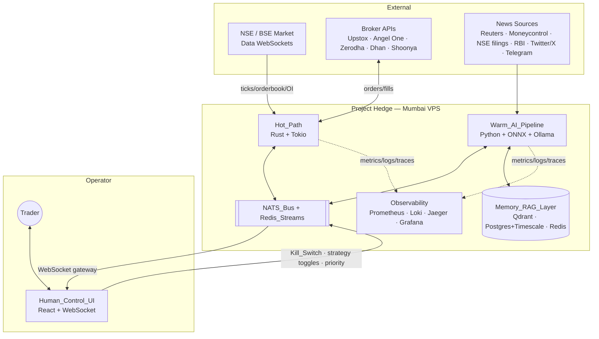
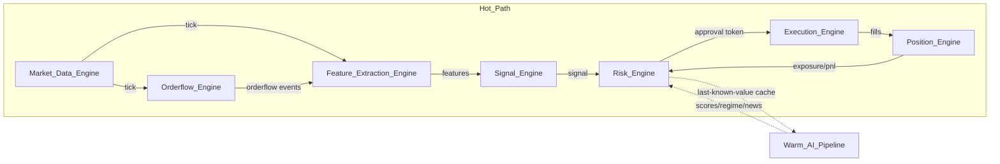
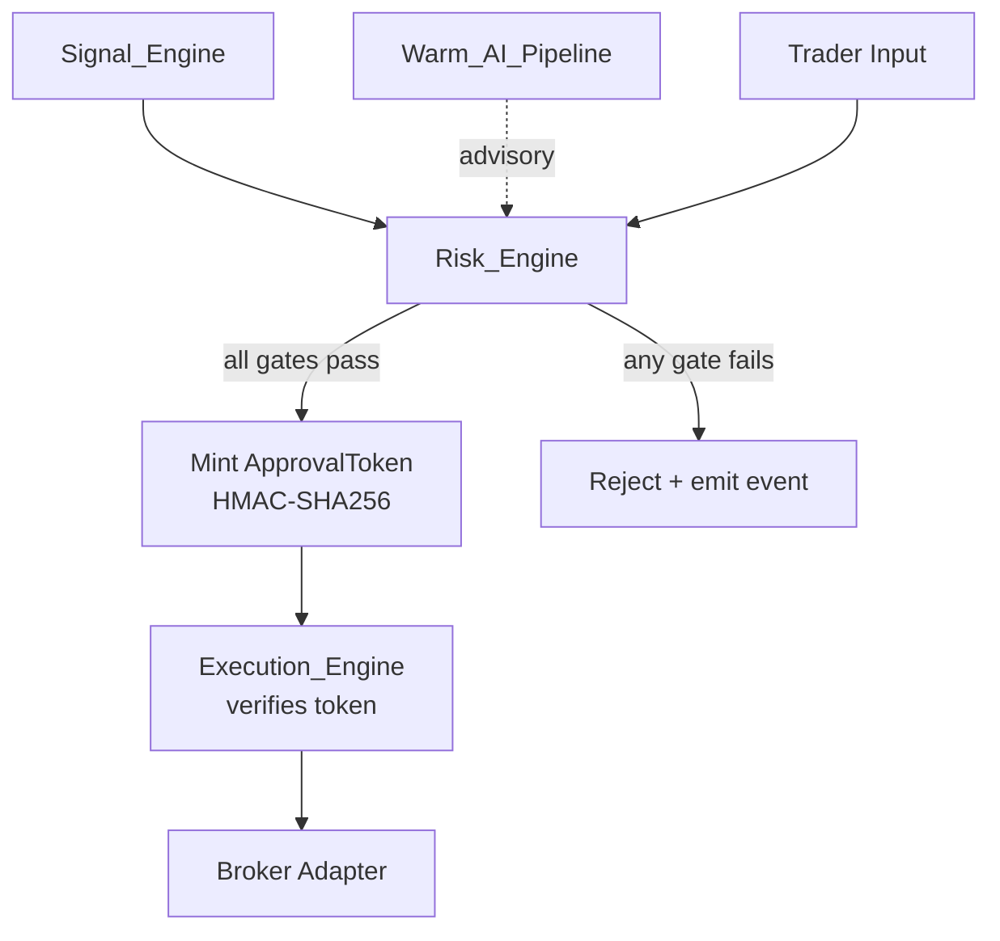
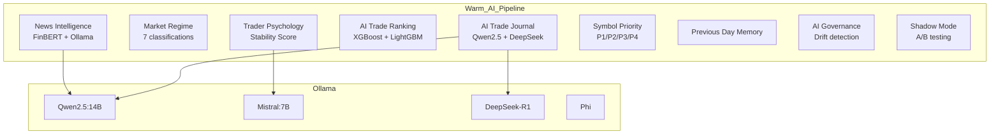
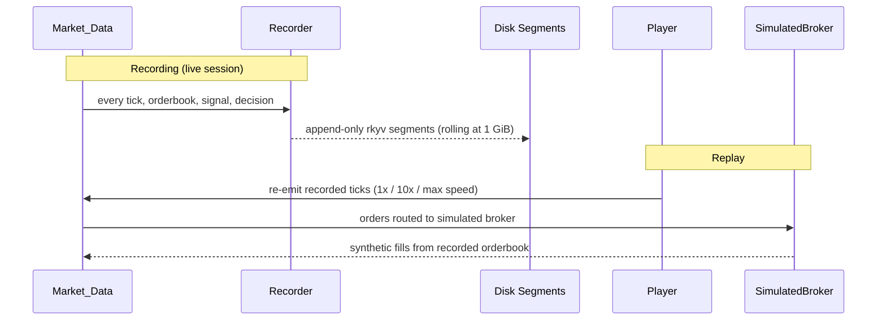

# PROJECT HEDGE

**Ultra-low latency AI-assisted intraday trading operating system for the Indian stock market (NSE/BSE).**

A production-grade, human-in-the-loop trading cockpit that combines deterministic Rust execution with asynchronous local AI reasoning — under the final authority of a Risk Engine that can never be bypassed.

---

## Key Highlights

- **Tick-to-trade < 50ms p99** — Rust Hot_Path with zero-allocation steady state
- **100% local AI** — Ollama (Qwen2.5:14B, Mistral:7B, DeepSeek-R1, Phi) + ONNX Runtime, zero cloud dependency
- **6 intraday strategies** — ORB, VWAP Pullback, Momentum Breakout, Liquidity Sweep Reversal, OI Expansion, Volatility Compression
- **Risk Engine with final authority** — 14+ limit gates, HMAC-signed approval tokens, Kill Switch
- **Real-time orderflow analysis** — bid/ask imbalance, absorption, spoofing detection, liquidity pressure
- **Trader psychology protection** — detects revenge trading, FOMO, tilt; progressive intervention ladder
- **Full session replay** — deterministic recording + playback with simulated broker
- **16-panel React cockpit** — WebSocket-only, 60fps target, War Mode presentation

---

## Architecture



---

## Four-Layer Architecture

| Layer | Language / Runtime | Responsibility | Latency |
|-------|-------------------|----------------|---------|
| **Hot_Path** | Rust 1.78 + Tokio | Tick → Orderflow → Features → Signals → Risk → Execution → Positions | < 50ms p99 end-to-end |
| **Warm_AI_Pipeline** | Python 3.11 + ONNX + Ollama | News, Regime, Ranking, Journal, Psychology, RAG | 10–500ms (off order path) |
| **Memory_RAG_Layer** | PostgreSQL/TimescaleDB, Qdrant, Redis | Persistent embeddings, time-series, hot cache | Async, no Hot_Path coupling |
| **Human_Control_UI** | React 18 + TypeScript + Tailwind | 16-panel cockpit via WebSockets | 60fps push-only |

---

## Hot_Path Data Flow



**Key invariant:** The Hot_Path **never blocks** on the Warm_AI_Pipeline. It reads from a thread-local last-known-value cache populated asynchronously.

---

## Authority Hierarchy



**Decision precedence:** Risk_Engine > Execution_Engine > Signal_Engine > Warm_AI_Pipeline > Trader_Input

The Execution_Engine physically cannot submit an order without a valid `ApprovalToken` — this is enforced at the type-system level.

---

## Strategies

| # | Strategy | Trigger |
|---|----------|---------|
| 1 | **Opening Range Breakout (ORB)** | Price breaks the first 15-min range with volume confirmation |
| 2 | **VWAP Pullback** | Price pulls back to VWAP with EMA alignment and orderflow support |
| 3 | **Momentum Breakout** | Strong momentum + compression zone breakout |
| 4 | **Liquidity Sweep Reversal** | Sweep of prior session high/low followed by reversal |
| 5 | **Options OI Expansion Breakout** | Open interest expansion at key strikes signals directional move |
| 6 | **Volatility Compression Breakout** | Bollinger squeeze + ATR compression resolves with volume |

All strategies are:
- Evaluated on every feature update (no polling)
- Gated by market regime, news impact, War Mode confidence floor
- Individually toggleable by the trader via the cockpit

---

## Risk Engine — 14+ Limit Gates

| Gate | What it enforces |
|------|-----------------|
| Max daily loss | Blocks all orders when session loss hits limit |
| Max position per symbol/portfolio | Prevents over-concentration |
| Max leverage per symbol/account | Caps margin usage |
| Max drawdown | Activates Kill Switch on breach |
| Max trade frequency | Per minute / hour / session caps |
| Max exposure per symbol/sector | Diversification enforcement |
| Slippage cooldown | Blocks symbol after excessive slippage |
| Volatility block | Blocks entries when realized vol exceeds threshold |
| Broker latency block | Blocks orders when broker is slow |
| Session-time gate | No orders outside 09:15–15:30 IST |
| Daily profit target | Applies post-target policy (reduce/stop/continue) |
| Adaptive Risk sizing | `BaseRisk × MarketStability × SignalConfidence × TraderDiscipline` |
| Kill Switch | Trader or system triggered halt |
| Authority override | Overrides any lower-precedence component |

---

## Warm_AI_Pipeline Components



---

## Trader Psychology Engine

Computes **Trader_Stability_Score** = `0.35×Discipline + 0.25×EmotionalControl + 0.20×RiskConsistency + 0.20×Patience`

**Intervention ladder:**

| Threshold | Action |
|-----------|--------|
| < 0.6 | ⚠️ Warning alert to cockpit |
| < 0.5 | 🧊 Cooldown — block new entries |
| < 0.4 | 📉 Size reduction — reduce position sizing |
| < 0.3 | 🛑 Kill Switch — halt all trading |

Detects: revenge trading, FOMO, overconfidence, tilt, impulsive trading, rapid re-entry, stop-loss removal, discipline deviation.

---

## Market Open War Mode

Active **09:15:00 – 09:45:00 IST** every trading day:
- Increased scan frequency and orderflow sensitivity
- Increased breakout detection sensitivity
- Signals below `war_mode.min_confidence` (default 0.6) are suppressed
- UI applies reduced-clutter presentation profile

---

## Replay Engine



**13 record kinds:** Tick, OrderBook, OpenInterest, NewsEvent, SignalEmitted, RiskDecision, OrderSubmitted, OrderModified, OrderCancelled, Fill, TraderAction, AIDecision, MarketConditionSnapshot

**Determinism guarantee:** Two replays of the same session with the same seed produce byte-identical outputs (Property 12).

---

## Broker Adapters

| Broker | Status | Auth |
|--------|--------|------|
| **Upstox** | ✅ Primary | OAuth daily access token |
| **Angel One** | ✅ Backup | SmartAPI + TOTP |
| Zerodha | ✅ Available | Kite Connect OAuth |
| Dhan | ✅ Available | Access token |
| Shoonya | ✅ Available | User/pass + TOTP |
| Simulated | ✅ Testing | No auth (replay/tests) |

Failover: when the primary broker's error rate or latency exceeds threshold, the system atomically swaps to the backup.

---

## Binance Crypto Module (Additive)

While the core system is heavily optimized for the Indian Stock Market, an additive Python-based module exists for Binance Spot trading (`python/binance_module`).

**Features:**
- Runs its own 5-service pipeline (Feed, Strategy, Risk, Exec, Position) independent of the Rust Hot_Path.
- Communicates over the same NATS and Redis infrastructure.
- Deploys as a self-contained unit using `start-binance.bat` or the included All-In-One `Dockerfile`.
- Uses an auto-reconciliation mechanism to handle Binance's 0.1% dust fee deductions during sell orders.
- Enforces strict constraints like LONG-ONLY and max-open-order limits.

---

## Observability

| Tool | Purpose | URL |
|------|---------|-----|
| Grafana | 5 pre-built dashboards | http://localhost:3000 |
| Prometheus | Metrics (latency histograms, counters) | http://localhost:9090 |
| Jaeger | Distributed tracing with correlation IDs | http://localhost:16686 |
| Loki | Structured logs | http://localhost:3100 |
| NATS Monitor | Message bus health | http://localhost:8222 |

**Grafana Dashboards:**
- Hot_Path Latency Budgets (per-stage p99 vs design budget)
- Warm_AI Performance (ranking p95, FinBERT p95, ONNX latency)
- Broker Performance (per-broker latency, error rate, failovers)
- Risk Events (kill-switch, target reached, cooldowns, rejections)
- Trader Psychology (stability score timeline, interventions)

---

## Human Control UI (16 Panels)

| Panel | Data Source |
|-------|------------|
| Live Market | `md.tick.*` |
| Orderflow Heatmap | `of.heatmap.*` |
| Options Chain | `md.oi.*` |
| Execution | `exec.order.*` |
| Positions | `pos.update.*` |
| Live PnL | `pos.risk_state` |
| Risk | `risk.decision.*` + Kill Switch |
| Latency Dashboard | `obs.latency.*` |
| AI Confidence Scores | `ai.rank.*` |
| AI Explanations | `ai.journal.entry` |
| Trader Stability Score | `ai.psych.stability` |
| News Feed | `ai.news.impact.*` |
| Alerts | severity-sorted, critical above non-critical |
| Replay Controls | list / play 1x / play 10x / pause / step |
| Strategy Toggles | per-strategy enable/disable |
| Symbol Priority | P1/P2/P3/P4 tier management |

---

## Project Structure

```
Trader/
├── crates/                     # 22 Rust crates
│   ├── hedge-core/             # Primitives, ring buffers, clock
│   ├── hedge-bus/              # NATS + Redis Streams typed wrappers
│   ├── hedge-schemas/          # FlatBuffers + JSON wire schemas
│   ├── hedge-obs/              # Prometheus, Loki, Jaeger
│   ├── hedge-config/           # YAML config loader + defaults
│   ├── hedge-market-data/      # WebSocket adapters, tick normalizer
│   ├── hedge-orderflow/        # Orderflow analysis, heatmap
│   ├── hedge-features/         # Incremental feature extraction
│   ├── hedge-signals/          # 6 strategy implementations
│   ├── hedge-risk/             # Risk Engine, ApprovalToken
│   ├── hedge-exec/             # Execution Engine, broker router
│   ├── hedge-position/         # Position + PnL tracking
│   ├── hedge-broker-upstox/    # Upstox API v2 adapter
│   ├── hedge-broker-angelone/  # Angel One SmartAPI adapter
│   ├── hedge-broker-zerodha/   # Zerodha Kite adapter
│   ├── hedge-broker-dhan/      # Dhan API adapter
│   ├── hedge-broker-shoonya/   # Shoonya adapter
│   ├── hedge-broker-simulated/ # Simulated broker (replay/tests)
│   ├── hedge-broker-api/       # BrokerAdapter trait
│   ├── hedge-warmcache/        # Non-blocking AI score cache
│   ├── hedge-replay/           # Replay Engine + regression binary
│   ├── hedge-supervisor/       # Self-healing supervisor
│   ├── hedge-session/          # Session + War Mode controller
│   └── hedge-ui-gateway/       # NATS-to-WebSocket bridge
├── python/
│   ├── hedge_warm_ai/          # Warm_AI_Pipeline services
│   └── hedge_memory_rag/       # Memory + RAG layer
├── ui/                         # React + TypeScript + Tailwind cockpit
├── docker/                     # Dockerfiles + provisioning configs
├── .github/workflows/          # CI: hot-path-purity + nightly soak
├── tests/fixtures/             # Canonical replay fixture
├── scripts/                    # Chaos test, canonical generator
├── start.bat                   # One-click ordered startup
├── run.bat                     # Full Docker startup
├── run-local.bat               # Hybrid local + Docker startup
├── .env                        # Broker credentials (gitignored)
├── docker-compose.yml          # Full deployment topology
└── docker-compose.override.yml # Local dev (no-auth NATS)
```

---

## Quick Start

### Prerequisites
- Docker Desktop (for infrastructure)
- Rust 1.78+ (for Hot_Path binaries)
- Node.js 18+ (for React UI)
- Ollama (for local AI inference)

### First Run

```bash
# 1. Build all Rust services
cargo build --release --workspace

# 2. Pull Ollama models
ollama pull qwen2.5:14b
ollama pull mistral:7b

# 3. Start everything in order
start.bat
```

### What starts:
1. **Infrastructure** — NATS, Redis, Postgres, Qdrant, Prometheus, Loki, Jaeger, Grafana
2. **Session + Supervisor** — clock observers + self-healing
3. **Hot_Path pipeline** — Market Data → Orderflow → Features → Signals → Risk → Execution → Position → Replay
4. **UI Gateway** — NATS-to-WebSocket bridge
5. **React Cockpit** — http://localhost:5173

---

## Configuration

All configuration lives in `/etc/hedge/config.yaml` (or falls back to built-in defaults):

```yaml
capital:
  base_inr: 20000
  daily_profit_target_min_inr: 300
  daily_profit_target_max_inr: 1000

brokers:
  primary: upstox
  backup: angel_one

session:
  start_ist: "09:15:00"
  end_ist: "15:30:00"

war_mode:
  start_ist: "09:15:00"
  end_ist: "09:45:00"
  min_confidence: 0.6
  scan_multiplier: 2.0
```

See `crates/hedge-config/examples/full_config.yaml` for all options.

---

## CI/CD

| Workflow | Trigger | What it checks |
|----------|---------|----------------|
| `hot-path-purity.yml` | Every PR | No Python/cloud-LLM/blocking-HTTP in Hot_Path crates |
| `nightly.yml` | Daily 02:00 UTC | Replay regression, proptest soak (5000 iterations), chaos test, alloc benchmark |

---

## Non-Goals (Architectural Prohibitions)

- ❌ No Pine Script execution
- ❌ No TradingView dependency
- ❌ No polling loops in Hot_Path steady state
- ❌ No LLM inference on the per-tick path
- ❌ No cloud-hosted services on the execution path
- ❌ No pandas/NumPy/Python in the Hot_Path
- ❌ No direct order submission from Warm_AI_Pipeline
- ❌ Not an autonomous trading bot
- ❌ Not a strategy backtester (use Replay Engine instead)

---

## Self-Healing

The `hedge-supervisor` detects and recovers from:

| Failure | Recovery |
|---------|----------|
| WebSocket disconnect | Exponential backoff reconnect |
| Broker error rate breach | Atomic failover to backup |
| Redis unavailable | Reconnect + degraded-state event |
| External API latency spike | Per-component mitigation |
| Ollama unresponsive | Fallback model routing |

---

## Security

- **NATS ACLs** — Warm_AI_Pipeline physically cannot publish to `risk.*` or `exec.*`
- **ApprovalToken** — HMAC-SHA256 signed, single-use, byte-bound to the order intent
- **Fail-closed** — missing credentials = service refuses to start
- **No cloud dependency** — all AI runs locally, egress firewall blocks cloud LLM providers
- **Credentials in `.env`** — gitignored, never committed

---

## Data Files & Repository Size

To keep the repository lightweight, large data files (like `*.csv` market data dumps, `.coverage` reports, and generated UI test screenshots) are intentionally ignored by Git. If you need test market data, please run the canonical generator scripts.

---

## License

Proprietary. All rights reserved.
